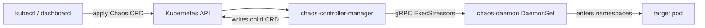

# Architecture

## Big picture

Chaos Mesh is built from three long-running components plus a set of custom resources. The controller-manager watches chaos CRDs and decides what to inject. The chaos-daemon runs as a privileged DaemonSet on every node and performs the injection inside the target container's namespaces. The dashboard serves a web UI and API. Faults are expressed as CRDs; the repository ships 23 CRD definitions under `config/crd/bases/`.

## Components

### chaos-controller-manager

The operator. Its `main` is at `cmd/chaos-controller-manager/main.go:60`. It uses Uber's `fx` for dependency injection: `fx.New(...)` wires `controllers.Module`, `selector.Module`, and `types.ChaosObjects`, then `fx.Invoke(Run)` starts the manager (`cmd/chaos-controller-manager/main.go:77-92`). It reconciles every chaos CRD and writes node-scoped child CRDs (`PodNetworkChaos`, `PodIOChaos`, `PodHttpChaos`) that record per-pod injection intent.

### chaos-daemon

A privileged DaemonSet on each node. It exposes a gRPC service whose interface is defined in `pkg/chaosdaemon/pb/chaosdaemon.proto:7-34`, with calls such as `ExecStressors`, `SetDNSServer`, `ApplyIOChaos`, and `InstallJVMRules`. The daemon enters the target container's namespaces and cgroups to apply the fault, so it is the only component that touches the host directly.

### chaos-dashboard

The web UI and API, with `main` under `cmd/chaos-dashboard/`. It is used to design experiments, observe status, and drive Workflows and Schedules.

Supporting binaries in `cmd/` include `chaos-builder` (CRD boilerplate generation), `chaos-daemon-helper`, `watchmaker` (used by TimeChaos, with separate Linux and Darwin builds), and `generate-makefile`.

## How a request flows

Take a StressChaos that loads CPU on a set of pods.

1. The CRD is applied. The controller-manager reconciles it through a shared pipeline whose steps are listed in `controllers/common/step.go:26-33`: `finalizers.InitStep`, `desiredphase.Step`, `condition.Step`, `records.Step`, `finalizers.CleanStep`.
2. The `records` step selects targets. `Reconcile` runs the selector when `records == nil` (`controllers/common/records/controller.go:64`, selection at `:84`), producing one `Record` per target.
3. For each record, a small state machine compares the desired phase against the current phase to decide `Apply`, `Recover`, or `Nothing` (`controllers/common/records/controller.go:128-149`). On `Apply` it calls `r.Impl.Apply(...)` and updates the counters (`:151` onward).
4. The StressChaos impl resolves the container and calls the daemon over gRPC. `Apply` decodes the target container and gets a `PbClient` (`controllers/chaosimpl/stresschaos/impl.go:43-52`), builds an `ExecStressRequest` with `EnterNS: true` (`impl.go:77-87`), and calls `pbClient.ExecStressors`.
5. The daemon launches `stress-ng` inside the target's namespaces and cgroup (`pkg/chaosdaemon/stress_server_linux.go:33` and `:112`).

The `desiredphase` step always returns a `RequeueAfter` until the experiment finishes, so the pipeline never re-enqueues immediately (`controllers/common/pipeline/pipeline.go:80-92`).

## Key design decisions

- One controller per field. The maintainers' stated design principle (summarized in the repository's `controllers/README.md`) is that each controller owns a single status field and stays independently explainable in roughly 100 words; retries are delegated to controller-runtime's exponential backoff rather than hand-rolled loops.
- Parent and child CRDs. A user-facing chaos object writes its selection result into node-scoped child CRDs (`PodNetworkChaos`, `PodIOChaos`, `PodHttpChaos`), and the daemon acts on those children. A predicate triggers the parent reconcile when a child changes (`controllers/common/fx.go:154-169`).
- Daemon does the dirty work. The controller never touches a host; all namespace and cgroup manipulation is isolated in the privileged daemon, behind a single gRPC contract.

## Extension points

- CRDs: each fault type is a CRD; 23 definitions live under `config/crd/bases/`. Cloud faults (`awschaos`, `azurechaos`, `gcpchaos`) and `physical_machine_chaos` extend beyond in-cluster pods.
- `ChaosImpl` interface: every fault type implements `Apply` and `Recover` (`controllers/chaosimpl/types/types.go:25-29`), which is the seam new fault types plug into.
- Admission webhooks: the common `InnerObject` interface includes `ValidateCreate`, `ValidateUpdate`, `ValidateDelete`, and `Default` (`api/v1alpha1/common_types.go:146-160`).
- Workflow and Schedule CRDs orchestrate and repeat experiments.

## Sources

1. chaos-mesh/chaos-mesh source at commit `8c13a9f`: <https://github.com/chaos-mesh/chaos-mesh>
2. Chaos Mesh project page (three-component overview): <https://www.cncf.io/projects/chaosmesh/>
