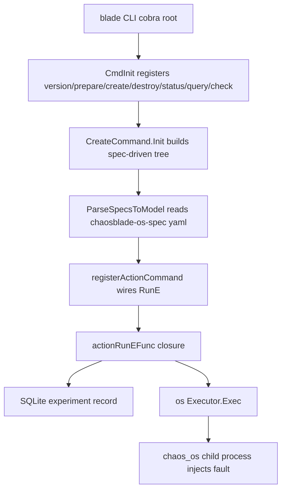

# Architecture

## Big picture

The `blade` binary is a thin dispatcher built on cobra (a Go CLI framework). At startup it registers a fixed set of top-level commands, then builds the fault-scenario command tree at runtime by parsing versioned YAML spec files. Each leaf command maps to an executor that knows how to inject one domain's faults. The CLI does not contain the fault logic; for hosts it shells out to a separate `chaos_os` binary, and the YAML plus that binary come from sibling repositories that the build clones and packages.

## Components

### CLI core (`cli/`)

The entry point is `cli/main.go:26`. `main` calls `cmd.CmdInit()` (`cli/main.go:27`) and then cobra's `Execute()` (`cli/main.go:28`). `CmdInit` at `cli/cmd/cmd.go:23` attaches the static commands: `version`, `prepare`, `revoke`, `create`, `destroy`, `status`, `query`, and `check`. Server command mode is deliberately disabled, as the comment at `cli/cmd/cmd.go:58` records.

### Spec-driven command service (`cli/cmd/exp.go`)

`baseExpCommandService` (`cli/cmd/exp.go:91`) holds two registries: `commands map[string]*modelCommand` and `executors map[string]spec.Executor`. `newBaseExpCommandService` (`cli/cmd/exp.go:99`) calls `registerSubCommands` (`cli/cmd/exp.go:119`), which registers each fault domain in turn. For the OS domain, `registerOsExpCommands` (`cli/cmd/exp.go:139`) reads a versioned spec file and calls `specutil.ParseSpecsToModel(file, os.NewExecutor())` (`cli/cmd/exp.go:141`). The same pattern repeats for middleware, cloud, jvm, cplus, docker, cri, and kubernetes.

### Executors (`exec/`)

Each subdirectory under `exec/` is an adapter that implements the `spec.Executor` interface: `cloud`, `cplus`, `cri`, `docker`, `jvm`, `kubernetes`, `middleware`, and `os`. The OS executor's `Exec` is at `exec/os/executor.go:42`. It does not inject faults in-process; it builds an argument array and runs the external `chaos_os` binary.

### Local state store (`data/`)

Experiment records persist to a local SQLite file named `chaosblade.dat` (`data/source.go:34`). The store abstraction is `SourceI` (`data/source.go:36`) and its concrete `Source` (`data/source.go:41`). The driver is the pure-Go `github.com/glebarez/sqlite` (`data/source.go:28`), opened via `sql.Open("sqlite", ...)` (`data/source.go:113`).

## How a request flows

Tracing `blade create cpu load --cpu-percent 60`:

1. `main` runs `CmdInit()` then `Execute()` (`cli/main.go:27` and `cli/main.go:28`).
2. The action leaf's `RunE` is the closure returned by `actionRunEFunc` (`cli/cmd/create.go:104`). cobra wired it at `cli/cmd/exp.go:394`.
3. The closure calls `createExpModel(...)` (`cli/cmd/create.go:106`) to turn cobra flags into a `spec.ExpModel`. The builder is at `cli/cmd/exp.go:435`; it walks every flag with `cmd.Flags().VisitAll` (`cli/cmd/exp.go:443`).
4. `actionCommand.recordExpModel(...)` (`cli/cmd/create.go:140`) builds a `data.ExperimentModel` (`cli/cmd/command.go:96`) and inserts it into SQLite via `GetDS().InsertExperimentModel` (`cli/cmd/command.go:106`).
5. On the synchronous path the CLI gets the executor (`cli/cmd/create.go:180`), sets its channel (`cli/cmd/create.go:181`), and calls `executor.Exec(model.Uid, ctx, expModel)` (`cli/cmd/create.go:183`).
6. The OS executor builds `chaosOsBin` (`exec/os/executor.go:66`) and starts it with `os_exec.CommandContext` (`exec/os/executor.go:67`). A long-running hang fault uses `command.Start()` (`exec/os/executor.go:71`); everything else uses `command.CombinedOutput()` (`exec/os/executor.go:78`) and decodes the result with `spec.Decode` (`exec/os/executor.go:84`).
7. On success the CLI updates the record with `GetDS().UpdateExperimentModelByUid(model.Uid, Success, ...)` (`cli/cmd/create.go:222`).

## Key design decisions

The defining decision is that `blade` is a spec-driven dispatcher, not a fault injector. Scenarios are not compiled into the CLI; they are loaded at runtime from versioned YAML such as `chaosblade-os-spec-<ver>.yaml` (`cli/cmd/exp.go:140`), and the OS executor shells out to `bin/chaos_os` (`exec/os/executor.go:66` and `exec/os/executor.go:67`). The executor binaries and their YAML are produced by sibling repositories; the `os` target in `Makefile:341` clones `chaosblade-exec-os` and runs its `make`, then copies the result into the package. Executors stay decoupled from the CLI through the YAML contract.

State lives in a local SQLite file rather than an external database, so a single host is self-contained (`data/source.go:34`). The path can be overridden with the `CHAOSBLADE_DATAFILE_PATH` environment variable (`data/source.go:78`).

Create supports a synchronous path and an asynchronous path. With `--async` the command re-launches itself under `nohup` and returns the experiment uid immediately (`cli/cmd/create.go:150`). The synchronous path runs the executor inline (`cli/cmd/create.go:183`).

## Extension points

A new fault domain is added by writing a new executor that satisfies `spec.Executor` plus its YAML spec, then registering it in `registerSubCommands` (`cli/cmd/exp.go:119`). Every action automatically gains a `timeout` flag through `addTimeoutFlag` (`cli/cmd/exp.go:405`); when set, `actionPostRunEFunc` (`cli/cmd/create.go:252`) schedules an automatic `blade destroy` so the experiment self-recovers. For Kubernetes, the operator (`chaosblade-operator`) exposes a Custom Resource Definition (CRD), a Kubernetes API extension type, as the declarative interface.
