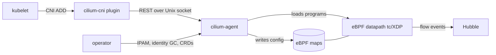

# Architecture

## Big picture

Cilium has two layers. A user-space Go agent runs on every node (one per node, as a DaemonSet) and decides what the network should do. A kernel-space eBPF datapath, compiled from C in `bpf/` and attached to tc and XDP hooks, does the actual packet processing. The agent computes configuration and writes it into eBPF maps; the kernel then handles real traffic without calling back into user space. A cluster-scoped operator handles work that is global rather than per-node.

## Components

### cilium-agent

The agent is the per-node brain. Its entry point is `daemon/main.go`, which builds the application with Cilium's own dependency-injection framework, Hive, and runs it as the `cilium-agent` cobra command (`daemon/main.go:13`, `daemon/cmd/root.go:24`). Modules ("cells") are assembled and wired in `daemon/cmd/`. The agent owns endpoint orchestration, identity allocation, policy resolution, and datapath loading.

### cilium-cni plugin

A separate binary that kubelet invokes per pod. It implements the CNI `Add` and `Del` operations in `plugins/cilium-cni/cmd/cmd.go` and talks to the agent over a Unix-socket REST API rather than doing the heavy lifting itself.

### operator

A single cluster-scoped Deployment (`operator/`) that handles work which must not be per-node: IPAM CIDR allocation, identity garbage collection, and CRD management.

### datapath and maps

`pkg/datapath/` is the datapath abstraction; `pkg/datapath/loader/` compiles, templates, and loads eBPF objects. `pkg/maps/` wraps the individual eBPF maps in Go: `lxcmap` for endpoints, `policymap` for resolved policy, `ctmap` for connection tracking, and others.

### identity, policy, and ipcache

`pkg/identity/` and `pkg/labels/` map label sets to numeric security identities. `pkg/policy/` resolves network policy into per-endpoint `MapState`, the contents of the eBPF policy map. `pkg/ipcache/` maintains the cluster-wide IP-to-identity mapping and syncs it into the eBPF ipcache map.

### Hubble

`hubble/` and `hubble-relay/` form the observability layer, turning eBPF-sourced flow events into queryable visibility.

## How a request flows

Tracing a pod from scheduling to a live eBPF datapath:

1. CNI ADD. Kubelet invokes `cilium-cni`. `Cmd.Add` (`plugins/cilium-cni/cmd/cmd.go:523`) allocates an address via IPAM and configures the veth interface inside the container netns. Because the CNI call must not return until the datapath is ready, it sets `ep.SyncBuildEndpoint = true` (`plugins/cilium-cni/cmd/cmd.go:838`, with a comment referencing GH-4409) and posts the endpoint to the agent with `c.EndpointCreate(ep)` (`plugins/cilium-cni/cmd/cmd.go:842`).
2. API handler. The agent serves `PUT /endpoint/{id}` through `EndpointPutEndpointIDHandler.Handle` (`pkg/endpoint/api/endpoint_api_handler.go:195`), reaching `endpointAPIManager.CreateEndpoint` (`pkg/endpoint/api/endpoint_api_manager.go:88`).
3. Endpoint construction. `createEndpoint` (`pkg/endpoint/endpoint.go:597`) builds the Endpoint struct, and `endpointManager.AddEndpoint` assigns a node-unique ID (`pkg/endpoint/api/endpoint_api_manager.go:293`). With no labels yet, the endpoint gets a provisional `reserved:init` identity (`pkg/endpoint/api/endpoint_api_manager.go:284`).
4. Identity resolution and regeneration. For a Kubernetes pod, `ep.RunMetadataResolver` fetches pod labels, finalizes the identity, and triggers regeneration (`pkg/endpoint/api/endpoint_api_manager.go:303`). Otherwise the manager calls `ep.Regenerate` explicitly at the `RegenerateWithDatapath` level (`pkg/endpoint/api/endpoint_api_manager.go:324`).
5. Regeneration pipeline. `Endpoint.Regenerate` (`pkg/endpoint/policy.go:867`) queues the build; `regenerate` and `regeneratePolicy` resolve policy into `MapState`, then `regenerateBPF` (`pkg/endpoint/bpf.go:360`) takes over. It first waits on `<-e.orchestrator.DatapathInitialized()` and then takes the compilation read lock, so endpoint builds do not race base-program compilation (`pkg/endpoint/bpf.go:375`).
6. Header, compile, load. `writeHeaderfile` emits endpoint-specific constants into `lxc_config.h` (`pkg/endpoint/bpf.go:139`), `realizeBPFState` (`pkg/endpoint/bpf.go:568`) runs, and `orchestrator.ReloadDatapath` (`pkg/endpoint/bpf.go:587`) loads the eBPF object and attaches it to tc/XDP, using the ELF template cache in `pkg/datapath/loader/cache.go`.
7. Synchronous completion. Because `SyncBuildEndpoint` is set, the agent blocks on `ep.WaitForFirstRegeneration(ctx)` (`pkg/endpoint/api/endpoint_api_manager.go:337`) until the first datapath build finishes before returning the REST response. By the time CNI ADD returns, the pod's eBPF datapath is live.

## Key design decisions

- Identity-based policy. Policy is keyed on numeric identities derived from label sets, not on IPs. Pods scaling up or down changes IP membership but not the identity, so rule counts do not grow with pod counts. `Identity`, `IPCache`, and `MapState` together make this model work.
- Template-and-substitute datapath. Cilium does not recompile eBPF per endpoint. It compiles one ELF per distinct configuration hash and clones it, substituting endpoint-specific values just before load (`pkg/datapath/loader/cache.go`). This avoids a clang invocation per pod.
- Push into the kernel. The agent pushes resolved state into eBPF maps and the kernel enforces it inline, rather than processing packets in user space.
- Declarative lifecycle via Hive. The agent is assembled from cells with `hive.New(cmd.Agent)` (`daemon/main.go:13`), so startup order and shutdown are declarative.

## Extension points

Cilium exposes Kubernetes CRDs for policy and configuration (CiliumNetworkPolicy and related types), a CNI plugin contract that kubelet drives, and the agent REST API consumed by the CNI plugin and `cilium-cli`. Hubble exposes flow data to external consumers. Cluster-scoped behavior such as IPAM and CRD handling is owned by the operator (`operator/`).
