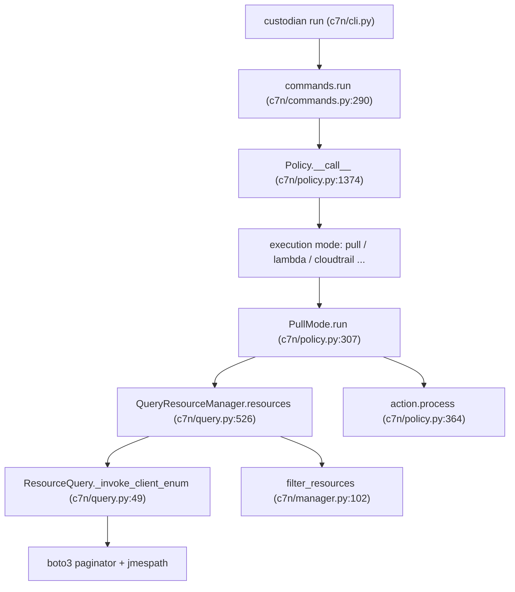

# Architecture

## Big picture

A Cloud Custodian policy is a YAML block with four parts: a `resource` type, a set of `filters`, a set of `actions`, and an optional `mode`. The core in `c7n/` reads that block, resolves each string key (the resource type, each filter name, each action name) to a registered Python class, queries the cloud provider for resources, applies the filters in order, and runs the actions on what survives. Everything is wired through string-keyed plugin registries, which is what lets the same engine grow to roughly 120 AWS resource types and multiple providers without touching the run loop.

## Components

### CLI and commands

`c7n/cli.py` builds the argparse parser and dispatches subcommands such as `run`, `report`, `schema`, and `validate`. `c7n/commands.py` holds the implementations. `commands.run` loops over the loaded policies, calls each one, captures exceptions so one failure does not stop the rest, and exits with code 2 if any policy errored (`c7n/commands.py:290`, `c7n/commands.py:306-320`).

### Policy and execution modes

`c7n/policy.py` defines the `Policy` class (`c7n/policy.py:1168`) and the `execution` registry of run modes (`c7n/policy.py:303`). `pull` is the default: if a policy declares no `mode`, `execution_mode` resolves to `pull` (`c7n/policy.py:1230`). Serverless modes such as `cloudtrail`, `periodic`, and `config-rule` subclass `ServerlessExecutionMode` and deploy the policy as a Lambda function instead of running it inline.

### Resource managers and queries

`c7n/query.py` holds `QueryResourceManager` (`c7n/query.py:452`), `TypeInfo` (`c7n/query.py:796`), and `ResourceQuery` (`c7n/query.py:38`). The resource manager owns the lifecycle: fetch, augment, filter, and limit-check. `ResourceQuery` performs the actual provider API call. `c7n/manager.py` defines the `ResourceManager` base whose `filter_resources` applies filters in sequence (`c7n/manager.py:102`).

### Filters and actions

`c7n/filters/core.py` defines the `Filter` base and its `process(resources, event)` contract (`c7n/filters/core.py:198`, `c7n/filters/core.py:206`), plus the generic `ValueFilter` (`c7n/filters/core.py:589`). `c7n/actions/core.py` defines the `Action` base (`c7n/actions/core.py:46`). The AWS resource implementations live in `c7n/resources/`.

### Registry

`c7n/registry.py` defines `PluginRegistry` (`c7n/registry.py:5`), a string-to-class map. Resources, filters, actions, execution modes, and sources are all registered through it.

## How a request flows

A `custodian run policy.yml` in the default `pull` mode flows as follows:

1. `c7n.cli:main` parses arguments and resolves the `run` subcommand.
2. `commands.run` iterates the policies and calls each `Policy` object (`c7n/commands.py:290`).
3. `Policy.__call__` selects the execution mode; for a non-serverless mode it calls `mode.run()` (`c7n/policy.py:1374`, `c7n/policy.py:1388`). `run` is an alias of `__call__` (`c7n/policy.py:1392`).
4. `PullMode.run` checks the policy is runnable, fetches resources, writes `resources.json`, skips actions on dry run, then runs each action (`c7n/policy.py:307`, `c7n/policy.py:330`, `c7n/policy.py:351`, `c7n/policy.py:357`, `c7n/policy.py:364`).
5. `QueryResourceManager.resources` checks the cache, fetches via the source, augments with tags, filters, then applies the resource limit (`c7n/query.py:526`).
6. `ResourceManager.filter_resources` applies each filter in order and stops early when the set is empty (`c7n/manager.py:102`).
7. `ResourceQuery._invoke_client_enum` runs the describe call with a boto3 paginator and extracts the array with jmespath (`c7n/query.py:49`).

## Key design decisions

The policy validation schema is generated at runtime, not written by hand. `schema.generate()` walks every registered resource, filter, and action and assembles a Draft 7 JSON Schema (`c7n/schema.py:359`), and `schema.validate()` checks a policy against it with `jsonschema.Draft7Validator` (`c7n/schema.py:56`). Adding a plugin extends both the DSL and the schema that validates it.

Resource enumeration is declarative. A resource binds to a provider API through an `enum_spec` tuple of `(describe_op, jmespath_path, extra_args)`, and one generic routine pages and extracts for every type. EC2 declares `enum_spec = ('describe_instances', 'Reservations[]', None)` (`c7n/resources/ec2.py:128`). This is why a new resource type is a thin declaration rather than new query code.

## Extension points

- New resource types: subclass `QueryResourceManager` with a `resource_type` (`TypeInfo`) and register it (`c7n/query.py:452`, `c7n/query.py:796`).
- New filters and actions: subclass `Filter` or `Action` and register them on a resource's filter or action registry (`c7n/filters/core.py:198`, `c7n/actions/core.py:46`).
- New execution modes: register on the `execution` registry (`c7n/policy.py:303`).
- New providers: the `tools/c7n_*` packages (Azure, GCP, OCI, Tencent, Kubernetes) load through Python entry points.
