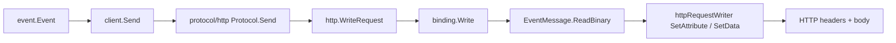

# Architecture

## Big picture

The Go SDK is organized so that the event model, the transport-neutral wire logic, and each concrete transport stay separate. An application works with a canonical `event.Event`. The `binding` layer turns that event into transport-neutral read and write operations against an abstract `Message`. Each `protocol` package (HTTP, Kafka, MQTT, and others) implements those operations for one wire format. A high-level `client` ties them together with `Send`, `Request`, and `StartReceiver`. The umbrella package `github.com/cloudevents/sdk-go/v2` re-exports the common entry points through `v2/alias.go:91`.

## Components

### event

`v2/event/` holds the canonical data model. `event.Event` (`v2/event/event.go:15`) is the in-memory representation of a CloudEvent: a `Context` plus an encoded data payload. The spec context attributes live in version-specific structs such as `EventContextV1` (`v2/event/eventcontext_v1.go:37`). This package is the SDK's view of the specification's data model.

### binding

`v2/binding/` is the transport-neutral core. It defines the `Message` and `MessageReader` abstraction (`v2/binding/message.go:89`, `v2/binding/message.go:23`) and the encoding algorithm in `write.go` and `to_event.go`. `binding/spec/` holds a registry of spec versions, and `binding/format/` holds payload formats such as JSON. Nothing here knows about a specific transport.

### protocol

`v2/protocol/` holds transport implementations. The in-tree `http/` package is the default. Kafka (sarama and confluent), MQTT, AMQP, NATS, NATS JetStream, GCP Pub/Sub, STAN, and an in-process gochan transport live in sibling modules under `protocol/`. Each implements the binding writer and reader interfaces for its wire format.

### client

`v2/client/` is the high-level API. The `Client` interface exposes `Send`, `Request`, and `StartReceiver` (`v2/client/client.go:116`, `v2/client/client.go:198`). It applies defaulting and validation on send and dispatches received events to a user handler via reflection.

## How an event flows

Tracing an outbound HTTP send in binary mode, end to end:

1. `ceClient.Send` (`v2/client/client.go:116`) runs outbound context decorators, applies the registered defaulter functions, calls `e.Validate()`, then hands the event to the sender as a `binding.EventMessage` with a zero-copy type conversion: `c.sender.Send(ctx, (*binding.EventMessage)(&e))` (`v2/client/client.go:138`).
2. `Protocol.Send` (`v2/protocol/http/protocol.go:168`) delegates to `Request`, finishes the response message, and on a non-ACK error reads the body to wrap it in a `Result`.
3. `WriteRequest` (`v2/protocol/http/write_request.go:23`) casts the `*http.Request` to an `httpRequestWriter` that serves as both structured and binary writer, then calls `binding.Write`.
4. `binding.Write` (`v2/binding/write.go:65`) reads the message encoding. An `EventMessage` reports `EncodingEvent` (`v2/binding/event_message.go:37`), so the direct path is skipped; `ToEvent` returns the same event, and because the default `preferredEventEncoding` is binary, it calls `writeBinary` which invokes `message.ReadBinary` (`v2/binding/write.go:91`).
5. `EventMessage.ReadBinary` (`v2/binding/event_message.go:50`) calls `eventContextToBinaryWriter`, which looks up the attribute set for the event's spec version, calls `b.SetAttribute` for each attribute and `b.SetExtension` for each extension, then sets the data via `b.SetData` (`v2/binding/event_message.go:80`).
6. `httpRequestWriter.SetAttribute` (`v2/protocol/http/write_request.go:109`) maps each attribute name to an HTTP header through `attributeHeadersMapping`, formats the value with `types.Format`, and appends it to the header. `SetData` (`v2/protocol/http/write_request.go:52`) sets the request body.

The header mapping table is built once at startup in `init()` (`v2/protocol/http/headers.go:27`), which walks every attribute of every spec version: `datacontenttype` maps to `Content-Type`, and everything else gets the `ce-` prefix run through `CanonicalMIMEHeaderKey`.

## Key design decisions

The most consequential decision is direct transcoding. Before decoding anything, `binding.Write` tries `DirectWrite` (`v2/binding/write.go:32`), which passes a structured-to-structured or binary-to-binary message through by copying headers and body without decoding the payload. Full decode and re-encode through `ToEvent` is only a fallback for when the direct path cannot apply (`v2/binding/write.go:83`). This means an event router can forward an event between transports without parsing its data, which keeps bridges cheap. Context keys (`skipDirectStructuredEncoding`, `skipDirectBinaryEncoding`, `preferredEventEncoding`, `v2/binding/write.go:16`) tune this behavior.

The second is the spec-version registry. `binding/spec` represents attributes by a cross-version `Kind` enum, so the same code reads and writes both v0.3 and v1.0 events through `AttributeFromKind`, `Get`, and `Set` (`v2/binding/spec/spec.go:106`). `WithPrefix` (`v2/binding/spec/spec.go:137`) generates a prefixed attribute set, which is how HTTP and Kafka get their `ce-` names without duplicating the attribute list.

## Extension points

- The `binding.Message`, `BinaryWriter`, and `StructuredWriter` interfaces (`v2/binding/message.go:89`, `v2/binding/binary_writer.go:39`) are the contract a new transport implements. The sibling `protocol/` modules are all implementations of these.
- `binding/format` lets a new structured payload format register alongside JSON.
- Client `Option` values, outbound context decorators, and event defaulter functions (`v2/client/client.go:127`) let callers inject behavior such as ID and timestamp defaulting without changing the SDK.
