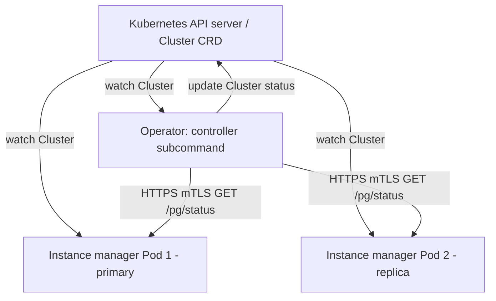

# Architecture

## Big picture

CloudNativePG ships as a single Go binary that behaves differently depending on the subcommand it is invoked with. Run as `controller`, it is the operator: a controller-runtime manager that watches `Cluster` custom resources and drives them toward their desired state. Run as `instance`, the same binary is the in-Pod agent (the instance manager) that starts and supervises PostgreSQL inside each database Pod. The subcommands are registered on a single cobra root in `cmd/manager/main.go:60`-`68` (`controller`, `instance`, `backup`, `bootstrap`, `walarchive`, `walrestore`, `pgbouncer`, `show`, `versions`).

The result is a two-tier reconcile model. Both tiers watch the same `Cluster` resource through the Kubernetes API, which serves as the shared source of truth instead of an external Distributed Configuration Store (DCS).

## Components

### Operator (controller)

The operator runs as a Deployment, normally in the `cnpg-system` namespace. Its reconcilers live in `internal/controller`, one per resource kind (`Cluster`, `Backup`, `ScheduledBackup`, `Pooler`, `Database`, and others). The `Cluster` reconciler is the heart of the system. Its entry point is `ClusterReconciler.Reconcile` in `internal/controller/cluster_controller.go:169`. The reconciler struct embeds the controller-runtime `client.Client` and holds an `InstanceClient` for talking to Pods, a plugin repository, and the operator's TLS client certificate (`internal/controller/cluster_controller.go:95`).

### Instance manager

Each PostgreSQL Pod runs the same binary as its entrypoint under the `instance run` subcommand. The instance manager starts its own controller-runtime manager and watches the `Cluster` resource with `For(&apiv1.Cluster{})` (`internal/cmd/manager/instance/run/cmd.go:277`-`280`). It is what actually starts PostgreSQL, applies configuration, and promotes or demotes the local instance. It also exposes HTTP servers: a remote web server the operator queries and a local web server (`internal/cmd/manager/instance/run/cmd.go:397` and `:407`).

### Instance status endpoint

The instance manager serves cluster status over HTTP. The path `/pg/status` is defined in `pkg/management/url/url.go:55` and the port `8000` in `pkg/management/url/url.go:79`. The operator's HTTP client builds the request URL from the Pod IP, this path, and this port in `pkg/management/postgres/webserver/client/remote/instance.go:320`.

### Plugin interface (CNPG-i)

CNPG-i (the CloudNativePG Plugin Interface) is a gRPC-based extension mechanism. The operator collects the plugin names a cluster needs and loads them at the start of each reconcile (`internal/controller/cluster_controller.go:227` and `:232`). The instance manager registers sidecar plugins reachable over a Unix domain socket with `RegisterUnixSocketPluginsInPath` (`internal/cmd/manager/instance/run/cmd.go:259`).

## How a request flows

One `Cluster` reconcile pass on the operator side:

1. `Reconcile` fetches the `Cluster` via `getCluster`, runs the admission guard `EnsureResourceIsAdmitted`, and loads the CNPG-i plugins the cluster needs (`internal/controller/cluster_controller.go:169`, `:213`, `:232`), then calls the inner `reconcile` (`:267`).
2. The inner `reconcile` applies defaults with `setDefaults`, resolves the container image with `reconcileImage`, and creates the supporting objects (Services, Secrets, ConfigMaps) with `createPostgresClusterObjects` (`internal/controller/cluster_controller.go:310`, `:333`, `:345`, `:372`).
3. It builds an mTLS (mutual Transport Layer Security) context with `certs.NewTLSConfigForContext` and asks every Pod for its replication state through `GetStatusFromInstances` (`internal/controller/cluster_controller.go:446`, `:456`).
4. The HTTP client filters to active Pods and calls `https://<podIP>:8000/pg/status` on each, assembling a `PostgresqlStatusList` (`pkg/management/postgres/webserver/client/remote/instance.go:183`, `:194`, `:320`).
5. If a switchover or failover is already in progress (current primary differs from target primary), it marks the old primary unhealthy and requeues after 1 second (`internal/controller/cluster_controller.go:409`-`429`). If more than one Pod reports itself as primary, it logs an old-primary detection and requeues after 5 seconds to let auto-healing converge (`:477`-`486`).
6. When healthy, it evaluates switchover with `handleSwitchover`, reconciles resources with `reconcileResources`, and records the final phase with `finalizeReconciliation` (`internal/controller/cluster_controller.go:589`, `:598`, `:605`).

Meanwhile each instance manager runs its own loop against the same `Cluster` resource, so a Pod can react to topology changes (for example, a promotion) directly rather than waiting for the operator to push commands.

## Key design decisions

The central decision is to use the Kubernetes API server as the high-availability consensus store and to avoid an external DCS such as etcd, Consul, or ZooKeeper, and tools such as Patroni, repmgr, or Stolon. Both the operator and the in-Pod instance managers watch the same `Cluster` resource, so there is one authoritative state. This removes a whole class of moving parts that Patroni-based stacks require.

A second decision is the two-tier reconcile: making the instance manager itself a Kubernetes controller rather than a passive process commanded by the operator (`internal/cmd/manager/instance/run/cmd.go:277`-`280`). Each Pod reacts to the desired state on its own, which keeps behavior level-triggered.

A third is immutable infrastructure: database Pods are disposable and images are pinned by digest, so upgrades happen by rolling replacement rather than in-place mutation.

## Extension points

- **CRDs**: the API group `postgresql.cnpg.io/v1` defines `Cluster`, `Backup`, `ScheduledBackup`, `Pooler`, `Database`, `Publication`, `Subscription`, `ImageCatalog`, `ClusterImageCatalog`, and `FailoverQuorum`. These are the declarative surface users build on.
- **CNPG-i plugins**: third parties implement gRPC sidecar plugins (for example backup providers) that the operator and instance manager load at runtime.
- **Poolers**: the `Pooler` CRD provisions PgBouncer connection pooling in front of a cluster.
