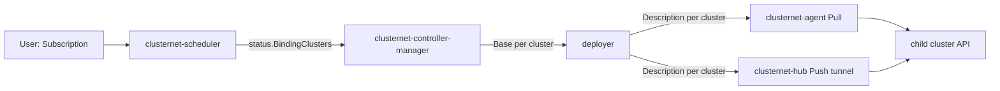

# Architecture

## Big picture

Clusternet has a parent cluster that holds all the APIs and state, plus one agent in each child cluster. The parent runs four components, each a separate binary under `src/cmd`: `clusternet-hub`, `clusternet-scheduler`, `clusternet-controller-manager`, and `clusternet-agent` (the agent runs on the child). The README and official docs describe the same four-component layout ([Introduction](https://clusternet.io/docs/introduction/)). Distribution flows through a chain of CRDs (Custom Resource Definitions): a user-authored Subscription is scheduled to a set of clusters, expanded into a Base per cluster, rendered into a Description per cluster, and finally applied to each child.

## Components

### clusternet-hub

The hub is an aggregated API server. It serves the shadow API, proxies `kubectl` traffic to child clusters, and approves cluster registration requests. Its package tree is `src/pkg/hub`, and the binary entry point is `main()` at `src/cmd/clusternet-hub/hub.go:31`, which builds the command via `app.NewClusternetHubCmd`.

### clusternet-scheduler

The scheduler decides which clusters a Subscription goes to. It is a port of the Kubernetes scheduler framework that schedules clusters rather than nodes, living under `src/pkg/scheduler`. Its per-item loop is `scheduleOne` at `src/pkg/scheduler/scheduler.go:287`.

### clusternet-controller-manager

The controller manager turns a scheduled Subscription into per-cluster Base and Description objects in each child's dedicated namespace. The deployer logic is in `src/pkg/controllermanager/deployer/deployer.go`, starting from `handleSubscription` at `src/pkg/controllermanager/deployer/deployer.go:273`.

### clusternet-agent

The agent is the only Clusternet process that runs in a child cluster. It registers the child with the parent through a ClusterRegistrationRequest plus a CSR (CertificateSigningRequest), reports heartbeat and health, and in Pull mode applies the Descriptions the parent produced. Its generic deployer entry is `handleDescription` at `src/pkg/agent/deployer/generic/generic.go:123`.

## How a request flows

Trace one Subscription from creation to running pods on children.

1. A user creates a Subscription in the parent. The subscription controller picks it up at `handle` (`src/pkg/controllers/apps/subscription/subscription.go:176`), injects a finalizer (`src/pkg/controllers/apps/subscription/subscription.go:203`), then delegates to an injected handler at `src/pkg/controllers/apps/subscription/subscription.go:230`.
2. `clusternet-scheduler` pops the Subscription from its queue in `scheduleOne` (`src/pkg/scheduler/scheduler.go:287`), where the pop happens at `src/pkg/scheduler/scheduler.go:288`. It calls the scheduling algorithm at `src/pkg/scheduler/scheduler.go:346` and binds asynchronously at `src/pkg/scheduler/scheduler.go:415`.
3. The default binder writes the chosen clusters back to the Subscription status rather than creating any Base, which keeps the scheduler and deployer loosely coupled. See `DefaultBinder.Bind` at `src/pkg/scheduler/framework/plugins/defaultbinder/default_binder.go:57` and the status assignment at `src/pkg/scheduler/framework/plugins/defaultbinder/default_binder.go:65`.
4. `clusternet-controller-manager` observes the status change and creates one Base per binding cluster in `populateBasesAndLocalizations` (`src/pkg/controllermanager/deployer/deployer.go:322`), then renders each Base into a Description in `populateDescriptions` (`src/pkg/controllermanager/deployer/deployer.go:755`).
5. In Pull mode the child's `clusternet-agent` watches its namespace's Description and applies it at `src/pkg/agent/deployer/generic/generic.go:131`. In Push mode the hub applies the same objects over the WebSocket tunnel.

The [Internals](./internals) page walks these hops with quoted code.

## Key design decisions

The scheduler does not produce Base objects; it only records `Status.BindingClusters` on the Subscription (`src/pkg/scheduler/framework/plugins/defaultbinder/default_binder.go:65`). The controller manager reacts to that status. This status-based handoff decouples scheduling from deployment, so each can be reasoned about and scaled on its own.

Children choose a sync mode. The mode is a typed string with three values defined at `src/pkg/apis/clusters/v1beta1/types.go:39`: `Push` (`src/pkg/apis/clusters/v1beta1/types.go:44`), where the hub pushes changes to the child; `Pull` (`src/pkg/apis/clusters/v1beta1/types.go:48`), where the child's agent watches the parent and applies changes itself; and `Dual` (`src/pkg/apis/clusters/v1beta1/types.go:51`), which does both. Pull mode means the parent never needs inbound reachability to the child.

A Subscription picks a scheduling strategy, defaulting to `Replication` and offering `Dividing` as the alternative (`src/pkg/apis/apps/v1alpha1/subscription.go:65`). Replication places a full copy on each matched cluster; Dividing splits replicas across clusters by predicted capacity.

## Extension points

- CRDs are the primary public surface: Subscription, Base, Description, ManagedCluster, FeedInventory, Localization, Globalization, Manifest, HelmChart, and HelmRelease, all under `src/pkg/apis`.
- The scheduler is a plugin framework with filter, score, predict, and bind extension points under `src/pkg/scheduler/framework/plugins`, mirroring the Kubernetes scheduler framework.
- The shadow API in `src/pkg/hub/registry/shadow` lets ordinary Kubernetes objects submitted with `kubectl` become distribution material without new resource types.
- The CRDs and clientsets are published separately as `github.com/clusternet/apis` for third-party integration ([README](https://github.com/clusternet/clusternet)).
