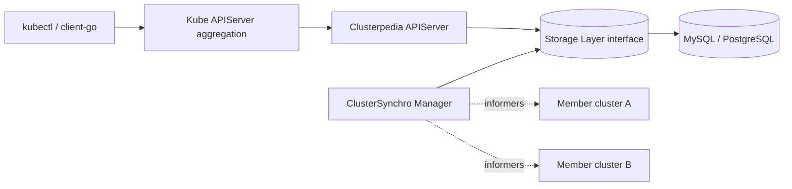

# Architecture

## Big picture

The README describes the system in four parts (`README.md:95` onward): the Clusterpedia APIServer, the ClusterSynchro Manager, a Storage Layer interface, and a concrete Storage Component such as MySQL or PostgreSQL. The APIServer is the read path; it registers as a Kubernetes Aggregated API and answers cross-cluster queries. The ClusterSynchro Manager is the write path; it watches each registered cluster and pushes observed resources into storage. The Storage Layer is an interface both sides talk to, so the backing database is pluggable.

A cluster is registered through the `PediaCluster` CRD (Custom Resource Definition) in API group `cluster.clusterpedia.io/v1alpha2`. That object carries both the credentials to reach the member cluster and the declaration of which resources to synchronize.

## Components

### Clusterpedia APIServer

Registers with the host Kubernetes APIServer through aggregation and provides the unified query entrance (`README.md:95` onward). The runtime scheme is installed in an `init` block via `install.Install(Scheme)` (`pkg/apiserver/apiserver.go:44`), the API group is wired into the generic server with `genericServer.InstallAPIGroup(&apiGroupInfo)` (`pkg/apiserver/apiserver.go:156`), and the server starts with `server.GenericAPIServer.PrepareRun().RunWithContext(ctx)` (`pkg/apiserver/apiserver.go:173`). The binary is built from `cmd/apiserver`.

### ClusterSynchro Manager

Manages the per-cluster synchros that copy resources into storage (`README.md:95` onward). Each synchro is created by `New` (`pkg/synchromanager/clustersynchro/cluster_synchro.go:84`), which builds a dynamic discovery manager for the cluster and reads existing resource versions from storage before starting informers. The binary is built from `cmd/clustersynchro-manager`.

### Storage Layer

An interface that both the read and write paths use, declared in `pkg/storage/storage.go`. `StorageFactory` (`pkg/storage/storage.go:20`) creates per-resource storages and manages cluster lifecycle; `ResourceStorage` (`pkg/storage/storage.go:39`) defines `Get`, `List`, `Watch`, `Create`, `Update`, and `Delete`. The default implementation lives under `pkg/storage/internalstorage`.

### Storage Component

The concrete database. The default storage layer connects to MySQL or PostgreSQL (`README.md:95` onward). Storage layers register themselves by name; `internalstorage` calls `storage.RegisterStorageFactoryFunc(StorageName, NewStorageFactory)` from its `init` (`pkg/storage/internalstorage/register.go:28`), where the registry function is `RegisterStorageFactoryFunc` (`pkg/storage/register.go:9`).

A fifth binary, `binding-apiserver`, runs the APIServer and the synchro manager in one process: it builds the manager with `synchromanager.NewManager(...)` and starts it with `go synchromanager.Run(1, ctx.Done())` (`cmd/binding-apiserver/app/binding_apiserver.go:73`).

## How a request flows

Trace `kubectl get deployments -A` across clusters, from the aggregated HTTP request to the database `SELECT`.

1. `ResourceHandler.ServeHTTP` (`pkg/kubeapiserver/resource_handler.go:42`) is the entry point. It branches on `requestInfo.Verb` (`pkg/kubeapiserver/resource_handler.go:53`); for `list` and `watch` it inspects the label selector to decide whether to forward the request (`pkg/kubeapiserver/resource_handler.go:54`).
2. If a cluster name was given, the PediaCluster lister checks the cluster exists (`pkg/kubeapiserver/resource_handler.go:91`). If the resource is not enabled in discovery, the request is passed to the delegate (`pkg/kubeapiserver/resource_handler.go:107`).
3. The GroupVersionResource (GVR) plus subresource resolve a REST storage through `r.rest.GetResourceREST(...)` (`pkg/kubeapiserver/resource_handler.go:117`).
4. For `verb == list`, it delegates to the upstream handler `handlers.ListResource(storage, nil, reqScope, false, r.minRequestTimeout)` (`pkg/kubeapiserver/resource_handler.go:154`). Reusing the standard handler is what makes responses `kubectl`-compatible.
5. The upstream handler calls `RESTStorage.List` (`pkg/kubeapiserver/resourcerest/storage.go:110`). It first runs `resolveListOptions` (`pkg/kubeapiserver/resourcerest/storage.go:77`), which decodes the URL query into an `internal.ListOptions` (`pkg/kubeapiserver/resourcerest/storage.go:80`) and rejects owner search unless exactly one cluster is named (`pkg/kubeapiserver/resourcerest/storage.go:92`).
6. It then calls `s.Storage.List(ctx, objs, options)` (`pkg/kubeapiserver/resourcerest/storage.go:145`), crossing into the storage layer interface.
7. The internalstorage implementation `ResourceStorage.List` (`pkg/storage/internalstorage/resource_storage.go:222`) builds the query in `genListObjectsQuery` (`pkg/storage/internalstorage/resource_storage.go:203`) and reads rows with `result.From(query)` (`pkg/storage/internalstorage/resource_storage.go:234`), then decodes each stored JSON blob back into a runtime object.

The write path is the mirror image: an informer event becomes `ResourceStorage.Create` (`pkg/storage/internalstorage/resource_storage.go:67`) or `ResourceStorage.Update` (`pkg/storage/internalstorage/resource_storage.go:110`), which write the same `Resource` row.

## Key design decisions

The defining choice is to store each resource as one JSON column rather than a normalized per-kind schema, and to translate label and field selectors into database JSON-path predicates at query time. The whole object is kept in `Object datatypes.JSON` (`pkg/storage/internalstorage/types.go:105`), and selectors are turned into predicates by the `JSONQuery` builder (`pkg/storage/internalstorage/json_builder.go:54`). One table fits every resource kind, and arbitrary field search reuses the same mechanism. The cost is dependence on per-dialect JSON functions and weaker index use, covered in [Internals](./internals).

Clusterpedia deliberately leaves network connectivity between clusters out of scope. The README states it does not solve multi-cluster networking and expects tools such as Submariner, Skupper, or tower to be used alongside it. The scope is collecting state centrally and serving cross-cluster reads.

A smaller decision: there is no default `ORDER BY`, for performance reasons, with a comment pointing at pull request #44 (`pkg/storage/internalstorage/util.go:324`).

## Extension points

- `PediaCluster` CRD (`staging/src/github.com/clusterpedia-io/api/cluster/v1alpha2/types.go:59`): how clusters and their synced resources are declared.
- Storage layer plugins: implement `StorageFactory` (`pkg/storage/storage.go:20`) and register a name (`pkg/storage/register.go:9`); shared-object plugins can also be loaded at runtime via `plugin.Open` in `LoadPlugins` (`pkg/storage/plugin.go:9`).
- Raw and parameterized SQL (Structured Query Language) search, gated by feature flags read in `applyListOptionsToQuery` (`pkg/storage/internalstorage/util.go:217`).
