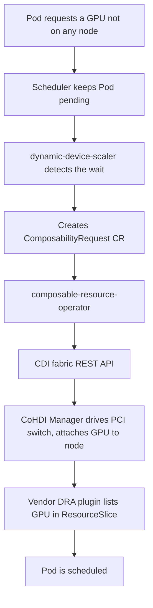

# Architecture

## Big picture

The `composable-resource-operator` is a kubebuilder and controller-runtime operator. `main` (`cmd/main.go:61`) builds one controller-runtime Manager and registers three reconcilers plus one validating webhook on it: `ComposabilityRequestReconciler` (`cmd/main.go:167`), `ComposableResourceReconciler` (`cmd/main.go:176`), `UpstreamSyncerReconciler` (`cmd/main.go:186`), and, unless `ENABLE_WEBHOOKS` is `false` (`cmd/main.go:196`), the webhook via `SetupWebhookWithManager` (`cmd/main.go:197`). The operator sits between a higher-level trigger (a scaler or a user) and a vendor CDI fabric manager that physically switches devices.

The wider data plane, from the org [profile README](https://github.com/CoHDI/.github/blob/main/profile/README.md), works like this:

## Components

### ComposabilityRequest reconciler

The user-facing control loop. `Reconcile` (`internal/controller/composabilityrequest_controller.go:72`) reads a `ComposabilityRequest` (desired count, model, allocation policy) and creates or deletes internal `ComposableResource` objects so the live set matches the request. It runs a state machine (`None` to `NodeAllocating` to `Updating` to `Running`) and watches child `ComposableResource` status changes.

### ComposableResource reconciler

The per-device control loop. `Reconcile` (`internal/controller/composableresource_controller.go:82`) drives one device through `Attaching`, `Online`, `Detaching`. This is the loop that calls the CDI provider to add or remove real hardware and then nudges the GPU stack to notice.

### Upstream syncer

A drift detector. `UpstreamSyncerReconciler` (`internal/controller/upstreamsyncer_controller.go:40`) runs as a background goroutine on a one-minute ticker (`internal/controller/upstreamsyncer_controller.go:61`) and reconciles what the CDI fabric reports against the cluster's `ComposableResource` objects.

### Validating webhook

`ComposabilityRequestCustomValidator` (`internal/webhook/v1alpha1/composabilityrequest_webhook.go:60`) rejects conflicting requests before they are admitted.

### CDI provider layer

`internal/cdi` holds the vendor abstraction. The `CdiProvider` interface (`internal/cdi/client.go:34`) is implemented by Fujitsu FTI_CDI (Composition Manager and Fabric Manager under `internal/cdi/fti`), SNIA Sunfish (`internal/cdi/sunfish`), and NEC (`internal/cdi/nec`).

## How a request flows

Creating a `ComposabilityRequest` for two GPUs flows like this:

1. Admission: the webhook's `validateRequest` (`internal/webhook/v1alpha1/composabilityrequest_webhook.go:100`) rejects a duplicate type and model, or a `target_node` combined with the `differentnode` policy.
2. `ComposabilityRequestReconciler.Reconcile` (`internal/controller/composabilityrequest_controller.go:72`) sees an empty state, so `handleNoneState` (`internal/controller/composabilityrequest_controller.go:197`) adds a finalizer and sets state `NodeAllocating` (`internal/controller/composabilityrequest_controller.go:207`).
3. `handleNodeAllocatingState` (`internal/controller/composabilityrequest_controller.go:213`) picks target nodes per the allocation policy, then moves to `Updating` (`internal/controller/composabilityrequest_controller.go:481`).
4. `handleUpdatingState` (`internal/controller/composabilityrequest_controller.go:487`) creates one `ComposableResource` per desired device and requeues until all report `Online`, at which point it sets `Running` (`internal/controller/composabilityrequest_controller.go:552`).
5. For each `ComposableResource`, `handleAttachingState` (`internal/controller/composableresource_controller.go:209`) calls `adapter.CDIProvider.AddResource(resource)` (`internal/controller/composableresource_controller.go:231`).
6. The child status change is picked up by the parent through a watch (`internal/controller/composabilityrequest_controller.go:684`) filtered by `resourceStatusUpdatePredicate` (`internal/controller/composabilityrequest_controller.go:658`).

The [Internals](./internals) page walks the attach path down into the Fabric Manager HTTP call.

## Key design decisions

- Two-stage reconcile. A request carries "how many plus a policy"; the operator splits it into N single-device objects, each with its own state machine. This isolates per-device failure and retry from the aggregate request.
- Vendor abstraction. The `CdiProvider` interface (`internal/cdi/client.go:34`) hides per-vendor management APIs. `NewComposableResourceAdapter` (`internal/controller/composableresource_adapter.go:40`) picks the implementation from `CDI_PROVIDER_TYPE`, and FTI_CDI further branches on `FTI_CDI_API_TYPE` into Composition Manager or Fabric Manager (`internal/controller/composableresource_adapter.go:63`).
- Drift detection over trust. Rather than assume the cluster and the fabric agree, the upstream syncer re-reads the fabric every minute and reconciles, tracking orphan devices with a grace period before detaching them.

## Extension points

- Two CRDs in API group `cro.hpsys.ibm.ie.com` (`api/v1alpha1/groupversion_info.go:29`): `ComposabilityRequest` (user-facing) and `ComposableResource` (operator-managed).
- The `CdiProvider` interface (`internal/cdi/client.go:34`) is the seam for adding a new hardware backend.
- A validating admission webhook for `ComposabilityRequest`.
- Runtime behaviour is driven by environment variables (`CDI_PROVIDER_TYPE`, `FTI_CDI_API_TYPE`, `DEVICE_RESOURCE_TYPE`, `ENABLE_WEBHOOKS`, and provider endpoints), read in the adapter and `main`.
