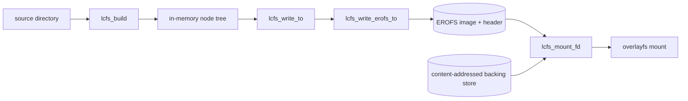

# Architecture

## Big picture

composefs has two halves: a writer that turns a directory tree into an EROFS metadata image, and a mount helper that stacks that image under overlayfs at runtime. The writer lives in `liblcfs` (the `libcomposefs/` directory) and is driven by the `mkcomposefs` tool. The mount path lives in the same library and is driven by `mount.composefs`. Both sides agree on a small composefs-specific header that prefixes the EROFS image (`src/libcomposefs/lcfs-erofs.h:18`).

## Components

### liblcfs writer core (`libcomposefs/lcfs-writer.c`)

Builds and walks the in-memory tree. `lcfs_build` recursively reads a directory into a tree of `lcfs_node_s` nodes (`src/libcomposefs/lcfs-writer.c:1507`). `lcfs_write_to` is the public entry point that validates options, allocates a write context, and dispatches to the EROFS serializer (`src/libcomposefs/lcfs-writer.c:389`). `lcfs_compute_tree` does a breadth-first walk that assigns inode numbers, fixes directory link counts, sorts extended attributes into canonical order, and tracks the minimum mtime (`src/libcomposefs/lcfs-writer.c:176`).

### EROFS serializer (`libcomposefs/lcfs-writer-erofs.c`)

The largest file. `lcfs_write_erofs_to` clones the input tree, rewrites it for overlayfs, computes inode layout, then writes the header, EROFS superblock, inodes, shared xattrs, and data blocks (`src/libcomposefs/lcfs-writer-erofs.c:1385`). Inode sizing and NID (node ID, the EROFS inode locator) assignment happen in `compute_erofs_inodes` (`src/libcomposefs/lcfs-writer-erofs.c:635`).

### Mount helper (`libcomposefs/lcfs-mount.c`)

`lcfs_mount` reads the image header, checks the magic, and dispatches to the EROFS-over-overlay path (`src/libcomposefs/lcfs-mount.c:635`). `lcfs_mount_erofs_ovl` mounts the EROFS image, falling back to a loop device when needed, then stacks overlayfs on top (`src/libcomposefs/lcfs-mount.c:573`).

### On-disk format headers (`libcomposefs/lcfs-erofs.h`, `libcomposefs/erofs_fs.h`)

`lcfs_erofs_header_s` is the composefs-specific header written before the EROFS superblock (`src/libcomposefs/lcfs-erofs.h:18`). `erofs_fs.h` carries the kernel EROFS on-disk structures.

### Tools (`tools/`)

`mkcomposefs` creates images from a directory or a dump file (`src/tools/mkcomposefs.c:1476`). `mount.composefs` is the mount helper invoked by `mount -t composefs` (`src/tools/mountcomposefs.c:100`). `composefs-info` and `composefs-dump` inspect images; `cfs-fuse` offers an optional FUSE (Filesystem in Userspace) mount.

## How a request flows

Creating an image with `mkcomposefs <dir> <out.cfs>`:

1. `mkcomposefs` builds the tree with `lcfs_build`, deliberately clearing the digest and inline flags and setting `LCFS_BUILD_NO_INLINE` so digesting and inlining can be parallelized afterwards (`src/tools/mkcomposefs.c:1687`, call at `src/tools/mkcomposefs.c:1692`).

2. `lcfs_build` reads the directory with `readdir`, recurses into subdirectories, loads each entry into a node, and links it to its parent with `lcfs_node_add_child` (loop at `src/libcomposefs/lcfs-writer.c:1542`, recursion at `src/libcomposefs/lcfs-writer.c:1575`, attach at `src/libcomposefs/lcfs-writer.c:1596`).

3. The tool computes digests and, if `--digest-store` was given, fills the content-addressed store (`src/tools/mkcomposefs.c:1699`, `src/tools/mkcomposefs.c:1702`).

4. It sets `options.format = LCFS_FORMAT_EROFS` and calls `lcfs_write_to` (`src/tools/mkcomposefs.c:1714`, `src/tools/mkcomposefs.c:1718`).

5. `lcfs_write_to` validates options, creates the context, and calls `lcfs_write_erofs_to` for the EROFS format (`src/libcomposefs/lcfs-writer.c:419`).

6. `lcfs_write_erofs_to` clones the tree, rewrites it for overlayfs, runs `lcfs_compute_tree`, computes shared xattrs and inode layout, then writes header, superblock, inodes, and data (`src/libcomposefs/lcfs-writer-erofs.c:1403` onward).

The mirror operation, `mount.composefs <image> -o basedir=<store> <mnt>`, opens the image and calls `lcfs_mount_fd` (`src/tools/mountcomposefs.c:255`), which reaches `lcfs_mount`, checks the header magic against `LCFS_EROFS_MAGIC`, and hands off to `lcfs_mount_erofs_ovl` (`src/libcomposefs/lcfs-mount.c:653`).

## Key design decisions

The central decision is that composefs stores no data of its own; the EROFS image is metadata only, and file content lives in an external content-addressed store referenced through `trusted.overlay.redirect` (`src/README.md:14-49`, `src/libcomposefs/lcfs-internal.h:50`). This is what lets unrelated images share content on disk and in the page cache (`src/README.md:70-77`).

The second is reproducibility. The writer always clones the input tree before mutating it for EROFS, so the caller's tree is never altered (`src/libcomposefs/lcfs-writer-erofs.c:1403`). It aggregates the minimum mtime across the tree and uses that as the EROFS `build_time`, so the same input produces the same bytes (`src/libcomposefs/lcfs-writer.c:225`, used at `src/libcomposefs/lcfs-writer-erofs.c:1444`).

The third is verification. fs-verity digests of content files are stored in `trusted.overlay.metacopy`, so overlayfs verifies content at use time, and the image itself can be sealed with its own fs-verity digest passed as a mount option (`src/README.md:78-95`).

## Extension points

composefs is a library plus tools rather than a plugin host. The integration surface is the C API in `libcomposefs/lcfs-writer.h` (build a node tree, then `lcfs_write_to`) and the `mount.composefs` helper. Language bindings build on these: a Rust crate (`composefs-rs`) and Go wrappers in containers/storage that shell out to `mkcomposefs` (`src/README.md:174-185`).
