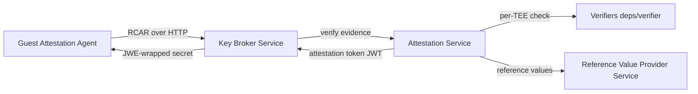

# Architecture

## Big picture

Trustee is the relying-party side of Confidential Containers. It receives hardware evidence from a guest, decides whether that guest is a genuine Trusted Execution Environment (TEE), and releases secrets only to guests that pass. It is a Cargo workspace whose members are listed in `src/Cargo.toml:2`: the Key Broker Service (`kbs`), the Attestation Service (`attestation-service`), the Reference Value Provider Service (`rvps`), the per-TEE verifiers under `deps/verifier`, and client tooling under `tools`.

The trust model splits two jobs that are easy to conflate. One job is evaluating hardware evidence (the verifier role in the Remote ATtestation procedureS, or RATS, architecture). The other job is releasing secrets (the relying-party role). The KBS is the relying party; it does not check hardware signatures itself. It delegates evidence evaluation to the Attestation Service, which returns a signed attestation token, and the KBS then re-checks that token before releasing anything.

## Components

### Key Broker Service (KBS)

The KBS lives in `src/kbs` and is the HTTP front end. It exposes the RCAR handshake endpoints, the secret-delivery plugins, and the Rego policy gate. Its binary entry point is `main` in `src/kbs/src/bin/kbs.rs:22`, which reads the configuration with `KbsConfig::try_from` (`src/kbs/src/bin/kbs.rs:64`), builds an `ApiServer` with `ApiServer::new` (`src/kbs/src/bin/kbs.rs:68`), and runs it with `serve` (`src/kbs/src/bin/kbs.rs:70`). The actual HTTP server is built in `ApiServer::server` (`src/kbs/src/api_server.rs:147`).

### Attestation Service (AS)

The AS verifies hardware evidence and issues an attestation token, a JSON Web Token (JWT). It is implemented in `src/attestation-service` with the per-TEE verifiers in `deps/verifier`. The KBS reaches it through the `Attest` trait (`src/kbs/src/attestation/backend.rs:89`), so the AS can be a built-in crate, a remote gRPC service, or Intel Trust Authority. `AttestationService::new` selects the backend in a match (`src/kbs/src/attestation/backend.rs:151`).

### Reference Value Provider Service (RVPS)

The RVPS lives in `src/rvps`. It stores the expected measurements (reference values) that the AS compares hardware evidence against. The AS asks the RVPS for these values during verification.

### Client tooling

`src/tools` holds `kbs-client` and `trustee-cli`, used to administer the KBS (set policies, upload resources) and to test attestation flows. The guest-side counterparts (the Attestation Agent and Confidential Data Hub) live in the separate [guest-components](https://github.com/confidential-containers/guest-components) repository.

## How a request flows

A guest obtaining a secret drives the RCAR handshake followed by a resource fetch. Every request hits a single catch-all actix-web route. `ApiServer::server` registers `web::resource([kbs_path!("{path:.*}")])` (`src/kbs/src/api_server.rs:172`) and binds GET, POST, PUT, and DELETE to one `api` handler. The route prefix is `const KBS_PREFIX: &str = "/kbs/v0";` (`src/kbs/src/api_server.rs:33`). The `api` handler (`src/kbs/src/api_server.rs:211`) splits the path on `/` and treats the first segment as the plugin name (`let plugin = path_parts[0];`, `src/kbs/src/api_server.rs:230`), then matches on it (`src/kbs/src/api_server.rs:247`).

1. **POST `/kbs/v0/auth`**: the `auth` match arm (`src/kbs/src/api_server.rs:249`) calls `AttestationService::auth` (`src/kbs/src/attestation/backend.rs:233`), which delegates to `__auth` (`src/kbs/src/attestation/backend.rs:239`). It deserializes the body into a `kbs_types::Request`, checks the client's protocol version against `VERSION_REQ` (`src/kbs/src/attestation/backend.rs:248`), generates a 32-byte nonce via `generate_challenge` (`src/kbs/src/attestation/backend.rs:257`), creates an `Authed` session, sets the `kbs-session-id` cookie, and persists it with `session_map.insert` (`src/kbs/src/attestation/backend.rs:272`).
2. **POST `/kbs/v0/attest`**: the `attest` match arm (`src/kbs/src/api_server.rs:255`) calls `AttestationService::attest` (`src/kbs/src/attestation/backend.rs:277`), which delegates to `__attest` (`src/kbs/src/attestation/backend.rs:283`). It loads the session from the cookie, deserializes the body into a `kbs_types::Attestation`, and rejects replays with a nonce check (`src/kbs/src/attestation/backend.rs:344`). It assembles the evidence and calls `self.inner.verify(evidence_to_verify)` (`src/kbs/src/attestation/backend.rs:404`), delegating to the AS. On success it moves the session to `Attested` with `session.attest(token)` (`src/kbs/src/attestation/backend.rs:425`) and returns the token.
3. **GET `/kbs/v0/resource/...`**: any path that is not a built-in name falls through to the plugin arm (`src/kbs/src/api_server.rs:378`). For token-gated plugins, the handler fetches the token with `get_attestation_token` (`src/kbs/src/api_server.rs:403`), verifies the JWT with `token_verifier.verify` (`src/kbs/src/api_server.rs:407`), then evaluates the Rego rule `data.policy.allow` with `evaluate_rego` (`src/kbs/src/api_server.rs:415`). A false result returns `Error::PolicyDeny` (`src/kbs/src/api_server.rs:441`). On allow, the plugin runs, and if the plugin marks the response encrypted, the handler extracts the guest's public key and wraps the secret with `jwe` (`src/kbs/src/api_server.rs:455`) so only the target CVM can decrypt it.

## Key design decisions

The KBS never verifies hardware evidence directly. Verification is delegated to a swappable `Attest` backend chosen in `AttestationService::new` (`src/kbs/src/attestation/backend.rs:151`), and the hinge of trust becomes the attestation token (a JWT) the AS issues. The KBS only re-verifies that JWT later with its `token_verifier`. This is the RATS background-check and passport split made concrete: secret delivery (relying party) is kept separate from evidence evaluation (verifier).

Every endpoint goes through one catch-all route plus a first-path-segment dispatch (`src/kbs/src/api_server.rs:172` and `src/kbs/src/api_server.rs:230`). The names `auth`, `attest`, `attestation-policy`, `reference-value`, and `resource-policy` are built in; anything else is served through the `PluginManager`. Resource fetches and secret delivery both pass the same single gate of attestation token plus Rego policy.

Sessions are persisted through a key-value storage abstraction with `serde_json` (`src/kbs/src/attestation/session.rs:120`), so the backend can be in-memory or external. A background task spawned in `AttestationService::new` runs `cleanup_expired` every 60 seconds (`src/kbs/src/attestation/backend.rs:187`).

## Extension points

- **Attestation backends**: implement the `Attest` trait (`src/kbs/src/attestation/backend.rs:89`) to plug in a built-in, gRPC, or Intel Trust Authority verifier.
- **Per-TEE verifiers**: implement the `Verifier` trait (`src/deps/verifier/src/lib.rs:218`) whose `evaluate` method (`src/deps/verifier/src/lib.rs:248`) checks one TEE type's hardware evidence.
- **Resource and secret plugins**: implement the `ClientPlugin` trait (`src/kbs/src/plugins/plugin_manager.rs:26`) to add a secret-delivery endpoint behind the same attestation and policy gate.
