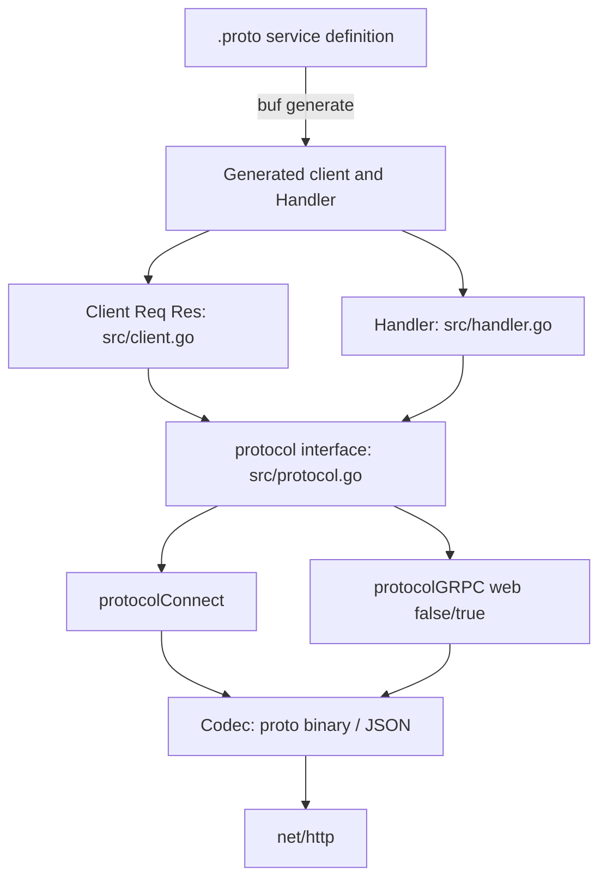

# Architecture

## Big picture

Connect is a library, not a server binary. It has no `func main`; the entry points are a generated `http.Handler` on the server and a generated client on the caller. Around those, a small set of types carries every RPC: a `Client` and a `Handler` sit at the edges, a `protocol` abstraction hides the wire format, a `Codec` marshals the payload, and an `Interceptor` chain wraps the call. The design keeps all transport on `net/http`, so the same `http.Server` and `http.Client` a Go service already uses carry the RPC.

## Components

### Client (`src/client.go`)

`Client[Req, Res]` (`src/client.go:34`) is a reusable, concurrency-safe client for one procedure. It exposes four methods matching the four RPC shapes: `CallUnary`, `CallClientStream`, `CallServerStream`, and `CallBidiStream`. `NewClient` builds a `clientConfig` from options (`src/client.go:42`) and creates the protocol client (`src/client.go:50`).

### Handler (`src/handler.go`)

`Handler` (`src/handler.go:28`) is the server-side implementation of one RPC. It implements `ServeHTTP` (`src/handler.go:259`), so it is a plain `http.Handler` that drops into any mux. Constructors such as `NewUnaryHandler` wrap the user's function.

### Protocol abstraction (`src/protocol.go`)

The `protocol` interface (`src/protocol.go:66`) has three implementations: `protocolConnect` (`src/protocol_connect.go`), `protocolGRPC{web:false}`, and `protocolGRPC{web:true}` (`src/protocol_grpc.go`). Each produces the handler and client machinery for its wire format. This is the seam that lets one server speak three protocols.

### Codec (`src/codec.go`)

The `Codec` interface (`src/codec.go:35`) marshals and unmarshals the message body. Two codecs ship: `protoBinaryCodec` (`src/codec.go:94`) for Protobuf binary and `protoJSONCodec` (`src/codec.go:146`) for JSON. JSON is what lets a browser or `curl` speak to a Connect handler.

### Envelope, Interceptor, Error

`envelope` (`src/envelope.go:45`) is the wire unit for streaming and gRPC: a 5-byte prefix (1 byte of flags plus a 4-byte length) followed by the body (`src/envelope.go:41-44`). `Interceptor` (`src/interceptor.go`) is the middleware chain wrapping unary and streaming calls. `Error` (`src/error.go:124`) and `Code` (`src/code.go:32`) carry a gRPC-compatible status code system.

## How a request flows

Trace a unary client call end to end.

1. `NewClient` builds `clientConfig` from options (`src/client.go:42`). The defaults are the Connect protocol, the Protobuf binary codec, and a gzip-acceptance request (`src/client.go:333-339`). It then creates the protocol client (`src/client.go:50`).
2. To avoid work on the hot path, interceptors are applied once at client creation rather than on every call (`src/client.go:75-110`). The body is `unaryFunc`: it opens a connection with `protocolClient.NewConn` (`src/client.go:79`), sends with `conn.Send(request.Any())` (`src/client.go:91`), calls `conn.CloseRequest()` (`src/client.go:96`), and reads the reply with `receiveUnaryResponse[Res]` (`src/client.go:100`).
3. `CallUnary` just delegates to `c.callUnary` (`src/client.go:149-154`). `callUnary` fills in spec, peer, and headers (`src/client.go:115-117`) and invokes the interceptor-wrapped `unaryFunc` (`src/client.go:135`).
4. `receiveUnaryResponse` reads exactly one message, then reads again and, if that is not EOF, returns a `CodeUnimplemented` error saying "unary response has multiple messages". This enforces the unary cardinality rule (`src/connect.go:433-499`).
5. On the server, `Handler.ServeHTTP` indexes the protocol handlers by HTTP method (`src/handler.go:274`) and selects the one whose `CanHandlePayload` matches the `Content-Type` (`src/handler.go:285-290`). For a GET it verifies there is no body (`src/handler.go:297-312`). It establishes the stream with `protocolHandler.NewConn` (`src/handler.go:324`), runs `h.implementation(ctx, connCloser)`, and closes the connection (`src/handler.go:337`).
6. For a unary handler, the `implementation` closure receives one message with `receiveUnaryRequest` (`src/handler.go:69`), pushes `handlerCallInfo` onto the context (`src/handler.go:75-81`), calls the interceptor-wrapped `untyped` function (`src/handler.go:82`), and sends the reply with `conn.Send(response.Any())` (`src/handler.go:101`).

## Key design decisions

The defining decision is to live entirely inside `net/http`. Connect ships no bespoke HTTP implementation, no name resolution, and no load-balancing API; the client-side dependency it needs is the `HTTPClient` interface with a single `Do` method (`src/connect.go:325-327`). This makes standard Go servers, clients, and middleware work unchanged, at the cost of leaving load balancing and service discovery to the surrounding infrastructure.

The second decision is one server, three protocols. When a handler is built, Connect always constructs the Connect, gRPC, and gRPC-Web handlers up front (`src/handler.go:385-389`) and picks one per request by method plus `Content-Type` (`src/handler.go:274-290`). A client switches protocol with a single option, `WithGRPC` or `WithGRPCWeb`.

The third is the hot-path optimization noted in the code: "Rather than applying unary interceptors along the hot path, we can do it once at client creation" (`src/client.go:75-76`).

## Extension points

- `Interceptor` (`src/interceptor.go`): the middleware chain for cross-cutting behavior on unary and streaming calls.
- `Codec` (`src/codec.go:35`): register a codec for a content sub-type beyond the built-in Protobuf binary and JSON.
- `Compressor` and `Decompressor` options: negotiate compression algorithms (gzip is the default request in `src/client.go:333-339`).
- Options such as `WithGRPC`, `WithGRPCWeb`, and `WithHTTPGet` select protocol and transport behavior per client or handler.
