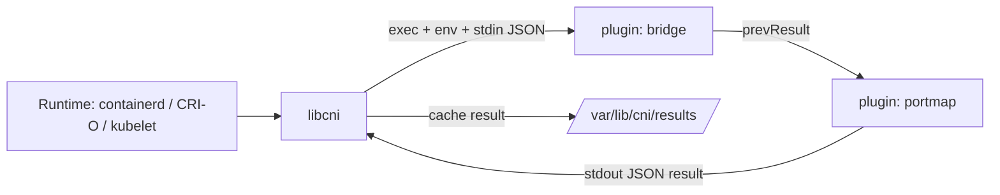

# Architecture

## Big picture

CNI splits into two roles that the code keeps strictly apart. On one side is the runtime (the consumer): it embeds `libcni`, reads a network configuration, and drives a chain of plugins. On the other side is the plugin (the provider): a standalone executable that receives intent and reports a result. There is no shared address space between them. The library invokes a binary, sets `CNI_*` environment variables, writes the network config as JSON to the plugin's stdin, and reads the result JSON back from stdout.

## Components

### libcni (runtime side)

`libcni` is the actual implementation of the CNI spec and is bundled into runtime providers such as containerd or CRI-O before they call runc or hcsshim (`libcni/api.go:17-21`). It parses the on-disk configuration, resolves and executes plugin binaries, caches results, and reconciles spec-version differences. Configuration enters through `NetworkConfFromBytes`, which unmarshals a conflist and builds the `Plugins` chain (`libcni/conf.go:92`).

### pkg/skel (plugin side)

`pkg/skel` is the skeleton a plugin binary links to. `pluginMain` reads the command from the environment, validates it, and dispatches to the plugin's callbacks for ADD, DEL, CHECK, GC, and STATUS (`pkg/skel/skel.go:232`, `pkg/skel/skel.go:245`). It also enforces basic invariants, such as rejecting a config with no network name (`pkg/skel/skel.go:216-229`).

### pkg/invoke (the wire)

`pkg/invoke` is the transport between the two sides. `Args.AsEnv` turns a call into the `CNI_COMMAND`, `CNI_CONTAINERID`, `CNI_NETNS`, `CNI_IFNAME`, `CNI_ARGS`, and `CNI_PATH` variables (`pkg/invoke/args.go:56-73`). `RawExec.ExecPlugin` runs the binary with the config on stdin (`pkg/invoke/raw_exec.go:34-41`), and `ExecPluginWithResult` reads stdout and turns it into a typed result (`pkg/invoke/exec.go:121-137`).

## How a request flows

An ADD over a conflist chain runs as follows.

1. `AddNetworkList` iterates `list.Plugins` in order, passing each plugin's result as the next plugin's `prevResult` (`libcni/api.go:515`).
2. For each plugin, `addNetwork` resolves the binary with `FindInPath`, then validates the container ID, network name, and interface name (`libcni/api.go:490-504`).
3. `buildOneConfig` injects `name`, `cniVersion`, and `prevResult` into the config, and `injectRuntimeConfig` adds only the capability arguments the plugin actually advertises (`libcni/api.go:155-191`).
4. `ExecPluginWithResult` runs the binary; `RawExec.ExecPlugin` starts it with `CommandContext`, the config on stdin, and the `CNI_*` env (`libcni/api.go:511`, `pkg/invoke/raw_exec.go:34-41`).
5. The plugin side receives the call in `pluginMain`, switches on `CNI_COMMAND`, and calls the registered `Add` function (`pkg/skel/skel.go:245`).
6. After the chain succeeds, `cacheAdd` writes the result to `/var/lib/cni/results/<net>-<container>-<if>` for later CHECK, DEL, and GC (`libcni/api.go:519-527`, `libcni/api.go:252-257`).

DEL walks the same chain in reverse order (`libcni/api.go:603`). GC and STATUS only fire when the config's CNI version is at least 1.1.0 (`libcni/api.go:818`, `libcni/api.go:857`).

## Key design decisions

The contract is a process boundary, not a Go interface. That is why plugins can be written in any language and shipped independently of the runtime. The cost is that every call is an `exec` with JSON serialization.

Version negotiation is deliberately forgiving. When a plugin returns a result with an empty `cniVersion`, the spec technically means 0.1.0, but `fixupResultVersion` instead assumes the result matches the config version, with a comment pointing at issue #895 (`pkg/invoke/exec.go:39-78`). The result package then registers up- and down-converters for every version from 0.1.0 to 1.1.0 in `init`, so a chain's `prevResult` can always be normalized to the config version (`pkg/types/100/types.go:34-53`).

## Extension points

The plugin executable is the primary extension point. Anyone can implement ADD, DEL, CHECK, GC, and STATUS against `pkg/skel` and drop the binary into a directory on `CNI_PATH`. Configuration is also extensible through capabilities: a runtime passes `CapabilityArgs`, and the library forwards only the keys a plugin declares it supports (`libcni/api.go:191`). Reference implementations of common plugins (bridge, host-local, macvlan, portmap) live in [containernetworking/plugins](https://github.com/containernetworking/plugins).
