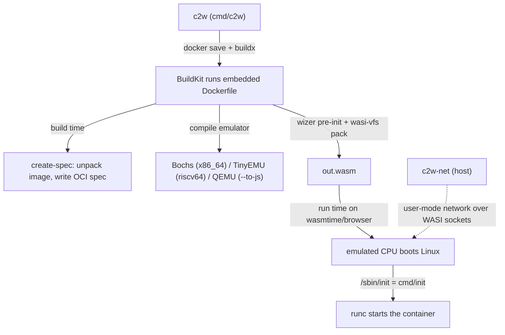

# Architecture

## Big picture

container2wasm has two sides. At build time a thin Go CLI (`c2w`) drives a large embedded Dockerfile through BuildKit; that Dockerfile compiles a CPU emulator to WebAssembly, unpacks the source container image into a root filesystem, generates an OCI runtime spec, and packs everything into one `.wasm` file. At run time that `.wasm` file is the emulator: a WASI runtime or browser executes it, the emulated CPU boots Linux, and an in-guest init process starts the container with runc. The Go host code is small. The real converter is the Dockerfile embedded into the binary (`embed.go:5-6`).

## Components

### Conversion CLI: `cmd/c2w`

The user-facing binary. `main()` is at `cmd/c2w/main.go:23` and the work happens in `rootAction` at `cmd/c2w/main.go:94`. It locates the `--builder` (default `docker`) with `exec.LookPath` (`cmd/c2w/main.go:119`), checks for `docker buildx` and falls back to legacy build if absent (`cmd/c2w/main.go:124`), writes the embedded Dockerfile to a temp file, and invokes `docker buildx build`. The CLI is a translator: it turns its flags into buildx arguments.

### Build-time spec generator: `cmd/create-spec`

Runs inside the build, in the guest, to prepare what runc will need. `main` is at `cmd/create-spec/main.go:34`. It unpacks the OCI image into a root filesystem (`cmd/create-spec/main.go:85`) and, in `createSpec` (`cmd/create-spec/main.go:278`), writes `spec.json`, `image.json`, and `initconfig.json` that are collected under `/pack`.

### Run-time init: `cmd/init`

Runs inside the emulated Linux as PID 1. `doInit` is at `cmd/init/main.go:39`. It reads `/oci/initconfig.json` (`cmd/init/main.go:44`), mounts the rootfs and pack over 9p (`cmd/init/main.go:88`), parses runtime flags the host passes in an `info` file (`cmd/init/main.go:422`), patches the OCI spec (`cmd/init/main.go:490`), and finally `exec`s runc. On exit it calls `poweroff -f` (`cmd/init/main.go:313`).

### Host network stack: `cmd/c2w-net`

WASI has no sockets, so networking is bridged from the host. `c2w-net` provides a user-mode virtual network using `gvisor-tap-vsock` (`cmd/c2w-net/main.go:15-17`), with a gateway at `192.168.127.1` and the VM at `192.168.127.3` (`cmd/c2w-net/main.go:21-23`). In the browser, an in-Wasm proxy (`extras/c2w-net-proxy`) uses Fetch and WebSocket instead.

### The embedded Dockerfile: `embed.go`

`//go:embed Dockerfile` pulls the 1064-line Dockerfile into the binary (`embed.go:5-6`). This is the actual converter. The final stage `FROM wasi-$TARGETARCH` (`Dockerfile:1064`) selects the emulator path: `wasi-amd64` is the Bochs path (`Dockerfile:1037`) and `wasi-riscv64` is the TinyEMU path (`Dockerfile:342`).

## How a request flows

Tracing `c2w ubuntu:22.04 out.wasm` end to end:

1. `rootAction` (`cmd/c2w/main.go:94`) sorts out the output path and architecture, then locates the builder (`cmd/c2w/main.go:119`) and probes for buildx (`cmd/c2w/main.go:124`).
2. `prepareSourceImg` (`cmd/c2w/main.go:172`, body at `cmd/c2w/main.go:319`) runs `docker save` (`cmd/c2w/main.go:364`), extracts the tar into a temp dir with `archive.Apply` (`cmd/c2w/main.go:376`), and touches every file's mtime so BuildKit prefers it over cache (`cmd/c2w/main.go:385`).
3. `build` (`cmd/c2w/main.go:181`) writes the embedded Dockerfile out (`cmd/c2w/main.go:200`) and runs `docker buildx build ... --output type=local,dest=<dir>` (`cmd/c2w/main.go:249`). With no `--target`, the Dockerfile's final stage is built.
4. The final stage `FROM wasi-$TARGETARCH` (`Dockerfile:1064`) resolves by architecture: the CLI default `target-arch=amd64` selects `wasi-amd64` (Bochs, `Dockerfile:1037`); `riscv64` selects `wasi-riscv64` (TinyEMU, `Dockerfile:342`).
5. During the build, the `bundle-dev` stage (`Dockerfile:93`) compiles and runs `create-spec` (`Dockerfile:104`, `Dockerfile:121`), which unpacks the image and writes the OCI spec and boot config into `/pack`.
6. The emulator is compiled with the wasi-sdk clang: TinyEMU at `Dockerfile:302`, Bochs at `Dockerfile:1019`.
7. wizer pre-initializes the emulator: `Dockerfile:313` (TinyEMU) and `Dockerfile:1029` (Bochs) run `wizer ... -r _start=wizer.resume --mapdir /pack::/pack`, snapshotting the booted state.
8. `wasi-vfs pack` embeds `/pack` into the wasm as one file (`Dockerfile:317`, `Dockerfile:1033`) and renames it to `OUTPUT_NAME`, default `out.wasm` (`Dockerfile:319`).
9. At run time (`wasmtime out.wasm uname -a`), the wasm is the emulator. The emulated CPU boots Linux, `/sbin/init` (`cmd/init`) runs, mounts rootfs and pack over 9p (`cmd/init/main.go:88`), applies the host's runtime flags (`cmd/init/main.go:490`), and `exec`s runc to start the container.

## Key design decisions

- **Emulate the CPU, not the application.** Rather than porting workloads to a Wasm target, container2wasm compiles a system emulator to Wasm and runs a real Linux plus runc inside it. This keeps OCI images unmodified at the cost of emulation speed. Non-x86_64 and non-riscv64 images run through a further binfmt + QEMU layer inside the guest, which is slower still.
- **Pre-boot with wizer.** Cold-booting a Linux kernel on every run would be slow. The build uses Bytecode Alliance's wizer to boot the emulator once and snapshot the entire linear memory into the module, so run time resumes from a booted state. This is the default `OPTIMIZATION_MODE=wizer` (`Dockerfile:29`); `native` boots every time. See [Internals](./internals) for the handshake this requires.
- **The converter is a Dockerfile.** Putting the pipeline in an embedded Dockerfile (`embed.go:5-6`) means BuildKit provides caching, multi-stage builds, and the cross-language toolchain (clang, Emscripten, wasi-sdk) for free. The Go CLI stays a thin front end.
- **Bridge networking off-Wasm.** WASI has no sockets, so `c2w-net` runs on the host and provides a user-mode network with gvisor-tap-vsock (`cmd/c2w-net/main.go:15-17`); the browser build uses an in-Wasm Fetch/WebSocket proxy instead.

## Extension points

- **WASI runtimes.** The output runs on wasmtime, WasmEdge, wamr, wasmer, and wazero.
- **Directory mapping.** A host directory passed with `--mapdir` is exposed through the WASI filesystem API and mounted into the guest over virtio-9p.
- **External bundles.** `extras/imagemounter` (`imagemounter.wasm`) supplies an external OCI bundle to the guest over 9p at run time.
- **Browser network proxy.** `extras/c2w-net-proxy` (`c2w-net-proxy.wasm`) runs inside the browser to bridge networking via Fetch and WebSocket.

## Sources

1. container2wasm source at commit [`74662a2`](https://github.com/container2wasm/container2wasm/commit/74662a2160241e31bbc3b74c7a4f7cf6ea9cfedd), accessed 2026-06-26.
2. [container2wasm README](https://github.com/container2wasm/container2wasm/blob/main/README.md), accessed 2026-06-26.
3. [Kohei Tokunaga, "container2wasm Converter" (nttlabs/Medium)](https://medium.com/nttlabs/container2wasm-2dd90a18cc9a), accessed 2026-06-26.
