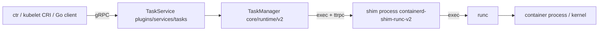

# Architecture

## Big picture

containerd runs as a single daemon that publishes its services over gRPC, by default on the UNIX socket `/run/containerd/containerd.sock`. The daemon is a set of plugins. Domain logic lives under `core/` (content store, images, snapshots, diff, containers, runtime, metadata, remotes, sandbox, leases, mount, transfer). The code that exposes that logic as gRPC services or as the Kubernetes CRI lives under `plugins/`. A client connects either with the Go SDK under `client/` or, for Kubernetes, through the kubelet talking to the CRI socket.

The defining choice is that containerd does not run containers in its own process. It launches a separate shim process per container (or pod sandbox), and the shim drives the OCI runtime (runc by default). The daemon and the shim talk over ttrpc, a lighter gRPC variant.

## Components

### containerd daemon (`cmd/containerd`)

The daemon entry point is `cmd/containerd/main.go:28`. It builds the CLI app and runs it. Which plugins are compiled in is decided by a side-effect import of `cmd/containerd/builtins` at `cmd/containerd/main.go:24`. That import set selects the CRI plugin, the snapshotters, and the other services that register at startup.

### core domain logic (`core/`)

`core/` holds the runtime-independent logic: the content-addressable blob store (`content`), image and layer handling (`images`, `snapshots`, `diff`), container metadata (`containers`), registry pull and push (`remotes`), persistence over bolt (`metadata`), and the task/shim runtime abstraction (`runtime`).

### gRPC and CRI plugins (`plugins/`)

`plugins/services/*` wire core packages into gRPC services. `plugins/services/tasks` is the task service that handles container execution. `plugins/cri` implements the Kubernetes CRI on top of the same core. Snapshotter and content plugins live here too.

### shim (`cmd/containerd-shim-runc-v2`)

The shim is a separate binary that the daemon execs once per container or sandbox. It stays resident, owns the container's runc process, and serves a ttrpc API back to the daemon. The runtime-v2 contract is documented in the [runtime-v2 README](https://github.com/containerd/containerd/blob/main/core/runtime/v2/README.md).

## How a request flows

Tracing a task creation (`ctr run`, or a kubelet CRI call) end to end:

1. The gRPC task service receives the call at `plugins/services/tasks/local.go:171`. It loads container metadata and assembles a `runtime.CreateOpts` at `plugins/services/tasks/local.go:239`, then calls the v2 runtime at `plugins/services/tasks/local.go:277`.
2. The TaskManager handles it at `core/runtime/v2/task_manager.go:159`. It writes an OCI bundle to disk with `NewBundle` at `core/runtime/v2/task_manager.go:160`, then activates the rootfs mounts at `core/runtime/v2/task_manager.go:189`.
3. It starts the shim at `core/runtime/v2/task_manager.go:213`, which lands in `core/runtime/v2/shim_manager.go:299`. The shim manager resolves the runtime name to a binary path at `core/runtime/v2/shim_manager.go:311` and builds a shim binary handle at `core/runtime/v2/shim_manager.go:316`.
4. The shim binary is exec'd at `core/runtime/v2/binary.go:66` with `Action: "start"` (`core/runtime/v2/binary.go:80`). containerd parses the address the shim prints, dials it over ttrpc at `core/runtime/v2/binary.go:138`, and writes `bootstrap.json` for later recovery at `core/runtime/v2/binary.go:144`.
5. Back in the TaskManager, the connected shim is wrapped at `core/runtime/v2/task_manager.go:220` and the actual create RPC is sent over ttrpc at `core/runtime/v2/task_manager.go:232`. The shim then has runc create the container.

## Key design decisions

The shim-per-container model is the central trade-off. By keeping each container's shim and runc process out of the daemon, containerd can restart or be upgraded without killing running containers; on reconnect it restores shim state from `bootstrap.json` via `restoreBootstrapParams` (`core/runtime/v2/shim_manager.go:343`). When a shim dies, the daemon cleans up and emits a task-exit event through `cleanupAfterDeadShim`, registered as the on-close callback at `core/runtime/v2/shim_manager.go:326`. Using ttrpc rather than gRPC for the daemon-shim channel keeps per-shim memory small.

The plugin model is the other. Every subsystem is a `plugin.Registration` (`vendor/github.com/containerd/plugin/plugin.go:61`) with a `Requires []Type` dependency list, so the daemon resolves a dependency order and wires a minimal core with replaceable parts around it.

## Extension points

- OCI runtimes through the runtime-v2 shim contract: runc, crun, gVisor, Kata, Firecracker, runwasi all plug in by implementing or configuring a shim.
- Snapshotters: overlayfs, devmapper, zfs, btrfs, and lazy-pull snapshotters such as stargz and SOCI.
- The CRI plugin for Kubernetes, and the Go client SDK for building on the daemon directly.
- The `plugin.Registration` interface itself, for compiling in custom services.
