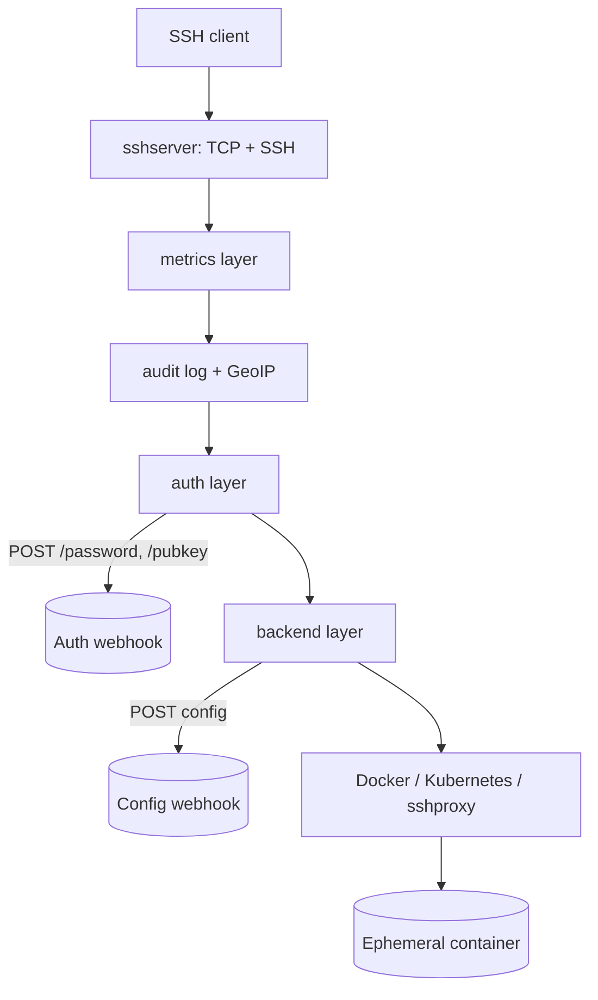

# Architecture

## Big picture

ContainerSSH is a single Go binary. Its entry point `cmd/containerssh/main.go` calls `containerssh.Main()`, whose real body is `Main()` at the repository root (`main.go:26`). The interesting part is how one SSH connection is served. The server is built as a stack of handlers wrapped around each other like nesting dolls. `New()` (`factory.go:22`) assembles them from the inside out, and each layer implements the same `sshserver.Handler` contract while wrapping the layer inside it.

The assembly order is fixed (`factory.go:54-78`), innermost first:

1. `createBackend` (`factory.go:54`, `backend.New`): the innermost layer that picks the container backend (docker, kubernetes, or sshproxy).
2. `createAuthHandler` (`factory.go:59`, `authintegration.New`): the layer that calls the authentication webhook.
3. `createAuditLogHandler` (`factory.go:64`, `auditlogintegration.New`): audit logging and GeoIP.
4. `createMetricsBackend` (`factory.go:69`, `metricsintegration.NewHandler`): Prometheus metrics.
5. `createSSHServer` (`factory.go:74`, `sshserver.New`): the outermost layer that actually listens for TCP and speaks SSH.

A request travels from the outside (SSH) inward (backend). When the SSH server accepts a connection, `Handler.OnNetworkConnection` (`internal/sshserver/handler.go:30`) fires, and each layer returns a `NetworkConnectionHandler` (`internal/sshserver/handler.go:97`) that chains to the next.

## Components

### SSH server layer

`sshserver` (`internal/sshserver/`) is the outermost layer. It owns the TCP listener and the SSH protocol, and it defines the handler interfaces every other layer implements: `Handler`, `NetworkConnectionHandler`, and the session-channel handler (`internal/sshserver/handler.go:19`, `:97`). Everything below it is expressed as an implementation of these interfaces.

### Authentication layer

The auth integration layer (`internal/auth/`) sits between the SSH server and the backend. On a login attempt it POSTs to an external webhook and translates the reply into a three-valued verdict (see below). Built-in OAuth2 / OIDC and Kerberos implementations also live here (`internal/auth/oauth2_oidc.go`, `internal/auth/kerberos.go`).

### Backend layer

The backend layer (`internal/backend/`) is the innermost handler. It holds the connection and delegates to a concrete container backend. `backend.networkHandler` (`internal/backend/handler.go:52`) keeps the connection and its chosen backend (`backend sshserver.NetworkConnectionHandler`), and centralises `OnDisconnect` and `OnShutdown`. The concrete backends are `internal/docker/`, `internal/kubernetes/`, and `internal/sshproxy/`.

### Configuration

`config.AppConfig` (`config/appconfig.go:11`) is the root of all configuration. It bundles `SSH`, `ConfigServer`, `Auth`, `Audit`, `Security`, `Backend`, `Docker`, `Kubernetes`, and `SSHProxy`. Some of it is what the per-connection config webhook overrides at runtime.

## How a request flows

Trace one connection into a Docker container.

1. The SSH handshake completes and control reaches the backend layer's `OnHandshakeSuccess` (`internal/backend/handler.go:96`). This is where the connection's real configuration is decided.
2. `loadConnectionSpecificConfig` (`internal/backend/handler.go:179`) calls the config webhook and merges its reply onto the base configuration. The HTTP call itself is `httpLoader.LoadConnection` (`internal/config/loader_http.go:37`), which does a `client.Get` and layers the returned `AppConfig` with `structutils.Merge` (`internal/config/loader_http.go:42-49`).
3. `getConfiguredBackend` (`internal/backend/handler.go:139`) reads the resulting `appConfig.Backend` string (`docker`, `kubernetes`, or `sshproxy`) and constructs the matching backend.
4. `security.New` (`internal/backend/handler.go:130`) always wraps a security overlay around that backend before returning it.
5. For the Docker backend, `OnHandshakeSuccess` (`internal/docker/handler_network.go:52`) sets up the Docker client, pulls the image, and (in connection mode) creates and starts one container for the connection (`internal/docker/handler_network.go:88-95`).
6. When the client opens a session channel, the Docker backend returns a channel handler (`internal/docker/handler_ssh.go:33`) and a `shell`/`exec` request runs a program inside the container (see [Internals](./internals)).
7. On disconnect, `networkHandler.OnDisconnect` (`internal/docker/handler_network.go:164`) removes the container. That is the mechanism behind "logging out destroys everything."

## Key design decisions

- **Authentication and per-connection configuration are HTTP webhooks, not config.** The server has no user database and no per-user config file. It POSTs to your auth webhook and to your config webhook, so a single deployment can route different users to different backends and images with all the logic living in your service. The config merge happens in `loader_http.go:42-49`.
- **A three-valued auth verdict.** `sshserver.AuthResponse` (`internal/sshserver/handler.go:35`) is `Success`, `Failure`, or `Unavailable`. `Unavailable` means the auth backend is down, distinct from wrong credentials, so an outage does not look like a rejected password.
- **A security overlay is always applied.** `security.New` wraps every backend (`internal/backend/handler.go:130`) rather than leaving hardening optional.
- **Config validation is skipped when a config server is in use.** `AppConfig.Validate(dynamic bool)` (`config/appconfig.go:92`) skips backend validation when `ConfigServer.URL != "" && !dynamic` (`config/appconfig.go:103`), because the backend settings are expected to arrive from the config server rather than the static file.

## Extension points

- **Authentication webhook**: implement an HTTP service that answers `/password`, `/pubkey`, and `/authz` (see [Internals](./internals)); the auth layer calls it per login.
- **Configuration webhook**: implement an HTTP service that returns a partial `AppConfig` per connection; it is merged onto the base config (`internal/config/loader_http.go:37`).
- **Container backend**: `docker`, `kubernetes`, and `sshproxy` are selected by the `Backend` string; each is a package under `internal/`.
- **Audit log sink**: the audit layer can upload the binary log to S3-compatible storage, and metrics are exposed for Prometheus.
