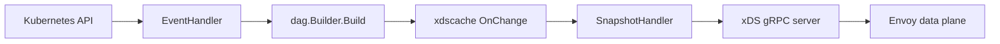

# Architecture

## Big picture

Contour is an xDS control plane for Envoy. It watches the Kubernetes API, converts routing objects into an internal DAG (Listener to VirtualHost to Route to Cluster), turns that DAG into Envoy xDS resources, and serves them to Envoy over gRPC. The main entry point is `cmd/contour/contour.go:30`, which uses kingpin subcommands (`serve`, `bootstrap`, `certgen`, `cli`, `gateway-provisioner`); the controller body runs under `serve`, reaching `doServe()` at `cmd/contour/serve.go:384`.

## Components

### internal/contour: EventHandler

Receives Kubernetes events and drives DAG rebuilds. `EventHandler` is defined at `internal/contour/handler.go:45`. It is a single-threaded event loop with a holdoff timer that batches bursts of events before rebuilding.

### internal/dag: DAG translation

The core translation logic. It converts Kubernetes objects into a directed acyclic graph. `Builder.Build` lives at `internal/dag/builder.go:59`. A set of processors does the work: `httpproxy_processor.go`, `ingress_processor.go`, `gatewayapi_processor.go`, and `listener_processor.go`.

### internal/xdscache (and v3): xDS resource caches

Converts the DAG into Envoy xDS resources (CDS, EDS, LDS, RDS, SDS, RTDS) and caches them. `RouteCache.OnChange` at `internal/xdscache/v3/route.go:62` builds Envoy `RouteConfiguration` from the DAG. `SnapshotHandler` at `internal/xdscache/v3/snapshot.go:35` produces the go-control-plane snapshot.

### internal/xds (and v3): gRPC server

The gRPC server that delivers resources to Envoy. `RegisterServer` is at `internal/xds/v3/server.go:38`. `ConstantHash` at `internal/xds/v3/hash.go:23` is the node ID hasher.

### internal/k8s and internal/provisioner

`internal/k8s` holds informers, the status updater, and clients. `internal/provisioner` is the Gateway API provisioner that creates Deployments and Services from Gateway objects. CRD type definitions live under `apis/projectcontour`.

## How a request flows

Tracing one change, an `HTTPProxy` edit, end to end to an Envoy RDS update:

1. A Kubernetes informer fires. `EventHandler.OnAdd/OnUpdate/OnDelete` (`internal/contour/handler.go:103-116`) send the operation onto the `update` channel. The handler is registered as an informer event handler in `cmd/contour/serve.go` and constructed at `cmd/contour/serve.go:599`.
2. The main loop in `EventHandler.Start` (`internal/contour/handler.go:134-244`) applies the change to the `KubernetesCache` and arms a holdoff timer to debounce a burst of events.
3. When the timer fires and the informer caches are synced, the loop builds a new DAG and hands it to the observer: `latestDAG := e.builder.Build()` then `e.observer.OnChange(latestDAG)` (`internal/contour/handler.go:224-226`). Status updates are then sent (`internal/contour/handler.go:228-231`).
4. `Builder.Build` (`internal/dag/builder.go:59-127`) runs each registered processor in order (`internal/dag/builder.go:79-81`) then prunes invalid virtual hosts and empty Listeners (`internal/dag/builder.go:87-124`). The processor order is built in `getDAGBuilder` (`cmd/contour/serve.go:1087-1167`): `ListenerProcessor` first, then `IngressProcessor`, then `HTTPProxyProcessor` (`internal/dag/httpproxy_processor.go:127`), with `GatewayAPIProcessor` added only when Gateway API is enabled.
5. `observer.OnChange` fans out through `ComposeObservers` (`internal/dag/dag.go:52-58`) to each `ResourceCache` and the `SnapshotHandler`. For example `RouteCache.OnChange` (`internal/xdscache/v3/route.go:62-142`) walks the DAG Listeners and VirtualHosts and builds Envoy `RouteConfiguration` protos.
6. `SnapshotHandler.OnChange` (`internal/xdscache/v3/snapshot.go:137-163`) collects each cache's `Contents()`, builds a new go-control-plane snapshot with a fresh UUID version (`internal/xdscache/v3/snapshot.go:153`), and stores it under the `ConstantHash` node ID key with `SetSnapshot` (`internal/xdscache/v3/snapshot.go:159`).
7. The xDS gRPC server, registered at `cmd/contour/serve.go:905-906` via `RegisterServer` (`internal/xds/v3/server.go:38-40`), then delivers the new RDS to every connected Envoy over ADS.

## Key design decisions

- **One snapshot for the whole fleet.** `ConstantHash.ID` always returns the same string (`internal/xds/v3/hash.go:23-36`), so any Envoy that connects, regardless of its service-node flag, shares one snapshot. Contour manages a single cluster-wide snapshot rather than per-node state.
- **EDS is handled separately.** The `SnapshotHandler` keeps a dedicated `LinearCache` for endpoints (`internal/xdscache/v3/snapshot.go:50-52`) and a `MuxCache` routes by `TypeUrl` (`internal/xdscache/v3/snapshot.go:54-71`). The comment (`internal/xdscache/v3/snapshot.go:46-49`) explains why: with a plain SnapshotCache every EDS stream would be notified of unrelated endpoint changes, so a LinearCache sends updates only for explicitly requested resources.
- **Debounced rebuilds gated on informer sync.** DAG rebuilds are debounced by the holdoff timer, and the loop skips and retries the rebuild until informer caches are synced (`internal/contour/handler.go:212-220`).

## Extension points

- Three configuration APIs: standard `Ingress`, the `HTTPProxy` CRD (`apis/projectcontour`), and the Gateway API.
- The Gateway provisioner (`internal/provisioner`) creates Contour and Envoy workloads from Gateway API objects.
- External authorization via Envoy `ext_authz`, plus global and local rate limiting, configured through `HTTPProxy`.
