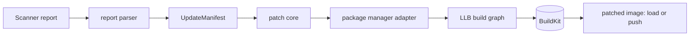

# Architecture

## Big picture

Copacetic is a CLI that turns a scanner report into a BuildKit build. The flow is: parse the report into a scanner-neutral update list, decide whether the target is a normal or a package-manager-less image, build an LLB (Low-Level Build) graph that installs only the fixed packages, solve that graph with BuildKit, and load or push the resulting image. BuildKit does the actual filesystem work; Copa's job is to construct the right graph and validate the result.

## Components

### CLI and options (`pkg/cmd/`)

The Cobra command layer builds `types.Options` from flags and validation (`src/pkg/cmd/cmd.go:86-113`). `newRootCmd` registers `patch` and `generate` (`src/main.go:42-43`). The `patch` RunE routes on the `--config` flag: with a config it calls `bulk.PatchFromConfig` for batch patching, otherwise `patch.Patch` for a single target (`src/pkg/cmd/cmd.go:120-133`). A report that yields no updates exits 0 rather than as an error (`src/main.go:58-61`).

### Report parsing (`pkg/report/`)

`TryParseScanReport` converts a scanner report into the neutral `unversioned.UpdateManifest`. A `scanner` value of `trivy` uses the built-in `TrivyParser`; any other value execs a `copa-<scanner>` plugin binary on the PATH, so Grype and others integrate without changing Copa (`src/pkg/report/report.go:33-37`, `src/pkg/report/report.go:52-55`).

### Patch orchestration (`pkg/patch/`)

`Patch` wraps the work in a timeout (default 5 minutes) and runs `patchWithContext` in a goroutine, watching for timeout or cancellation with a select (`src/pkg/patch/patch.go:41-79`). It routes to `patchSingleArchImage` for a single-architecture report file, or `patchMultiPlatformImage` when the report is a directory or a multi-platform image is detected with no report (`src/pkg/patch/patch.go:194-204`). `ExecutePatchCore` is the shared core that builds the patched state (`src/pkg/patch/core.go:91`).

### Package-manager adapters (`pkg/pkgmgr/`)

`GetPackageManager` selects the apk, dpkg, rpm, or pacman adapter from the report's OS metadata (`src/pkg/pkgmgr/pkgmgr.go:37-74`). Each adapter implements one interface, `InstallUpdates(ctx, *UpdateManifest, bool) (*llb.State, []string, error)`, and returns the BuildKit state that installs the fixes (`src/pkg/pkgmgr/pkgmgr.go:32-35`).

### Language patching (`pkg/langmgr/`), experimental

Language-library and toolchain patching lives here and is gated behind `COPA_EXPERIMENTAL`. It is applied after OS packages when language updates are present (`src/pkg/patch/core.go:136-172`). Treat it as experimental; the stable path is OS-package patching.

### BuildKit and image loading (`pkg/buildkit/`, `pkg/imageloader/`, `pkg/frontend/`)

`pkg/buildkit/` owns the BuildKit client, driver selection, and platform discovery. `pkg/imageloader/` loads the solved image into Docker or Podman. `pkg/frontend/` with `cmd/frontend/` provides a BuildKit frontend entry point (`src/cmd/frontend/main.go:22`). `pkg/vex/` emits OpenVEX documents, and `pkg/bulk/` drives config-file batch patching.

## How a request flows

Tracing `copa patch -i IMAGE -r report.json -t TAG` for a single-architecture image:

1. The `patch` RunE fills `types.Options`, creates a context cancelled on SIGINT/SIGTERM, and calls `patch.Patch` because a report file and single image are given (`src/pkg/cmd/cmd.go:71-72`, `src/pkg/cmd/cmd.go:133`).
2. `Patch` applies the timeout and hands off to `patchWithContext`, which detects the single-arch case and calls `patchSingleArchImage` (`src/pkg/patch/patch.go:194-204`).
3. `patchSingleArchImage` parses the report with `TryParseScanReport`, filters by package type, and returns `ErrNoUpdatesFound` if both OS and language updates are empty (`src/pkg/patch/single.go:121`, `src/pkg/patch/single.go:149-153`).
4. It creates a BuildKit client and decides the export media type (OCI or Docker). To avoid a mutable-tag race when the patched tag reuses the source tag, it reads the source manifest annotations before patching (`src/pkg/patch/single.go:173`, `src/pkg/patch/single.go:186-194`).
5. `executePatchBuild` runs `bkClient.Build`, and inside that callback `ExecutePatchCore` initializes the target image's LLB state, sets up the package manager, and calls `InstallUpdates` (`src/pkg/patch/single.go:520-541`, `src/pkg/patch/core.go:99-127`).
6. The final state is marshalled and solved with `c.Solve`, then the config is normalized for the target platform (`src/pkg/patch/core.go:209-231`). Copa builds a manifest from the packages that patched successfully and writes a VEX document (`src/pkg/patch/single.go:553-587`).
7. Without `--push`, `loadImageToRuntime` pipes the image into Docker or Podman; with `--push` it goes to the registry (`src/pkg/patch/single.go:257-259`, `src/pkg/patch/single.go:392-415`).

## Key design decisions

Patch as an additive layer, not a rebuild. Copa installs only the fixed packages on top of the existing image, so the lower layers and their cache are untouched. This is the opposite approach to the "always rebuild on the newest base" model (for example Chainguard/Wolfi): Copa extends the life of an image the consumer does not own (`src/README.md:29-54`).

Scanner-neutral core. Everything downstream of `TryParseScanReport` operates on `unversioned.UpdateManifest`, so the package-manager and BuildKit layers never see a scanner-specific format. New scanners plug in as `copa-<scanner>` binaries (`src/pkg/report/report.go:52-55`).

Handle package-manager-less images. For distroless or scratch-based images there is no `apt`/`apk` inside the image to run. Copa resolves a matching tooling image, downloads and unpacks the fixed packages there, and merges only those artifacts into the target filesystem. See [Internals](./internals) for the `unpackAndMergeUpdates` and `probeDPKGStatus` path.

## Extension points

- **Scanner plugins**: any `copa-<scanner>` binary on the PATH that emits the expected report shape (`src/pkg/report/report.go:52-55`).
- **Package managers**: the `PackageManager` interface, with apk/dpkg/rpm/pacman adapters shipped (`src/pkg/pkgmgr/pkgmgr.go:32-35`).
- **BuildKit frontend**: `pkg/frontend/` with `cmd/frontend/main.go:22` lets Copa run as a BuildKit frontend.
- **Language managers**: the `langmgr` interface for library/toolchain patching, gated behind `COPA_EXPERIMENTAL` and experimental (`src/pkg/patch/core.go:136-172`).
