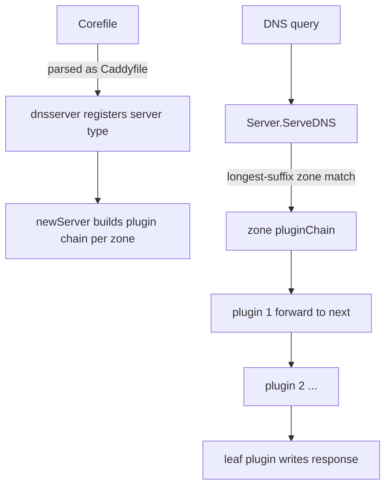

# Architecture

## Big picture

CoreDNS is one binary. At startup it registers itself as a Caddy server type, parses a Corefile into server blocks, and for each block builds a chain of plugin handlers. At request time a server listening on a port acts as a multiplexer: it matches the query name to a zone, then hands the request to that zone's plugin chain. The chain runs plugin by plugin until one writes a response.

## Components

### Entry point and startup: `coredns.go` and `coremain/`

`main()` calls `coremain.Run()` and does nothing else (`src/coredns.go:11-13`). The file blank-imports `github.com/coredns/coredns/core/plugin`, which pulls in every in-tree plugin so each one's `init()` runs and registers it (`src/coredns.go:7`).

### Server core: `core/dnsserver/`

This package owns the server. `register.go` calls `caddy.RegisterServerType("dns", ...)` in its `init()` and hands Caddy the `Directives` list and a default Corefile (`src/core/dnsserver/register.go:18-30`). `server.go` builds the per-zone plugin chains and implements `ServeDNS`, the dispatch entry point. `config.go` defines the `Config` struct that holds the settings for one server block.

### Plugins: `plugin/`

Each plugin lives in its own directory under `plugin/` (`forward`, `cache`, `kubernetes`, `file`, `etcd`, `metrics`, `errors`, `log`, `rewrite`, `dnssec`, and more). A plugin registers itself with `plugin.Register(name, setup)`, a thin wrapper that calls `caddy.RegisterPlugin` for server type `dns` (`src/plugin/register.go:6-9`). Cross-plugin helpers (the upstream proxy, DNS utilities) live in `plugin/pkg/`.

### Request wrapper: `request/`

`request.Request` wraps the `*dns.Msg` and the `dns.ResponseWriter` and lazily caches derived values (buffer size, DNSSEC OK bit, client IP and port, address family) so plugins do not recompute them (`src/request/request.go:14-33`).

### Generated wiring: `core/plugin/zplugin.go` and `core/dnsserver/zdirectives.go`

These two files are generated from `plugin.cfg` by `go generate`. `zplugin.go` is the list of blank imports, and `zdirectives.go` holds the `Directives` slice that fixes plugin order. The `make` target regenerates them when `plugin.cfg` changes (`src/Makefile:27-28`).

## How a request flows

1. At startup, `newServer` builds the chain for each zone. It folds the plugin factories from the end of the list to the front: `for i := len(site.Plugin) - 1; i >= 0; i--` with `stack = site.Plugin[i](stack)` (`src/core/dnsserver/server.go:106-108`). The result is stored as `site.pluginChain` (`src/core/dnsserver/server.go:130`).
2. A query arrives at `Server.ServeDNS(ctx, w, r)` (`src/core/dnsserver/server.go:259`). An empty question returns SERVFAIL (`src/core/dnsserver/server.go:262-265`). A non-INET class query that is not CHAOS returns REFUSED (`src/core/dnsserver/server.go:283-286`). A wrong EDNS version returns immediately (`src/core/dnsserver/server.go:288-291`).
3. The response writer is wrapped in a `ScrubWriter` so the reply is trimmed to fit the client's buffer (`src/core/dnsserver/server.go:294`).
4. The query name is lowercased (`src/core/dnsserver/server.go:296`) and the server walks labels with `dns.NextLabel`, looking up `s.zones[q[off:]]` for the longest matching zone (`src/core/dnsserver/server.go:303-338`). On a match it calls that Config's `pluginChain.ServeDNS` (`src/core/dnsserver/server.go:323`); if `plugin.ClientWrite(rcode)` is false the error path runs (`src/core/dnsserver/server.go:324-326`).
5. If no zone matches, the root zone `"."` is tried as a last resort (`src/core/dnsserver/server.go:354-378`), and otherwise the server returns REFUSED (`src/core/dnsserver/server.go:381`).

## Key design decisions

The chain is built in reverse order so that each plugin's `Next` field points at the plugin that runs after it (`src/core/dnsserver/server.go:106-108`). Execution order (top to bottom in `plugin.cfg`) and build order (bottom to top) are deliberately opposite, which is easy to misread.

Plugin order is fixed at compile time. `plugin.cfg` states that ordering is "VERY important" and that every plugin feels the effects of the plugins after it, while it must not care what the plugins above it do (`src/plugin.cfg:1-5`). Because the order is baked into the generated `Directives`, users cannot reorder plugins by editing the Corefile; they reorder by changing `plugin.cfg` and rebuilding.

DS queries get special handling. When the question type is DS, the matching handler is kept but the search continues, because the parent zone may need to answer the delegation signer record (`src/core/dnsserver/server.go:329-351`).

## Extension points

The primary extension point is a plugin: a type implementing `plugin.Handler` plus a `setup` function registered with `plugin.Register` (`src/plugin/register.go:6-9`). The `Handler` interface is `ServeDNS(ctx, w, r) (int, error)` and `Name()` (`src/plugin/plugin.go:50-53`); the rcode return is what lets a plugin signal whether a response has been written. In-tree plugins are listed in `plugin.cfg`; out-of-tree plugins are added by listing them there and rebuilding, or via the `COREDNS_PLUGINS` build variable.
