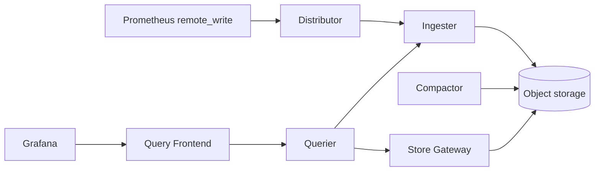

# Architecture

## Big picture

Cortex is a single Go binary that exposes a set of named modules. The `-target` flag selects which modules a process runs; the alias `all` enables single-binary mode (`pkg/cortex/cortex.go:147`). The module names are declared in `pkg/cortex/modules.go:74-106` and include `api`, `ring`, `distributor`, `ingester`, `querier`, `query-frontend`, `query-scheduler`, `store-gateway`, `compactor`, `ruler`, and `alertmanager`. The same components run as one process for testing or as independently scaled services in production.

The components group into a write path, a read path, and a storage/compaction path, with a hash ring and tenant isolation cutting across all of them.

## Components

### Distributor (write path)

Stateless. It receives remote write requests, validates them, deduplicates HA replica pairs, computes a consistent-hash token per series, and fans samples out to the owning ingesters. It is defined at `pkg/distributor/distributor.go:85` and holds the ingester ring reference, rate limiters, the HA tracker, and Prometheus metrics.

### Ingester (write path)

Semi-stateful. It holds recent samples in a per-tenant in-memory TSDB head and periodically flushes and ships completed TSDB blocks to object storage. The per-tenant wrapper is `userTSDB` at `pkg/ingester/ingester.go:376`.

### Querier and Query Frontend / Scheduler (read path)

The querier is stateless and runs PromQL across both ingesters and long-term storage. The optional query-frontend caches, splits, and queues queries; the optional query-scheduler detaches that queue so it can scale independently. Both are listed in the module set (`pkg/cortex/modules.go:74-106`).

### Compactor and Store Gateway (storage path)

The compactor (stateless) compacts TSDB blocks inside object storage. The store-gateway (semi-stateful) serves queries against those blocks. Both appear in the module set (`pkg/cortex/modules.go:74-106`).

## How a request flows

A remote write request is the representative operation. The HTTP route is registered at `pkg/api/api.go:296`, binding `POST /api/v1/push` to `push.Handler(...)`. The handler at `pkg/util/push/push.go:49` decompresses and decodes the remote-write protobuf, bounded by `maxRecvMsgSize`, then calls the distributor's `Push`.

`(*Distributor).Push` at `pkg/distributor/distributor.go:747` resolves the tenant ID, checks inflight and rate limits (`pkg/distributor/distributor.go:858`), and deduplicates HA replicas. For each series it computes a ring token via `tokenForLabels` (`pkg/distributor/distributor.go:583`): when `ShardByAllLabels` is set it hashes user plus every label name and value (`shardByAllLabels`, `pkg/distributor/distributor.go:618`), otherwise it hashes only the metric name (`shardByMetricName`, `pkg/distributor/distributor.go:605`).

The fan-out runs through `doBatch` (`pkg/distributor/distributor.go:980`), which calls `ring.DoBatch` (`pkg/ring/batch.go:74`). For each key, `r.Get` resolves the replication set of ingesters (`pkg/ring/batch.go:93`), and `record` (`pkg/ring/batch.go:151`) tallies per-instance results into 2xx/4xx/5xx families to decide quorum. Successful keys dispatch a gRPC send to each ingester, whose `(*Ingester).Push` (`pkg/ingester/ingester.go:1324`) appends to the per-tenant TSDB head.

## Key design decisions

- **Push (remote write) over pull.** Cortex centrally receives samples rather than scraping. This is what enables central multi-tenant storage and independent scaling of the write path.
- **Background context for ingester fan-out.** `doBatch` sends to ingesters under a fresh background context with `RemoteTimeout` rather than the client's context (`pkg/distributor/distributor.go:984`), so an early client disconnect does not break replication quorum. The inline comment is explicit: "Use a background context to make sure all ingesters get samples even if we return early".
- **Hash ring for sharding and replication.** Membership and token ownership live in the ring, backed by Consul, Etcd, or memberlist gossip (`pkg/ring/`).
- **Tenant isolation by header.** Tenants are keyed by `X-Scope-OrgID`, and auth is on by default (`pkg/cortex/cortex.go:151`).

## Extension points

- **Ring KV backends**: Consul, Etcd, or memberlist gossip, selected by configuration (`pkg/ring/`).
- **Object storage backends**: S3, GCS, Azure, and Swift for blocks storage.
- **Modules**: the `-target` flag composes the binary into single-binary or per-service deployments (`pkg/cortex/cortex.go:147`, `pkg/cortex/modules.go:74-106`).
