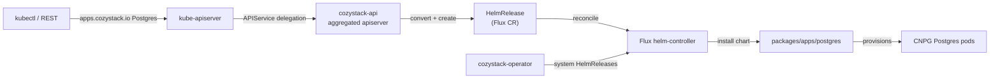

# Architecture

## Big picture

Cozystack is not one binary. It is a small set of Go controllers plus a large catalog of Helm charts, layered on top of an existing Kubernetes cluster. The Go code lives under `cmd/`, and the catalog lives under `packages/`. The controller that a tenant actually talks to is `cozystack-api`, an aggregated apiserver that serves the `apps.cozystack.io` and `core.cozystack.io` API groups. Everything a tenant creates through that API becomes a Flux `HelmRelease`, and Flux's helm-controller does the real work of installing charts.

## Components

### cozystack-api

The aggregated apiserver. `kube-apiserver` delegates the `apps.cozystack.io` group to it through an `APIService`, and it presents tenant-facing kinds such as `Postgres`, `Kubernetes`, and `VMInstance`. Its entry point is `cmd/cozystack-api/main.go:27`, which just builds options and starts the generic apiserver. At startup it reads `ApplicationDefinition` resources from the cluster and registers one REST storage per kind (see [Internals](./internals)).

### cozystack-operator and cozystack-controller

`cozystack-operator` reconciles the platform's own packages: it takes the `platform` package and emits the `HelmRelease` objects for system components. `cozystack-controller` runs platform-wide controllers. Both live under `cmd/` alongside helper binaries such as `backup-controller`, `backupstrategy-controller`, `flux-shard-operator` (which shards Flux's load), `flux-plunger`, `kubeovn-plunger`, `lineage-controller-webhook`, `check-readiness`, and the `cozypkg` chart-packaging CLI.

### The package catalog

`packages/` holds the Helm charts, split three ways. `packages/apps/` is the tenant-facing catalog: `kubernetes`, `postgres`, `mariadb`, `mongodb`, `redis`, `clickhouse`, `kafka`, `rabbitmq`, `nats`, `opensearch`, `qdrant`, `foundationdb`, `harbor`, `vm-instance`, `vm-disk`, `vpc`, `vpn`, `tenant`, `http-cache`, `tcp-balancer`, `bucket`, and `openbao`. `packages/system/` holds the CSI, CNI, and operator charts that make up the platform (over 130 of them); charts with a `-rd` suffix ship the `ApplicationDefinition` resources that describe the tenant-facing kinds. `packages/core/` holds `installer`, `platform`, `talos`, and `flux-aio`.

### The vendored stack

The system charts vendor the projects Cozystack builds on: Flux (as the reconciliation backend), KubeVirt with CDI (VMs), Cluster API with Kamaji (tenant control planes), CloudNativePG (Postgres), LINSTOR and Piraeus with SeaweedFS (storage), Cilium with Kube-OVN (networking), MetalLB (load balancing), Talos Linux (OS), Keycloak (OIDC), and VictoriaMetrics with Grafana (observability) (README, source 2).

## How a request flows

Trace a tenant creating a `Postgres`.

1. The tenant applies an `apps.cozystack.io/v1alpha1` `Postgres` object into their namespace with `kubectl`.
2. `kube-apiserver` sees the `apps.cozystack.io` group is delegated to `cozystack-api` and forwards the create.
3. `cozystack-api` receives it in `REST.Create` (`pkg/registry/apps/application/rest.go:166`). It validates the name format and length, rejects reserved `_`-prefixed keys, and runs the validating admission chain explicitly (`pkg/registry/apps/application/rest.go:210`).
4. It converts the object with `ConvertApplicationToHelmRelease` (`pkg/registry/apps/application/rest.go:216`). The generated `HelmRelease` is named `<prefix><app-name>`, points at the `packages/apps/postgres` chart via a fixed `ChartRef`, always mounts `Secret/cozystack-values`, and sets `Values: app.Spec`, so the tenant's spec becomes the chart's Helm values (`pkg/registry/apps/application/rest.go:1605`).
5. It creates the `HelmRelease` in the tenant namespace (`pkg/registry/apps/application/rest.go:238`). There is no separate Cozystack store; the `HelmRelease` is the persisted state.
6. Flux's helm-controller reconciles the `HelmRelease` and installs the chart, which stands up the actual CloudNativePG cluster.
7. On reads, `cozystack-api` converts the `HelmRelease` back into an `Application` and synthesizes status, so the tenant sees a `Postgres` object, not the `HelmRelease` underneath.

## Key design decisions

The API is a translation layer, not a datastore. Cozystack does not persist tenant resources in its own etcd tables; it projects each Application onto a Flux `HelmRelease` and lets Flux own reconciliation, history, and retries (`pkg/registry/apps/application/rest.go:1605`). That choice is what lets one generic REST implementation back every kind.

Kinds are data, not code. A new managed service is a Helm chart under `packages/apps/` plus an `ApplicationDefinition` (shipped by a `-rd` chart). `cozystack-api` reads those definitions at startup and registers each kind dynamically (`pkg/apiserver/apiserver.go:229`), so adding a service does not require rebuilding the Go binary. This is covered in detail in [Internals](./internals).

Load on Flux is sharded. Because every tenant resource becomes a `HelmRelease`, a busy platform produces many of them. `flux-shard-operator` exists to spread that reconciliation load across multiple helm-controller shards.

## Extension points

- `ApplicationDefinition` resources define new tenant-facing kinds without code changes; a `-rd` chart is the delivery mechanism.
- The `packages/apps/` catalog is Helm charts, so operators can fork or add charts to change what a kind provisions.
- Per-kind behavior (install and upgrade timeouts, retry, wait disablement) is set through `ApplicationDefinition` annotations, read at conversion time (`pkg/registry/apps/application/rest.go:1553`).
- The platform reuses standard Kubernetes and Flux extension surfaces: admission webhooks, CRDs, and Flux `HelmRelease` values.
