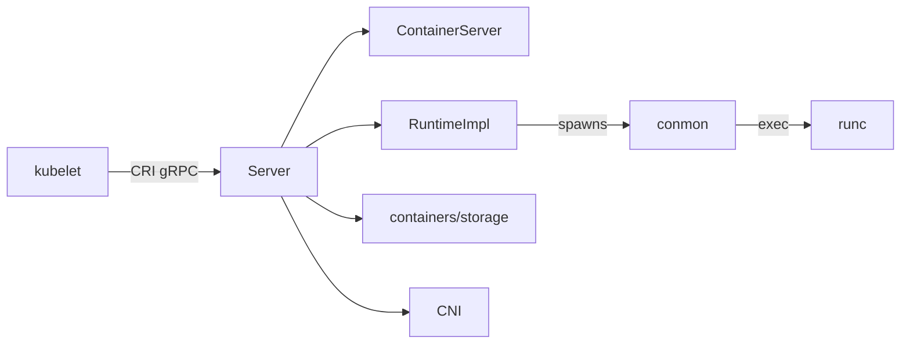

# Architecture

## Big picture

CRI-O runs as one daemon, `crio`. The entry point is `cmd/crio/main.go`, which builds a urfave/cli v2 app and brings up a gRPC server multiplexed with cmux (`cmd/crio/main.go:1-60`). The kubelet connects over a Unix socket and issues CRI calls. Those calls land on the `Server` type, which implements both CRI services and delegates execution to an OCI runtime, storage to containers/storage, and networking to CNI.

## Components

### Daemon and CRI server (`cmd/crio`, `server/`)

`cmd/crio/main.go` is the process entry point. The CRI surface lives in `server/`, where one `Server` struct implements both the `RuntimeService` and the `ImageService` (`server/server.go:68-104`). The per-RPC handlers are split across files such as `container_*.go`, `sandbox_*.go`, and `image_*.go`. `Server` embeds `*lib.ContainerServer`, the core that holds the runtime, the store, and the storage runtime server (`server/server.go:69-70`).

### OCI runtime abstraction (`internal/oci/`)

`internal/oci/` hides which runtime actually runs a container behind the `RuntimeImpl` interface, which declares the full container lifecycle: create, start, exec, stop, checkpoint, and more (`internal/oci/oci.go:60-86`). There are three implementations: `runtime_oci.go` for conmon plus runc or crun, `runtime_pod.go` for conmonrs, and `runtime_vm.go` for VM runtimes like Kata. A `Runtime` keeps a `runtimeImplMap` from handler name to implementation (`internal/oci/oci.go:95-98`), so a pod's runtime handler selects the implementation.

### Core library and storage (`internal/lib/`, `internal/storage/`)

`internal/lib/` holds `ContainerServer` and the `sandbox` package with the `Sandbox` type, one per pod. `internal/storage/` wraps containers/storage for image pulls, layers, and container rootfs. Networking is handled through CNI from `server/sandbox_network_linux.go`, with host port mapping in `internal/hostport/`.

## How a request flows

`RunPodSandbox` is the call the kubelet makes to start a pod. The trace:

1. `RunPodSandbox` (`server/sandbox_run.go:68`) hands off to the platform implementation `runPodSandbox` (`server/sandbox_run_linux.go:409`).
2. A sandbox is built and `GenerateNameAndID()` assigns the OCI name `<ns>-<name>-<attempt>` and an ID (`server/sandbox_run_linux.go:413-438`).
3. The pod name is reserved, idempotently returning an existing sandbox if present, and cleanup steps are pushed onto a `resourceCleaner` for rollback (`server/sandbox_run_linux.go:440-468`).
4. Unless the pod uses host networking, CRI-O waits for the CNI plugin to be ready (`server/sandbox_run_linux.go:472-476`).
5. The pause (infra) image is created in storage via `StorageRuntimeServer().CreatePodSandbox(...)`, with `ErrDuplicateName` handled explicitly (`server/sandbox_run_linux.go:535-547`).
6. The infra container is created with `oci.NewContainer(...)`, or `NewSpoofedContainer` for VM and pod runtime types (`server/sandbox_run_linux.go:1294-1310`).
7. `createAndStartInfraContainer` runs PreStart hooks, emits a `CONTAINER_CREATED` event, then calls `Runtime().StartContainer` and persists state to disk (`server/sandbox_run_linux.go:1350-1372`).
8. Networking is brought up with `s.networkStart(ctx, sb)` to obtain the IP and CNI result (`server/sandbox_run_linux.go:1489`).
9. The rootfs is mounted with `StorageRuntimeServer().StartContainer(sboxID)` (`server/sandbox_run_linux.go:1587`).

If any step fails mid-creation, the deferred `resourceCleaner` unwinds the prior steps in LIFO order (`server/sandbox_run_linux.go:444-453`).

## Key design decisions

CRI-O does not fork containers itself. The OCI create path does not exec runc directly; it launches the monitor daemon `conmon`, passing `-r <runtime path>` and `--runtime-arg root=<root>` so conmon invokes runc on its behalf (`internal/oci/runtime_oci.go:145-160,217`). Because conmon is the container's parent rather than `crio`, restarting the CRI-O daemon does not kill running containers. conmon owns stdio, the log, the exit code, terminal allocation, and OOM handling.

The second decision is the runtime abstraction itself. By routing every lifecycle call through `RuntimeImpl` (`internal/oci/oci.go:60-86`) and selecting the implementation by `RuntimeType` per handler (`internal/oci/oci.go:184`), the same CRI path serves conmon-and-runc, conmonrs, and Kata VMs without branching in the server layer.

A third is parallel-pull coalescing. `Server` keeps `pullOperationsInProgress` keyed by image plus credentials, guarded by `pullOperationsLock`, so concurrent pulls of the same image block on one operation instead of racing (`server/server.go:84-126`).

## Extension points

- **Runtime handlers**: each `config.RuntimeHandler` names a `RuntimePath`, `MonitorPath`, and `RuntimeType`, letting operators register runc, crun, conmonrs, or a VM runtime and select it per pod (`internal/oci/oci.go:108-124`).
- **NRI**: the Node Resource Interface plugin surface lives in `internal/nri/`, exposed on `Server` as `nri *nriAPI` (`server/server.go:99`).
- **Hooks**: OCI runtime hooks are resolved per sandbox through `hooksRetriever` (`server/server.go:101`).
- **CNI**: networking is any CNI plugin, called from `server/sandbox_network_linux.go`.
