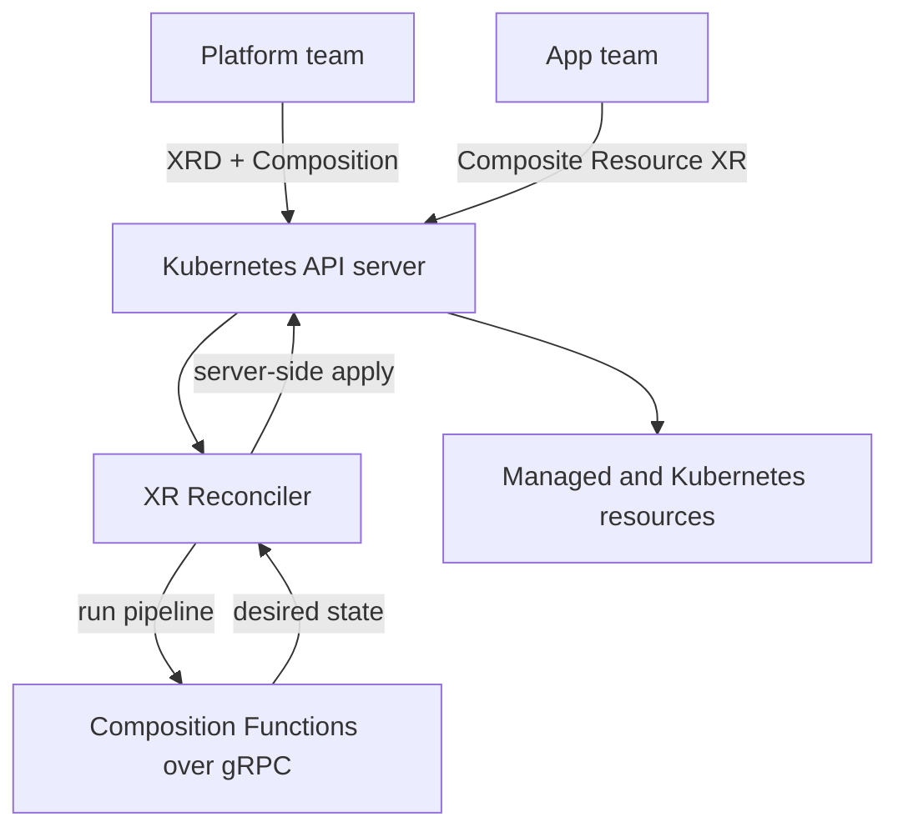

# Architecture

## Big picture

Crossplane is a set of controllers that run on top of a Kubernetes API server. It adds no state store of its own. Desired and observed state are custom resources in etcd, and controllers reconcile them on a loop. A single `crossplane` binary exposes subcommands `core`, `rbac`, and `render` (`cmd/crossplane/main.go:87`). The `core` controller process wires together five top-level controller groups, each owning one concern: composition, package management, operations, RBAC, and protection.

## Components

### apiextensions: the composition engine

`internal/controller/apiextensions/` is the core composition engine. It handles XRDs, Compositions, CompositionRevisions, and composite resources (XRs). It is the center of the reconcile path. It is started by `apiextensions.Setup(mgr, ao)` (`cmd/crossplane/core/core.go:539`).

### pkg: the package manager

`internal/controller/pkg/` installs Provider, Configuration, and Function packages, which are OCI images. It resolves dependencies and manages package revisions. Dependency resolution uses a directed acyclic graph in `internal/dag/dag.go:17` ("Package dag implements a Directed Acyclic Graph for Package dependencies"). It is started by `pkg.Setup(mgr, po)` (`cmd/crossplane/core/core.go:642`).

### ops: Operations (v2)

`internal/controller/ops/` is a v2 feature. It runs a function pipeline once to completion like a Job, in the forms `operation`, `cronoperation`, and `watchoperation`. It is started conditionally behind a feature flag by `ops.Setup` (`cmd/crossplane/core/core.go:550`).

### rbac and protection

`internal/controller/rbac/` is the RBAC Manager. It generates the ClusterRoles each XRD needs. `internal/controller/protection/` handles usage and deletion protection, including foreground deletion and cross-resource reference protection. It is started by `protection.Setup` (`cmd/crossplane/core/core.go:654`).

### engine: dynamic controller lifecycle

`internal/engine/engine.go:17` ("Package engine manages the lifecycle of a set of controllers") starts and stops an XR controller for each XRD as XRDs are applied or removed, so the set of running controllers tracks the set of defined APIs.

## How a request flows

The representative operation is reconciling a composite resource (XR). The entry point is `(*Reconciler).Reconcile` in `internal/controller/apiextensions/composite/reconciler.go:564`.

1. Get the XR (`reconciler.go:574`).
2. Check circuit breaker state and set a condition (`reconciler.go:592`).
3. Honor the pause annotation and return if paused (`reconciler.go:600`).
4. If the XR is being deleted, remove the finalizer and return; functions do not run on delete (`reconciler.go:618`).
5. Add the finalizer (`reconciler.go:642`).
6. Resolve the Composition reference (`reconciler.go:656` `SelectComposition`).
7. Select and fetch the CompositionRevision (`reconciler.go:674`, `reconciler.go:693`).
8. Call `resource.Compose(ctx, xr, ...)`, which runs the function pipeline (`reconciler.go:745`).

`Compose` is implemented by `(*FunctionComposer).Compose` in `internal/controller/apiextensions/composite/composition_functions.go:288`. It observes existing composed resources, builds the protobuf state, loops over the pipeline steps calling each function over gRPC (`composition_functions.go:405` `c.pipeline.RunFunction`), passing the desired state from one step to the next, then constructs and applies the composed resources.

## Key design decisions

- **Composition functions over gRPC.** v2 dropped patch-and-transform and made composition a pipeline of functions, each a separate process or container speaking gRPC. The contract is `proto/fn/v1/run_function.proto` with `RunFunctionRequest` (`run_function.proto:39`) and `State` (`run_function.proto:281`). A function returns the complete desired state; anything it does not include is removed. This lets compositions be written in any language. See the [Functions docs](https://docs.crossplane.io/latest/packages/functions/).
- **Server-side apply field ownership.** Composed resources are owned through SSA field managers. `ComposedFieldOwnerName(xr)` (`composition_functions.go:755`) derives a per-XR field manager name so multiple composers can share a resource safely.
- **Built-in circuit breaker.** The XR reconciler checks circuit state before doing work (`reconciler.go:592`) to cut off runaway watches and surface the state as a condition.

## Extension points

- **XRDs and Compositions** let platform teams define new APIs and map them to function pipelines.
- **Packages** (Provider, Configuration, Function as OCI images) extend the cluster, resolved through the DAG in `internal/dag/`.
- **The function gRPC contract** in `proto/fn/v1/run_function.proto` is the interface third parties implement to write composition logic in any language.
