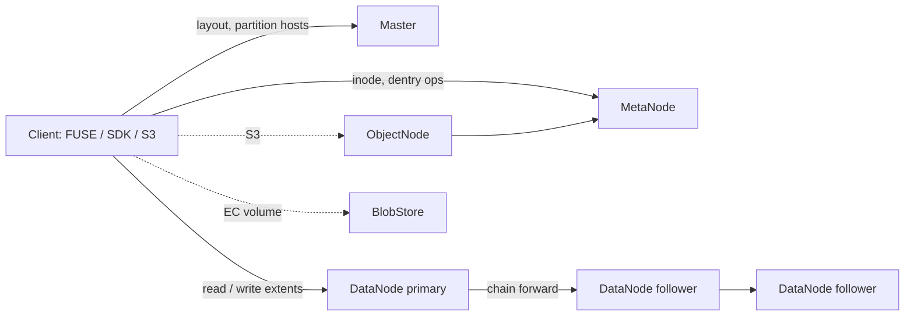

# Architecture

## Big picture

CubeFS runs as a set of roles, all built from one binary. The config file's `role` key selects which role a process starts as (`cmd/cmd.go:184`), and a switch in `cmd/cmd.go:206-239` constructs the matching server. The role names are constants in `cmd/cmd.go:71-93`: master, metanode, datanode, objectnode, authnode, console, lcnode, flashnode, and flashgroupmanager.

The core split is three planes. The Master plane tracks cluster topology and partition placement. The metadata plane (MetaNodes) holds inodes and directory entries in memory. The data plane (DataNodes) stores file content as extents on local disks. Clients talk to all three but the Master stays off the data path; it only hands out the list of DataNodes that hold a partition.

## Components

### Master (`master/`)

The resource manager. It owns the cluster ledger, volumes, data partitions, and meta partitions. Key types: `master/cluster.go:141` `type Cluster`, `master/vol.go:142` `type Vol`, `master/data_partition.go:34`, `master/meta_partition.go:54`. The Master itself is replicated with raft for availability.

### MetaNode (`metanode/`)

Holds all file metadata (inodes and directory entries) in memory. Metadata is sharded into meta partitions, and each partition is replicated with multi-raft. The in-memory indexes are two B-Trees per partition (`metanode/partition.go:489-490`).

### DataNode (`datanode/`)

Stores actual file content as extents, which are local files. Storage is sharded into data partitions, and each partition replicates with a primary-backup chain. `datanode/partition.go:102` `type DataPartition` is the on-node partition object.

### ObjectNode (`objectnode/`)

The S3-compatible gateway. It maps S3 operations onto the same metadata and data planes so an object and a POSIX file can be the same bytes.

### BlobStore (`blobstore/`)

The erasure-coding engine for low-cost, very large scale. It is itself a set of submodules: clustermgr, blobnode, access, proxy, scheduler, and shardnode. A volume opts into this engine instead of multi-replica.

### Auxiliary roles and clients

AuthNode handles authentication, Console serves a web UI, lcnode runs lifecycle policies, and flashnode plus flashgroupmanager form a distributed cache. Clients live in `client/` (FUSE), `sdk/` (Go SDK), and `java/` (libcubefs).

## How a request flows

Trace an append write from a client to the replicas. The full code walk is in [Internals](./internals); the component hops are:

1. The client SDK splits the write into per-extent requests and buffers them, then a sender goroutine ships packets to the primary DataNode (`sdk/data/stream/extent_handler.go:292`). The packet carries every replica address in `packet.Arg` (`extent_handler.go:338`).
2. The primary DataNode receives the packet, forwards it to all followers, then applies it locally (`datanode/repl/repl_protocol.go:334`, `datanode/repl/repl_protocol.go:342-349`). This is the primary-backup chain.
3. The local write lands in the extent store (`datanode/wrap_operator.go:912`, `datanode/storage/extent.go:499`).
4. After the write commits, the client registers the resulting ExtentKey into the inode on a MetaNode, so the metadata plane learns where the data is.

The Master never touches steps 1 to 4. It only supplied the partition's host list earlier.

## Key design decisions

The defining choice is in-memory metadata. Each meta partition keeps an inode B-Tree and a dentry B-Tree fully in RAM (`metanode/partition.go:489-490`), backed by a thin RWMutex wrapper around Google's `btree.BTree` (`metanode/btree.go:31`). Durability comes from raft logs plus periodic snapshots, so the persistent store is not the index source. The SIGMOD paper places metadata by node memory usage, which it argues removes the need for data rebalancing when capacity grows (S7). The cost is that metadata capacity is bound by node RAM, and POSIX semantics are relaxed to cut consistency cost (S2).

The second choice is two engines under one metadata plane. A volume picks multi-replica (strong consistency) or erasure coding via BlobStore. The `StorageClass` field on the inode (`metanode/inode.go:78`) is what records which engine an inode uses.

## Extension points

- S3 API through ObjectNode for any S3 SDK.
- Hadoop FileSystem (HDFS-compatible) and POSIX FUSE clients.
- CSI driver (`cubefs/cubefs-csi`) and Helm chart (`cubefs/cubefs-helm`) as separate sub-project repositories (S1).
- Prometheus metrics through `util/exporter`.
