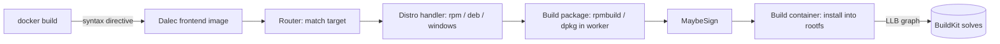

# Architecture

## Big picture

Dalec runs as a BuildKit frontend: a container image that BuildKit launches, hands the YAML spec and build options, and expects an LLB graph back. It does not execute the build itself. It reads the spec, decides which distro target the user asked for, and assembles the LLB graph that fetches sources, runs `rpmbuild` or `dpkg` inside a worker image, installs the resulting package into a fresh root filesystem, and (optionally) signs and attests it. BuildKit then solves that graph in parallel with caching.

## Components

### Frontend entrypoint

`cmd/frontend/` is the binary that BuildKit runs. `main` (`cmd/frontend/main.go:34`) branches on arguments: with none it calls `dalecMain` (`cmd/frontend/main.go:90`), the frontend proper; with arguments it runs an internal subcommand via `lookupCmd` (`cmd/frontend/main.go:64`), whose command set comes from a blank-imported `internal/commands` package (`cmd/frontend/main.go:22`). `dalecMain` builds the router with `frontendapi.NewRouter` (`cmd/frontend/main.go:92`), wraps it with `frontend.WithTargetForwardingHandler` (`cmd/frontend/main.go:96`), and starts serving over the BuildKit gateway protocol with `grpcclient.RunFromEnvironment` (`cmd/frontend/main.go:99`).

### Router

`frontend/` holds the dispatch layer. The `Router` is a flat route table, `routes map[string]Route` keyed by a fully qualified path such as `azlinux3/container` (`frontend/router.go:73`). A source comment states this replaced a hierarchical `BuildMux` with a simpler dispatch model (`frontend/router.go:71`). `Router.Handle` reads the requested `target` from the build options, serves any subrequest (such as the target-listing API), then resolves the route with `lookupTarget` and calls its handler (`frontend/router.go:119`, `frontend/router.go:148`, `frontend/router.go:158`). A top-level `recover` in the handler turns a panic into a returned error rather than a crashed frontend (`frontend/router.go:91`).

### Distro handlers and packaging

`targets/` has one handler tree per platform family: `targets/linux/rpm/distro` (Azure Linux, AlmaLinux, Rocky Linux), `targets/linux/deb/distro` (Debian, Ubuntu), `targets/windows`, and `targets/plugin` for external frontends. Each distro is described by a `distro.Config` (`targets/linux/rpm/distro/distro.go:14`) that registers its routes (`targets/linux/rpm/distro/distro.go:93`). The actual conversion from spec to a `.spec` file or a `debian/` directory, and the `rpmbuild`/`dpkg` invocation, lives under `packaging/linux/rpm` and `packaging/linux/deb`, expressed as LLB rather than run directly.

### Spec model

The repository root (`package dalec`) holds the data model the whole system reads: `spec.go`, `load.go`, the `source*.go` files, `artifacts.go`, `tests.go`, and the generators such as `generator_gomod.go`. This is the parsed form of the YAML that every distro handler consumes.

## How a request flows

Trace the `azlinux3/container` target, which goes spec to RPM to minimal container:

1. `docker build` reads the spec's first line, `# syntax=ghcr.io/project-dalec/dalec/frontend:latest`, and pulls and runs the Dalec frontend image (`docs/examples/hello.inline.yml:1`).
2. The frontend starts, builds the router, and dispatches. For an RPM distro, `Config.Routes` registers routes like `azlinux3`, `azlinux3/rpm`, and `azlinux3/container` (`targets/linux/rpm/distro/distro.go:93`); the `/container` route's handler is `linux.HandleContainer(cfg)` (`targets/linux/rpm/distro/distro.go:124`).
3. `HandleContainer` calls `Config.BuildContainer` (`targets/linux/rpm/distro/container.go:17`), which first needs the package. `Config.BuildPkg` prepares a worker image with build dependencies, runs the spec's generators via `spec.Preprocess`, builds an `rpmbuild` tree with `rpm.BuildRoot`, and runs `rpmbuild` as LLB with `rpm.Build` (`targets/linux/rpm/distro/pkg.go:47`, `pkg.go:54`, `pkg.go:58`, `pkg.go:70`).
4. `frontend.MaybeSign` produces a signed state if the spec asks for signing and overlays it onto the unsigned output with `st.File(llb.Copy(signed, "/", "/"))` (`targets/linux/rpm/distro/pkg.go:72`, `pkg.go:76`).
5. Back in `BuildContainer`, the package is installed into a fresh root filesystem: it picks a base image with `spec.GetSingleBase(targetKey)`, mounts an install-time repository, runs `cfg.Install` on the worker to place the RPM under `/tmp/rootfs`, applies any post-install symlinks, and returns the rootfs state (`targets/linux/rpm/distro/container.go:23`, `container.go:31`, `container.go:68`, `container.go:76`).
6. None of this runs immediately. Each step appends to the LLB graph, and BuildKit solves the graph with parallelism and caching.

## Key design decisions

The frontend produces LLB rather than running the build. Everything above is graph assembly; the actual `rpmbuild`, package install, and copies happen when BuildKit solves. This is what lets Dalec run under any BuildKit (local Docker, `buildx`, CI) with no build server of its own, and it is why caching and parallelism come for free from BuildKit (moby/buildkit; Docker frontend docs).

The router is a flat table, and routes can be overwritten. `Add` deliberately allows a later route with the same `FullPath` to replace an earlier one, and the comment says this is used by target forwarding to override built-ins (`frontend/router.go:79`). `WithTargetForwardingHandler` (`frontend/router.go:399`) uses that to let a spec point at an external frontend and take over a route the built-in handlers would otherwise serve. Extension is implemented as route override rather than a separate plugin registry.

## Extension points

- **External frontends**: a spec can name another frontend to handle a target, and target forwarding overrides the matching built-in route to dispatch to it (`frontend/router.go:399`; `targets/plugin`).
- **Source generators**: the `Generate` block on a source runs generators (gomod, cargohome, pip) that pre-populate build caches, wired through `spec.Preprocess` before the package build (`targets/linux/rpm/distro/pkg.go:54`).
- **Distro targets**: a new distro is a new `distro.Config` value plus its route registration (`targets/linux/rpm/distro/distro.go:14`), which is how Azure Linux, AlmaLinux, and Rocky Linux share one RPM code path.
