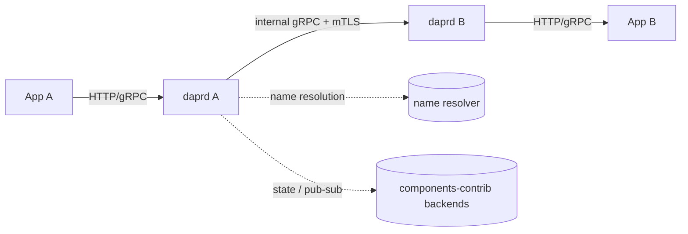

# Architecture

## Big picture

Dapr splits into a data plane and a control plane, both shipped from the single `dapr/dapr` repo under `cmd/`. The data plane is one binary, `daprd`, that runs as a sidecar next to each app instance. The control plane is a set of binaries that manage the sidecars on Kubernetes. An app always talks to its local sidecar over HTTP or gRPC; the sidecar talks to other sidecars over an internal gRPC channel secured with mTLS.

## Components

### daprd (data plane sidecar)

The sidecar runtime. `cmd/daprd/main.go:21` calls `app.Run()`, which parses flags and starts the runtime (`cmd/daprd/app/app.go:56`). Its state lives in one `DaprRuntime` struct (`pkg/runtime/runtime.go:102`) that holds the app channels, direct messaging, actors, the workflow engine, the component store, resiliency, and the security handler. It runs two gRPC servers: a public API server for the app and an internal server for sidecar-to-sidecar traffic (`pkg/runtime/runtime.go:139` onward, fields `grpcAPIServer` and `grpcInternalServer`).

### operator

The Kubernetes operator (`cmd/operator`). It watches Dapr CRDs (Component, Subscription, Resiliency, and others) and delivers their contents to sidecars.

### injector

The sidecar injector (`cmd/injector`). A mutating admission webhook that adds the `daprd` container to pods annotated with `dapr.io/enabled: "true"`.

### sentry

The certificate authority (`cmd/sentry`). It issues SPIFFE-based workload certificates that the sidecars use for mTLS.

### placement

The actor placement service (`cmd/placement`). It manages partition placement of actors across hosts using consistent hashing.

### scheduler

The scheduling backend (`cmd/scheduler`) for jobs, actor reminders, and workflows.

## How a request flows

A service-invocation call from app A to a method on app B traces through both sidecars.

1. App A sends `POST /v1.0/invoke/<app-id>/method/<method>` to sidecar A. The HTTP handler `onDirectMessage` extracts the target ID and method from the decoded path, selects a resiliency policy, and builds an `InvokeMethodRequest` (`pkg/api/http/directmessaging.go:97`). It wraps the call in a resiliency runner and calls `a.directMessaging.Invoke` (`pkg/api/http/directmessaging.go:164`).

2. `directMessaging.Invoke` normalizes the method name (`pkg/messaging/direct_messaging.go:168`), then resolves the destination and branches three ways (`pkg/messaging/direct_messaging.go:175` onward): an HTTPEndpoint or external URL, the local app itself (`invokeLocal`), or a remote sidecar via `invokeWithRetry(... d.invokeRemote ...)`.

3. For a remote target, `getRemoteApp` (`pkg/messaging/direct_messaging.go:607`) splits the `app.namespace` form and uses the configured name resolver (mDNS, Kubernetes, consul) to find the destination sidecar's gRPC address.

4. `invokeRemote` opens a connection, attaches forwarded, destination app ID, and caller/callee headers, and calls the peer's internal gRPC via `internalv1pb.ServiceInvocationClient` (`pkg/messaging/direct_messaging.go:311`). The default path is a streaming send.

5. On sidecar B, the internal gRPC server's `CallLocal` receives the request (`pkg/api/grpc/daprinternal.go:44`), rebuilds it with `FromInternalInvokeRequest`, validates the ACL with `callLocalValidateACL`, then calls the app channel `appChannel.InvokeMethod` to reach app B (`pkg/api/grpc/daprinternal.go:71`). The response is returned as protobuf.

The app never learns app B's IP or DNS name; it addresses B by app ID only, and the sidecars carry mTLS between them.

## Key design decisions

Dapr concentrates the service-invocation security boundary at one edge. The method name is normalized once in `directMessaging.Invoke` (`pkg/messaging/direct_messaging.go:168`), and that normalized form is used for both ACL evaluation and dispatch, so a `../`-style method cannot bypass the ACL by being evaluated in one form and dispatched in another. See [Internals](./internals) for the normalizer code.

Replay buffering for retries is decided per request. An `InvokeMethodRequest` can buffer its body for resend, but for chunked or unknown-length bodies the HTTP handler sets the streaming flag and disables replay, so a large stream is never buffered into memory just to enable a retry (`pkg/api/http/directmessaging.go:148`).

## Extension points

- **Components** implement a building-block interface (state store, pub/sub, binding, secret store, lock, crypto, conversation, name resolution, middleware) and are registered in the component store (`pkg/runtime/compstore/compstore.go:42`). The community implementations live in the separate `dapr/components-contrib` repo.
- **CRDs** drive configuration on Kubernetes: Component, Subscription, Resiliency, HTTPEndpoint, Configuration, and others are tracked in the same store (`pkg/runtime/compstore/compstore.go:58` onward).
- **Pluggable components** let a component run as a separate gRPC process rather than compiled into the runtime.
- **SDKs** in Go, Java, .NET, Python, JavaScript, Rust, C++, and PHP wrap the HTTP and gRPC APIs.
