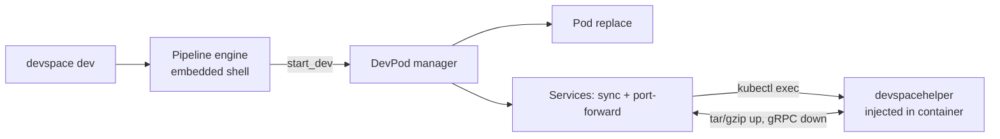

# Architecture

## Big picture

DevSpace is a single CLI binary that talks to a Kubernetes cluster through the user's kube-context. Nothing of DevSpace runs permanently in the cluster. A command such as `devspace dev` is a thin wrapper that starts a named pipeline, which is a POSIX shell script executed by an embedded interpreter. That script calls DevSpace built-in commands (`build_images`, `create_deployments`, `start_dev`) that do the real work: build images, deploy manifests, and start a development session. The dev session replaces the target pod with a development pod, injects a small helper binary into its container, and opens a two-way file sync and port-forwarding over `kubectl exec` streams.

## Components

### CLI commands

`cmd/` holds the cobra commands: `dev.go`, `deploy.go`, `build.go`, `sync.go`, `enter.go`, `run_pipeline.go`, and others, assembled into the root command in `cmd/root.go` (`cmd/root.go:51` `NewRootCmd`). Most high-level commands do not implement their own logic; they configure and run a pipeline. `NewDevCmd` builds a `RunPipelineCmd` with `Pipeline: "dev"` (`cmd/dev.go:11`).

### Pipeline engine

`pkg/devspace/pipeline/` is the execution engine. `engine/` wraps the `mvdan.cc/sh/v3` shell interpreter (`pkg/devspace/pipeline/engine/engine.go:9`), so pipelines run the same on Linux, macOS, and Windows with no external shell. `engine/pipelinehandler/commands/` holds the built-in commands (`build_images.go`, `create_deployments.go`, `start_dev.go`, and so on), and `types/default.go` holds the default pipeline scripts for dev, build, deploy, and purge.

### DevPod lifecycle

`pkg/devspace/devpod/` owns the lifecycle of a development pod: starting it, retrying, and launching the per-pod services. `devpod.go` is the entry point (`pkg/devspace/devpod/devpod.go:74` `Start`).

### Services

`pkg/devspace/services/` holds the individual capabilities a dev session turns on: `sync/` (two-way file sync), `podreplace/` (swap the target workload for a dev pod), `inject/` (place the helper binary in the container), `portforwarding/`, `ssh/`, `terminal/`, `attach/`, and `logs/`.

### Sync engine and helper

`pkg/devspace/sync/` is the client side of the file-sync engine. `helper/` is a separate binary (`devspacehelper`) that DevSpace injects into the target container; it holds the server side of sync (`helper/server/upstream.go`, `helper/server/downstream.go`) plus the SSH server and restart helper, and builds from its own `helper/main.go`.

### Build and deploy backends

`pkg/devspace/build/builder/` implements the pluggable image builders: `docker`, `buildkit`, `kaniko`, and `custom`. `pkg/devspace/deploy/` implements deploy via Helm and kubectl manifests. `pkg/devspace/config/versions/` holds the config schema generations that let old `devspace.yaml` files keep working.

## How a request flows

Trace `devspace dev`, the representative operation, from the CLI to a live file sync.

1. `NewDevCmd` builds a `RunPipelineCmd{Pipeline: "dev", SkipPushLocalKubernetes: true}` (`cmd/dev.go:11`). The `dev` command is a wrapper around running a pipeline.
2. `RunPipelineCmd.Run` (`cmd/run_pipeline.go:199`) loads the config and resolves the named pipeline, falling back to the default if the user did not define one.
3. The default `dev` pipeline is a shell script (`pkg/devspace/pipeline/types/default.go:31`): `run_dependencies --all`, `ensure_pull_secrets --all`, `build_images --all`, `create_deployments --all`, `start_dev --all`.
4. The script runs on the embedded interpreter. The DevSpace-specific words are not ordinary programs; they are built-ins registered on a custom exec handler (`pkg/devspace/pipeline/engine/pipelinehandler/handler.go:45`, `:48`, `:55`), which the handler intercepts before falling back to the basic shell (`handler.go:121`).
5. `start_dev` dispatches to `StartDev` (`pkg/devspace/pipeline/engine/pipelinehandler/commands/start_dev.go:27`), which resolves the dev configs and calls `pipeline.DevPodManager().StartMultiple(...)` (`start_dev.go:74`).
6. `devPod.Start` (`pkg/devspace/devpod/devpod.go:74`) goes through `startWithRetry` (`:123`) to `start` (`:221`), which replaces the pod if needed, selects the target container, and calls `startServices` (`:501`).
7. `startServices` runs sync and port-forwarding concurrently in a tomb (a group of goroutines): `sync.StartSync(...)` (`devpod.go:515`) and `portforwarding.StartPortForwarding(...)` (`devpod.go:526`).
8. `StartSync` (`pkg/devspace/services/sync/sync.go:64`) runs the controller's `startSync` (`pkg/devspace/services/sync/controller.go:270`), which first injects the helper binary into the container at `/tmp/devspacehelper` (`controller.go:403` calling `inject.InjectDevSpaceHelper`; path constant at `pkg/devspace/services/inject/inject.go:43`), then builds the sync client with `sync.NewSync` (`controller.go:462`).
9. The controller opens two `kubectl exec` streams: upstream runs `[/tmp/devspacehelper sync upstream ...]` (`controller.go:468`) and downstream runs `[/tmp/devspacehelper sync downstream ...]` (`controller.go:513`). It wires them to the sync client with `InitUpstream` (`controller.go:507`) and `InitDownstream` (`controller.go:535`).
10. The sync engine's `Start` (`pkg/devspace/sync/sync.go:166`) runs `mainLoop` (`:209`): `startUpstream` (`:232`) watches the local filesystem with a recursive watch tree (`notify.NewTree()` at `:234`, `tree.Watch` at `:241`), `startDownstream` (`:268`) pulls container-side changes, and `initialSync` (`:277`) reconciles the two once at startup.

From there a saved local edit flows up to the container and a container-side change flows down to disk, continuously, with no image rebuild or redeploy in between.

## Key design decisions

**Client-only, nothing resident in the cluster.** DevSpace uses the existing kube-context and installs no operator or CRD. The server side of sync is a throwaway binary injected on demand rather than a running component (README; DevSpace official site). This keeps the trust and install footprint the same as `kubectl`, at the cost of doing more work over `exec` streams from the client.

**Pipelines as replaceable shell scripts.** v6 turned hard-coded workflows into POSIX scripts plus privileged built-in commands, so a user can override an entire workflow in `devspace.yaml` instead of bending a fixed one with hooks (Pipelines docs; DevSpace 6 announcement). Embedding `mvdan.cc/sh` rather than shelling out means the same script runs on every OS.

**Pod replacement instead of a sidecar.** For a dev session, DevSpace scales the target Deployment or StatefulSet down and stands up a modified dev pod (swapped image, overridden command, optional persistent volume), then syncs into it (`pkg/devspace/services/podreplace/replace.go:52` `ReplacePod`). This gives the developer a container they fully control, at the cost of mutating a running workload.

**Asymmetric sync protocol.** Local-to-container uploads are a raw `tar`/`gzip` stream; container-to-local uses gRPC to the helper. Both directions ride a single `kubectl exec` stdin/stdout pair. The [Internals](./internals) page traces this.

## Extension points

- **Pipelines and built-in commands**: a user redefines any workflow in `devspace.yaml` using the built-in commands as a vocabulary (`pkg/devspace/pipeline/engine/pipelinehandler/commands/`).
- **Build backends**: `docker`, `buildkit`, `kaniko`, or `custom` selected per image (`pkg/devspace/build/builder/`).
- **Deploy backends**: Helm, kubectl manifests, or kustomize (`pkg/devspace/deploy/`).
- **Plugins and hooks**: `pkg/devspace/plugin/` and `pkg/devspace/hook/` let external code extend commands and fire around lifecycle events.
- **Imports**: a `devspace.yaml` can import configuration from another one, added in v6 (Pipelines docs).
