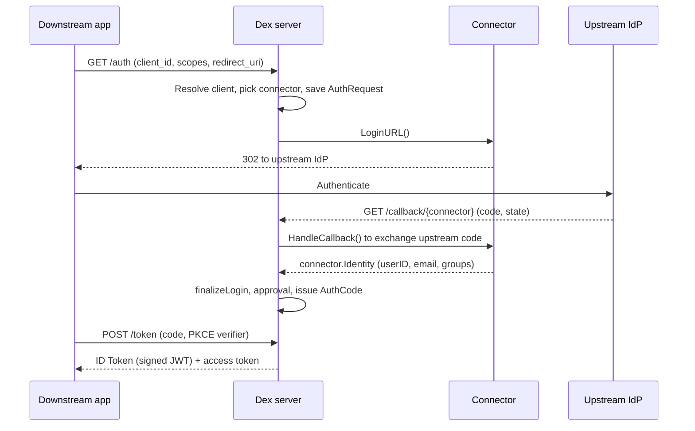

# Architecture

## Big picture

Dex is one Go binary with three top-level parts. The **server** (`server/`) is the OIDC and OAuth2 authorization server: it registers the HTTP routes, issues tokens, manages signing keys, and serves discovery. The **connectors** (`connector/`) are the federation strategies, one per upstream identity provider. The **storage** (`storage/`) is a pluggable state layer that holds request state, issued codes and tokens, and client registrations.

A downstream application only ever talks to the server over OIDC. When a user needs to log in, the server hands off to a connector, the connector talks to the upstream provider, and the identity that comes back is normalised into a common shape. The sequence below is the authorization code flow with an upstream OIDC provider.

## Components

### Server (`server/`)

The authorization server owns the HTTP surface. Routes are registered in `server/server.go`, including `/auth`, `/auth/{connector}`, `/callback`, `/callback/{connector}`, `/approval`, `/token`, `/keys`, `/userinfo`, and `/.well-known/openid-configuration` (`server/server.go:526-556`). It also serves an administrative gRPC API. The bulk of the login and token logic lives in `server/handlers.go` and `server/oauth2.go`.

### Connectors (`connector/`)

A connector encapsulates how to authenticate against one kind of upstream. The interfaces are defined in `connector/connector.go`. There are 16 implementations under `connector/`: `ldap`, `github`, `gitlab`, `google`, `microsoft`, `oidc`, `oauth`, `saml`, `openshift`, `keystone`, `linkedin`, `bitbucketcloud`, `gitea`, `atlassiancrowd`, `authproxy`, and `mock`. Whatever the upstream, a connector returns a normalised `connector.Identity` (`connector/connector.go:38`) carrying the user ID, username, email, and groups.

### Storage (`storage/`)

Storage is an interface, `storage.Storage` (`storage/storage.go:78`), implemented four ways: `memory`, `sql` (via the ent ORM, backing SQLite, Postgres, and MySQL), `etcd`, and `kubernetes` (custom resources). It persists the flow state and issued artifacts: `AuthRequest`, `AuthCode`, `RefreshToken`, `Client`, and `Connector` configs.

## How a request flows

The authorization code flow, from the downstream app's first request to the issued token:

1. **`GET /auth`** lands in `handleAuthorization` (`server/handlers.go:167`). It looks up the client by `client_id`, lists connectors, and filters them by the client's allowed set. If exactly one connector applies, it redirects straight to `/auth/{connector}` (`server/handlers.go:229`).
2. **`GET /auth/{connector}`** lands in `handleConnectorLogin` (`server/handlers.go:346`). It parses the authorization request, verifies the connector is permitted, sets `authReq.ConnectorID`, and saves the `AuthRequest` to storage. It then calls the connector's `LoginURL()` and redirects the browser to the upstream provider.
3. **The upstream login URL** is built by the connector. For the OIDC connector, `LoginURL` (`connector/oidc/oidc.go:442`) calls `oauth2Config.AuthCodeURL(state, ...)`, putting Dex's `AuthRequest` ID into `state`, and adds PKCE parameters.
4. **`GET /callback/{connector}`** lands in `handleConnectorCallback` (`server/handlers.go:701`). It restores the `AuthRequest` from `state`, then type-switches on the connector kind and calls `CallbackConnector.HandleCallback` (`server/handlers.go:760`).
5. **`HandleCallback`** (`connector/oidc/oidc.go:499`) exchanges the upstream code for tokens and calls `createIdentity` (`connector/oidc/oidc.go:559`), which verifies the upstream ID Token and returns a normalised `connector.Identity`.
6. **`finalizeLogin`** (`server/handlers.go:814`) copies the identity into `storage.Claims` and marks the `AuthRequest` logged in. If offline access was requested and the connector can refresh, it creates or updates an `OfflineSession` (`server/handlers.go:852`).
7. **Approval and code issuance.** `handleApproval` (`server/handlers.go:960`) shows the consent screen unless it is skipped, then `sendCodeResponse` (`server/handlers.go:1054`) issues a `storage.AuthCode`, deletes the `AuthRequest`, and redirects to the client with `?code=...&state=...`.
8. **`POST /token`** lands in `handleToken` (`server/handlers.go:1261`), which for the authorization-code grant calls `handleAuthCode` (`server/handlers.go:1312`). It loads and validates the code, runs PKCE verification, then `exchangeAuthCode` (`server/handlers.go:1372`) mints the access token and ID Token and deletes the one-time code.

The [Internals](./internals) page walks the token endpoint, PKCE, and ID Token signing in detail.

## Key design decisions

- **Delegation over storage.** Dex does not own user identities. It presents one OIDC face downstream and pushes the real authentication up to a connector, so an application implements OIDC once and Dex absorbs every upstream protocol.
- **Capability by interface, not a monolith.** A connector implements only the interfaces for what it can do: `PasswordConnector` for direct username and password (`connector/connector.go:58`), `CallbackConnector` for OAuth2 redirect flows (`connector/connector.go:65`), `SAMLConnector` for SAML POST binding (`connector/connector.go:91`), `RefreshConnector` for refreshing claims (`connector/connector.go:109`). The server discovers each capability with a type assertion.
- **Storage is swappable, including Kubernetes.** Because state hides behind `storage.Storage` (`storage/storage.go:78`), Dex can run cluster-native on CRDs with no separate database, which is why embedded deployments favour it.
- **Upstream tokens never leak downstream.** The `ConnectorData` field on an identity holds upstream tokens and is kept inside storage; it is never handed to the end user or the downstream OAuth client (`connector/connector.go:47-51`).

## Extension points

The connector interfaces in `connector/connector.go` are the primary extension surface: a new upstream is a new type that implements `PasswordConnector` or `CallbackConnector`. The storage layer is likewise pluggable through `storage.Storage`. Operational control is exposed through the gRPC admin API in `api/api.proto`, which lets an external system create and manage clients, passwords, and connectors at runtime.

## Sources

- Source read at commit `17a54e9` (v2.45.0 plus 248 commits): paths above are relative to the repository root.
- [Dex documentation](https://dexidp.io/docs/)
