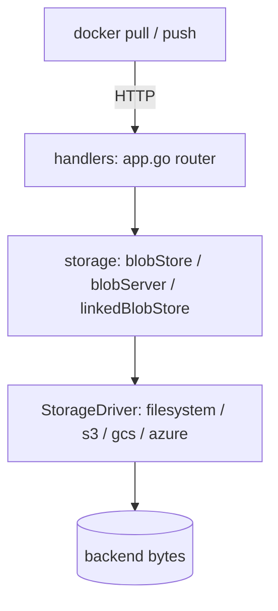

# Architecture

## Big picture

Distribution is three layers stacked on top of each other. At the top is an HTTP API layer that routes registry requests to handlers (`registry/handlers`). Below it is a storage abstraction that knows the registry's on-disk layout and the content-addressable rules (`registry/storage`). At the bottom are storage drivers, each a filesystem-like key/value backend for a specific target such as the local filesystem, S3, GCS, or Azure Blob (`registry/storage/driver`). A request enters at the top, and the layers translate it down to reads and writes on whatever backend is configured.

## Components

### HTTP router and dispatchers

`registry/handlers/app.go` is the center of the HTTP layer. The `App` holds a gorilla/mux router and registers one dispatcher per route name (`registry/handlers/app.go:106`). The route names are defined in `registry/api/v2/routes.go:11`: `base`, `manifest`, `tags`, `blob`, `blob-upload`, `blob-upload-chunk`, and `catalog`. A dispatcher is a function that reads the request, builds the right handler, and maps HTTP methods to handler methods.

### Handlers

Each registry operation has a handler file under `registry/handlers/`: `blob.go` for blob GET/HEAD/DELETE, `blobupload.go` for the blob upload session that a push uses, `manifests.go` for manifest GET/PUT, plus `tags.go` and `catalog.go`. A handler is the glue between an HTTP request and the storage layer; it does not itself know how bytes are stored.

### Storage abstraction

`registry/storage/` holds the layer that knows the registry's layout. `blobStore` and `blobStatter` (`registry/storage/blobstore.go:19`, `registry/storage/blobstore.go:156`) are the global, repository-independent view of blobs, keyed by digest. `blobServer` (`registry/storage/blobserver.go:19`) serves blob bytes over HTTP. `linkedBlobStore` (`registry/storage/linkedblobstore.go`) is the per-repository view: it tracks which blobs a given repository contains, using small link files. This is the layer that enforces content-addressability and repository membership.

### Storage drivers

`registry/storage/driver/` holds the backends: `filesystem`, `inmemory`, `s3-aws`, `gcs`, and `azure`. They all satisfy one interface, `StorageDriver` (`registry/storage/driver/storagedriver.go:56`), which models a filesystem-like key/value object store: `GetContent`, `PutContent`, `Reader`, `Writer`, `Stat`, `List`, `Move`, `Delete`, `RedirectURL`, and `Walk`. Swapping backends means swapping the driver; nothing above this interface changes.

## How a request flows

Trace a blob GET, the read half of `docker pull`, from HTTP request to bytes:

1. The `blob` route is registered with `blobDispatcher` (`registry/handlers/app.go:112`). The dispatcher builds a `blobHandler` and maps GET and HEAD to `GetBlob` (`registry/handlers/blob.go:14`, `registry/handlers/blob.go:34`).
2. `blobHandler.GetBlob` gets the repository's blob service with `bh.Repository.Blobs(bh)`, then calls `blobs.Stat(bh, bh.Digest)` to confirm the blob exists (`registry/handlers/blob.go:55`, `registry/handlers/blob.go:58`), and on success calls `blobs.ServeBlob` (`registry/handlers/blob.go:68`).
3. `Stat` resolves to `blobStatter.Stat` (`registry/storage/blobstore.go:165`). It computes the blob's data path from the digest and calls `driver.Stat` (`registry/storage/blobstore.go:166`, `registry/storage/blobstore.go:173`). A missing path is translated from the driver's `PathNotFoundError` into `distribution.ErrBlobUnknown` (`registry/storage/blobstore.go:176`), which the handler turns into the correct HTTP error.
4. `ServeBlob` resolves to `blobServer.ServeBlob` (`registry/storage/blobserver.go:26`). It re-stats the blob, computes the path, and if `redirect` is enabled it asks the driver for a `RedirectURL` (`registry/storage/blobserver.go:37`). If the driver returns a non-empty URL, the registry replies `307 Temporary Redirect` and the client fetches the bytes straight from object storage (`registry/storage/blobserver.go:41`).
5. If there is no redirect URL, the registry falls back to streaming: it opens a `newFileReader` on the driver and serves the content with `http.ServeContent` (`registry/storage/blobserver.go:50`, `registry/storage/blobserver.go:73`).

## Key design decisions

**Content-addressable storage.** A blob is stored once, under a path derived from its digest (`blobs/<algorithm>/<digest>/data`), and each repository refers to it through a link file rather than a second copy. The layout is documented in a comment block in `registry/storage/paths.go:24`. A blob shared by many repositories costs one copy of the bytes plus a handful of tiny links. Integrity comes for free: the digest is the address, so a corrupted blob does not match its own path.

**Redirect instead of proxy.** For cloud drivers, the registry does not sit in the data path. `blobServer.ServeBlob` returns a `307` to a presigned object-storage URL and the client downloads directly from the store (`registry/storage/blobserver.go:37`). This keeps the registry process from being the bottleneck when thousands of nodes pull a popular image at once. It can be turned off with the `redirect` flag, in which case the registry streams the bytes itself.

**Pluggable drivers.** Backends are registered through a factory and created by name (`registry/storage/driver/storagedriver.go:50` comment). Because every driver is just a filesystem-like key/value store behind one interface, the storage and HTTP layers are backend-agnostic.

**Cross-repository blob mount.** If a blob already lives in another repository the client can mount it instead of re-uploading, short-circuiting the upload entirely (`registry/storage/linkedblobstore.go:139`). This is a direct payoff of content-addressability: the bytes already exist, so a mount is just a new link.

## Extension points

- **Storage drivers**: implement `StorageDriver` (`registry/storage/driver/storagedriver.go:56`) and register it with the factory to add a backend. The in-tree drivers (`filesystem`, `s3-aws`, `gcs`, `azure`, `inmemory`) are examples of the same interface.
- **The library itself**: the README states the components are meant to be consumed as libraries for building a larger registry, and notes those library interfaces are unstable (README). Harbor is the canonical example of a product built this way.
