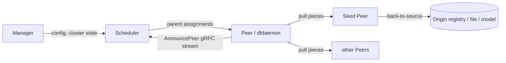

# Architecture

## Big picture

Dragonfly 2.0 splits the system into four roles. The Manager and Scheduler live in this repository as Go services. The Seed Peer and Peer are clients (`dfdaemon`), implemented in Rust in the `dragonflyoss/client` repository, and they move the actual bytes. The Scheduler never touches file data: it builds a per-task peer graph and tells each peer which parents to pull pieces from over gRPC. This is the key change from the 1.x supernode model, where a central node controlled fixed-size chunks directly.

## Components

### Manager

The manager (`manager/`) is the configuration and cluster-management hub. It owns dynamic configuration distributed to the other roles, the console UI, role-based access control (`manager/permission/rbac`), OAuth (`manager/auth/oauth`), and the database layer (`manager/database`). Other roles read their configuration from the manager.

### Scheduler

The scheduler (`scheduler/`) is the scheduling brain. It accepts peer registrations and decides which parent peers a child should pull pieces from. It exposes two gRPC service versions side by side, v1 (`scheduler/service/service_v1.go`) and v2 (`scheduler/service/service_v2.go`); v2 is current. The wire API types come from the external module `d7y.io/api/v2` declared in `go.mod`.

### Seed Peer and Peer

Seed Peers and Peers are the data plane. A Peer is a downloading node; a Seed Peer is a node that proactively caches content and can fetch from the origin (back-to-source). Both run as the Rust `dfdaemon` client in a separate repository. The scheduler in this repository only returns instructions, so all transfer throughput lives outside this codebase.

## How a request flows

A representative operation is a peer registering for a task and getting assigned parents. Every hop below is inside the scheduler.

1. The scheduler binary starts at `cmd/scheduler/main.go:23`, which calls `cmd.Execute()`.
2. A peer opens the bidirectional stream `AnnouncePeer` at `scheduler/service/service_v2.go:121`. The handler loops on `stream.Recv()` and switches on the request type at `service_v2.go:144`.
3. For a register request the switch dispatches at `service_v2.go:157` into `handleRegisterPeerRequest` (`service_v2.go:1300`). It resolves host, task, and peer resources, then throttles registration storms with exponential backoff plus jitter at `service_v2.go:1325`. Seed peers skip the delay because of their latency role, gated at `service_v2.go:1324`.
4. The handler branches on the task `SizeScope` at `service_v2.go:1386`. An empty task returns immediately; normal, tiny, small, and unknown scopes call `ScheduleCandidateParents` at `service_v2.go:1434`.
5. `ScheduleCandidateParents` (`scheduler/scheduling/scheduling.go:113`) runs a retry loop. When `RetryBackToSourceLimit` (`scheduling.go:150`) or `RetryLimit` (`scheduling.go:175`) is exceeded, it returns a back-to-source instruction so the peer fetches from the origin instead.
6. Otherwise `FindCandidateParents` (`scheduling.go:187`) selects parents, the scheduler adds parent-to-child edges to the task DAG with `AddPeerEdge` (`scheduling.go:199`), and sends a normal response back over the stream at `scheduling.go:219`.

## Key design decisions

The scheduler models each task as a directed acyclic graph of peers (`scheduler/resource/standard/task.go:157`, field `DAG dag.DAG[*Peer]`). Before adding a parent edge it checks for cycles with `CanAddEdge` (`pkg/graph/dag/dag.go:277`), and a cycle returns `ErrCycleBetweenVertices` (`dag.go:46`). This structurally prevents a peer topology from forming a loop and deadlocking, where two peers each wait on the other for pieces.

Parent selection does not scan every peer. It samples a random subset and filters that, via `LoadRandomPeers(filterParentLimit)` at `scheduling.go:497`. The cost of scheduling stays bounded by the sample size even in very large clusters.

## Extension points

The scheduler picks parents through a pluggable evaluator (`scheduler/scheduling/evaluator/`); `evaluatorDefault` is the built-in scoring implementation. The manager exposes configuration, RBAC, and OAuth surfaces (`manager/auth/oauth`, `manager/permission/rbac`) for integration. On the data plane, Dragonfly integrates as a containerd or Docker registry mirror and supports origin schemes including `hf://` and `modelscope://`.
