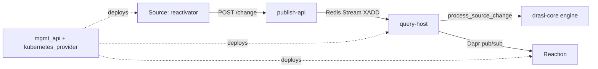

# Architecture

## Big picture

Drasi installs onto Kubernetes and runs as a set of services wired together by Dapr. A user declares three kinds of resource (Source, Continuous Query, Reaction) as YAML, and the control plane turns each into running pods. At runtime a change travels one direction: a Source captures an external change and posts it to a query container, the query container evaluates every affected continuous query and publishes the result diff, and a Reaction consumes that diff and acts. The two hops use different transports: Source to query is a Redis Stream, query to Reaction is Dapr pub/sub.

## Components

### Control plane

`control-planes/mgmt_api` (Rust) is the management API that accepts the declarative resources. `control-planes/kubernetes_provider` (Rust) is the operator that turns those resources into Kubernetes objects; its `src/` holds the controller, actor, and spec-builder code that reconciles a Source, Query, or Reaction into pods. Together they own the "declared YAML becomes running workload" step.

### Sources

`sources/` holds the connectors. A Source watches an external system's change feed and converts each change into a Drasi `SourceChange`. The relational Source uses Debezium as its change-data-capture engine (`sources/relational/debezium-reactivator`), and other prebuilt Sources cover Cosmos DB, Dataverse, Event Hubs, and Kubernetes (`sources/cosmosdb`, `sources/dataverse`, `sources/eventhub`, `sources/kubernetes`). Shared plumbing lives in `sources/shared` (`change-router`, `change-dispatcher`, `query-api`), which routes captured changes and serves the bootstrap data a query needs at startup. Source integrations can be written against the SDKs in `sources/sdk` (Rust, Java, .NET).

### Query container

`query-container/` (Rust) is the runtime for continuous queries and splits into three services:

- `publish-api` is the entry point that Sources post to. It receives a change on `/change` and appends it to a Redis Stream (`query-container/publish-api/src/main.rs:59`).
- `query-host` runs each continuous query as a Dapr virtual actor, consumes changes from the stream, evaluates them incrementally, and publishes the result diff.
- `view-svc` persists the materialized result view of a query (for example to MongoDB) so a Reaction or client can read the current result set.

The evaluation itself lives in the vendored `drasi-core` engine, pulled in as a submodule under `query-container/query-host/drasi-core`.

### Reactions

`reactions/` holds the components that act on query results. A Reaction subscribes to a query's result topic and runs an action when rows are added, updated, or deleted. Prebuilt Reactions include HTTP, SignalR, Gremlin, Dapr, Debezium, SQL, AWS, Azure, Power Platform, a vector-store sync, and MCP (`reactions/http`, `reactions/signalr`, `reactions/gremlin`, and the sibling directories). Reaction integrations can be written against the SDKs in `reactions/sdk` (Python, .NET, JavaScript).

### CLI

`cli/` (Go) is the `drasi` command. `drasi init` installs Drasi onto the current kubectl cluster (`cli/cmd/init.go`), `drasi apply` creates or updates resources (`cli/cmd/apply.go`), and the rest of `cli/cmd/*.go` covers list, describe, delete, tunnel, wait, and uninstall.

## How a change flows

Trace a single relational row that is updated, changing a continuous query's result and firing a Reaction. Every hop has a `file:line` anchor.

1. **The Source captures the change and posts it.** The relational reactivator reads the database change through Debezium, converts it to a Drasi `SourceChange`, and posts it to the query container's `publish-api`, which exposes `/change` (`query-container/publish-api/src/main.rs:59`).
2. **publish-api appends it to a Redis Stream.** The stream topic is `{query_container_id}-publish` (`query-container/publish-api/src/main.rs:45`), and `Publisher::publish` runs an `xadd` onto it (`query-container/publish-api/src/publisher.rs:78`).
3. **query-host consumes the stream.** The worker reads through a Redis consumer group created with `xgroup_create_mkstream` (`query-container/query-host/src/change_stream/redis_change_stream.rs:51`) under group `qh` (`redis_change_stream.rs:73`). The worker loop receives one event with `change_stream.recv::<ChangeEvent>()` (`query-container/query-host/src/query_worker.rs:363`) and acks-and-skips any event addressed to a different query (`query_worker.rs:383`).
4. **The engine evaluates incrementally.** `process_change` (`query-container/query-host/src/query_worker.rs:502`) calls `continuous_query.process_source_change(source_change)` (`query_worker.rs:524`), which lands in the engine's `ContinuousQuery::process_source_change` (`drasi-core/core/src/query/continuous_query.rs:89`). For an update, `build_solution_changes` (`continuous_query.rs:165`) looks up the previous element version from the index (`continuous_query.rs:196`), computes the result set both before and after the change, and emits the added, updated, and deleted rows from the diff.
5. **query-host publishes the result diff.** `process_change` calls `publisher.publish(query_id, output)` (`query_worker.rs:576`), and `ResultPublisher::publish` sends it through Dapr's HTTP publish API to topic `{query_id}-results` (`query-container/query-host/src/result_publisher.rs:47`), propagating the trace context in a `traceparent` header (`result_publisher.rs:61`).
6. **The Reaction consumes and acts.** A Reaction subscribes to `{query_id}-results`, receives the added/updated/deleted notification, and runs its action, implemented against one of the Reaction SDKs (`reactions/sdk/{python,dotnet,javascript}`).

At query startup the same path runs in reverse for initial data: `bootstrap` (`query_worker.rs:590`) subscribes to the Source by posting to its `/subscription` endpoint (`query-container/query-host/src/source_client.rs:48`), then feeds the initial rows into the engine as inserts (`query_worker.rs:652`). The initial result set and the live change stream therefore go through the same incremental engine.

## Key design decisions

**Incremental evaluation, not re-query.** The engine keeps an index of every element it has seen so that an update can be diffed against the element's previous version rather than recomputing the whole query. That is why an update looks up the old version before computing the new result (`continuous_query.rs:196`), and it is what lets a continuous query stay cheap as changes arrive (Continuous Queries docs).

**Push, not poll.** Sources push captured changes forward and Reactions are pushed the result diffs; nothing polls on a timer. The two transports are deliberately different: an at-least-once Redis Stream carries Source to query so changes are durable and acked, and Dapr pub/sub carries query to Reaction (`redis_change_stream.rs:73`; `result_publisher.rs:47`).

**Built on Dapr.** Each continuous query runs as a Dapr virtual actor and the components communicate through Dapr, so Drasi assumes a Dapr sidecar is present. This buys the actor lifecycle and state management from Dapr rather than reimplementing them (Azure blog).

## Extension points

- **Sources**: implement a new connector against the Source SDK (`sources/sdk`, in Rust, Java, or .NET) to bring a system's change feed into Drasi.
- **Reactions**: implement a new action against the Reaction SDK (`reactions/sdk`, in Python, .NET, or JavaScript) to act on query result diffs.
- **Index backends**: the engine abstracts its element index behind a trait so the backing store can be in-memory, Garnet (Redis-compatible), or RocksDB (`drasi-core/core/src/interface/`, with implementations under `drasi-core/index-garnet` and `drasi-core/index-rocksdb`).
- **Query middleware**: Sources can attach middleware in the engine's `middleware` package to transform changes before evaluation (`drasi-core/middleware`).
