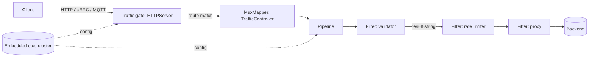

# Architecture

## Big picture

Every managed thing in Easegress is an object under a supervisor, and every object's configuration is stored in an embedded etcd cluster shared across all nodes. Objects fall into categories that start in priority order: system controllers first, then business controllers, then pipelines, then traffic gates (`pkg/supervisor/registry.go:102`). A traffic gate such as an HTTP server accepts a request, routes it to a pipeline, and the pipeline runs the request through an ordered list of filters. The last filter is usually a proxy that forwards to a backend.

## Components

### Supervisor and object model

`pkg/supervisor` owns the lifecycle of every object. The `Object` interface (`pkg/supervisor/registry.go:30`) requires `Category`, `Kind`, a default spec, status, and close. Objects that handle traffic also implement `TrafficObject` with `Init(superSpec, muxMapper)` (`pkg/supervisor/registry.go:61`). The category constants and their startup priority are defined together (`pkg/supervisor/registry.go:102`), which fixes the order in which the supervisor brings objects up and tears them down.

### Traffic gates

A traffic gate is the data-plane entry point. `HTTPServer` (`pkg/object/httpserver`) is the listener for HTTP; `GRPCServer` and `MQTTProxy` cover the other protocols. A gate does not process the request itself past routing: it matches a route and looks up the handler (a pipeline) that the route names.

### Pipelines and filters

`Pipeline` (`pkg/object/pipeline`) holds a map of filters and an ordered `flow`. Each filter lives under `pkg/filters/*`: proxy, validator, ratelimiter, corsadaptor, opafilter, waf, aigatewayproxy, and more. A filter's `Handle(ctx)` returns a result string, and the pipeline uses that string to decide the next node. This is where traffic orchestration happens.

### Controllers

Controllers run in the background as the control plane. `TrafficController` (`pkg/object/trafficcontroller`) holds HTTP servers and pipelines per namespace and can resolve a handler by name (`pkg/object/trafficcontroller/trafficcontroller.go:123`). Others include `AutoCertManager`, `MeshController` for the service mesh, and the various service registries (Eureka, Consul, Nacos, Zookeeper, etcd).

### Embedded etcd cluster

`pkg/cluster` embeds `go.etcd.io/etcd/server/v3/embed` into each node (`pkg/cluster/cluster.go:31`). The `cluster` struct holds an `*embed.Etcd` server (`pkg/cluster/cluster.go:123`) started with `embed.StartEtcd` (`pkg/cluster/cluster.go:586`). Raft and leader election provide high availability, and the `Cluster` interface exposes Get, Put, Watch, Syncer, and STM over the shared key space (`pkg/cluster/cluster_interface.go:33`). Configuration lives in etcd and is shared across every node.

## How a request flows

Trace one HTTP request from the listener to the backend. All anchors are verified at commit `3bdb192`.

1. `mux.ServeHTTP` (`pkg/object/httpserver/mux.go:338`) is the entry point. It special-cases ACME challenges under `/.well-known/acme-challenge/` (`pkg/object/httpserver/mux.go:344`), and otherwise forwards to the current `muxInstance.serveHTTP` (`pkg/object/httpserver/mux.go:357`).
2. Inside `serveHTTP`, the request body is wrapped in a byte-count reader (`pkg/object/httpserver/mux.go:452`), a trace span is opened (`pkg/object/httpserver/mux.go:457`), an internal context is created with `context.New(span)` (`pkg/object/httpserver/mux.go:459`), and the request is set on the context with `ctx.SetRequest` (`pkg/object/httpserver/mux.go:467`).
3. Routing: `routers.NewContext(req)` then `mi.search(routeCtx)` decides the route (`pkg/object/httpserver/mux.go:472`), and `ctx.SetRoute` records it (`pkg/object/httpserver/mux.go:474`). A missed route returns a failure response (`pkg/object/httpserver/mux.go:533`).
4. Backend resolution: `route.route.GetBackend()` (`pkg/object/httpserver/mux.go:539`) names the handler, and `mi.muxMapper.GetHandler(backend)` fetches it (`pkg/object/httpserver/mux.go:540`). The `MuxMapper` is the `TrafficController`'s `Namespace.GetHandler` (`pkg/object/trafficcontroller/trafficcontroller.go:123`), so the handler is a pipeline.
5. Rewrite and payload: `route.route.Rewrite` (`pkg/object/httpserver/mux.go:548`) then `req.FetchPayload(maxBodySize)` (`pkg/object/httpserver/mux.go:557`), which returns 413 if the body exceeds the limit.
6. Execution: with no global filter the code calls `handler.Handle(ctx)` (`pkg/object/httpserver/mux.go:572`); with one it calls `globalFilter.Handle(ctx, handler)` (`pkg/object/httpserver/mux.go:574`). The `Handler` interface is just `Handle(ctx) string` (`pkg/context/context.go:35`).
7. `Pipeline.Handle` (`pkg/object/pipeline/pipeline.go:357`) calls `doHandle` (`pkg/object/pipeline/pipeline.go:371`), which walks the flow and calls each `node.filter.Handle(ctx)` (`pkg/object/pipeline/pipeline.go:390`). The returned result string indexes `JumpIf` to pick the next node, or ends the flow (`pkg/object/pipeline/pipeline.go:399`).
8. A terminal filter is usually the proxy. `Proxy.Handle` (`pkg/filters/proxies/httpproxy/proxy.go:343`) fires the mirror pool asynchronously (`pkg/filters/proxies/httpproxy/proxy.go:346`), selects a candidate pool by match (`pkg/filters/proxies/httpproxy/proxy.go:351`), and forwards through the server pool (`pkg/filters/proxies/httpproxy/proxy.go:358`).
9. The response is written back in a deferred `mi.sendResponse` (`pkg/object/httpserver/mux.go:367`), which copies `ctx.GetResponse` to the writer and finishes the access log, metrics, and span.

The key idea: a pipeline is a directed-graph execution engine. An empty result string means continue to the next filter; a non-empty result with no matching `JumpIf` entry ends the flow (`pkg/object/pipeline/pipeline.go:399`).

## Key design decisions

Resilience is injected into the proxy, not run as separate filters. The v2.0 rework moved circuit breaker, retry, and time limiter out of standalone filters and into the Proxy, which distributes them to its pools via `InjectResiliencePolicy` (`pkg/filters/proxies/httpproxy/proxy.go:362`). The maintainers called the earlier split a mistake that mixed control logic with business logic (MegaEase v2.0 announcement).

The handler abstraction is deliberately tiny. From the HTTP server's view a pipeline is a single method that returns a string (`pkg/context/context.go:35`). That minimalism is what lets one pipeline model serve HTTP, gRPC, and MQTT: the gate protocol differs, but the pipeline contract does not.

etcd is embedded rather than external. Each node bundles the etcd server as a library (`pkg/cluster/cluster.go:31`) instead of talking to a separate etcd process. The trade-off is a larger binary that contains etcd, in exchange for a self-contained HA cluster with nothing else to deploy.

## Extension points

- **Filters**: implement the `Filter` interface (`pkg/filters/filters.go:54`) and register a `Kind` in the package `init()` via `filters.Register` (`pkg/filters/registry.go:29`). A filter declares the result strings it can return, which the pipeline validates against its jump table.
- **Objects**: register a new `Object` kind with the supervisor to add a controller or traffic gate type.
- **WebAssembly**: the `wasmhost` filter runs user code compiled to WebAssembly, so extensions need not be written in Go.
- **Service registries**: pluggable backends for Eureka, Consul, Nacos, Zookeeper, and etcd feed service discovery into routing.
