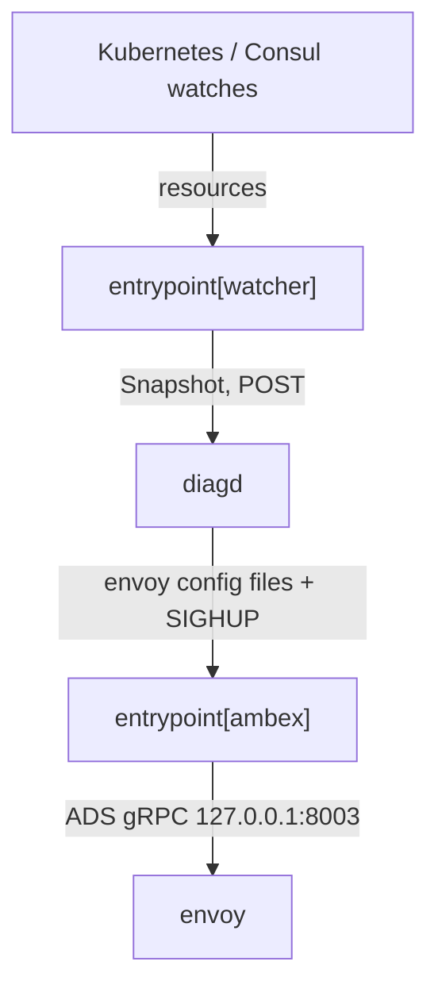

# Architecture

## Big picture

Emissary-Ingress runs as a single container that hosts three processes plus one in-process goroutine, all sharing fate. The design is written out as a dataflow diagram directly in the source comments at `cmd/entrypoint/entrypoint.go:26-78`. The Go `entrypoint` process launches `diagd` (Python) and `envoy` as child processes and runs `ambex` (Go) and the cluster `watcher` as goroutines (`cmd/entrypoint/entrypoint.go:147-191`). If any one of them dies, the whole process shuts down and Kubernetes is expected to restart it (`cmd/entrypoint/entrypoint.go:74-78`).

## Components

### entrypoint (Go)

The process manager and watcher. `Main` (`cmd/entrypoint/entrypoint.go:80`) waits for the CRD conversion webhook to be ready (`cmd/entrypoint/entrypoint.go:96`), then starts the child processes and goroutines as a `dgroup` (`cmd/entrypoint/entrypoint.go:147-191`). It is reached through a BusyBox-style dispatch in `cmd/busyambassador/main.go:36`, where `os.Args[0]` selects `entrypoint`, `kubestatus`, or `version`.

### watcher (Go goroutine)

`WatchAllTheThings` (`cmd/entrypoint/watcher.go:26`) uses the `kates` client to watch Kubernetes. The watched types are decided by `GetInterestingTypes` (`cmd/entrypoint/interesting_types.go`) and filtered by RBAC at boot. It assembles updates from Kubernetes, Consul, and the filesystem into one consistent `snapshot.Snapshot`.

### diagd (Python)

The configuration engine. It receives a snapshot over HTTP, compiles it into an intermediate representation, generates Envoy configuration, and validates it before publishing. It listens on port 8004 by default (`cmd/entrypoint/env.go:153`).

### ambex (Go goroutine)

The ADS server. It holds Envoy configuration in a go-control-plane `SnapshotCache` and pushes it to Envoy over the ADS gRPC stream on `127.0.0.1:8003` (`cmd/entrypoint/entrypoint.go:164-167`). Its role is documented in the header comment at `pkg/ambex/main.go:6-40`.

### envoy

The data plane. It connects to `ambex` over ADS and serves live traffic. The Envoy binary is shipped inside the container image.

## How a request flows

This traces a configuration change from a `Mapping` resource to a live Envoy route.

1. The watcher detects a change and assembles a `snapshot.Snapshot` (`cmd/entrypoint/watcher.go:201`).
2. When the snapshot reaches the `SnapshotReady` disposition (`cmd/entrypoint/watcher.go:106-118`), the `notify` closure calls `notifyReconfigWebhooks` (`cmd/entrypoint/watcher.go:62-67`).
3. That POSTs to diagd at the watt update URL built from `GetEventUrl` (`cmd/entrypoint/env.go:244`) and `notifyWebhookUrl` (`cmd/entrypoint/notify.go:42`).
4. diagd's Flask route `handle_watt_update` (`python/ambassador-diag/src/ambassador_diag/diagd.py:916`) reads `?url=` and enqueues the config.
5. diagd compiles the snapshot into an `IR`, generates an `EnvoyConfig`, and splits it into bootstrap/ADS/clustermap (`python/ambassador-diag/src/ambassador_diag/diagd.py:1585-1635`).
6. The generated config is validated by a real `envoy --mode validate` run (`python/ambassador-diag/src/ambassador_diag/diagd.py:1652`); on failure the old config is kept.
7. Validated config is written to disk and picked up by ambex, which pushes it over ADS to Envoy.

## Key design decisions

- **Kubernetes as the source of truth.** There is no separate database; the watcher reconstructs the world state from the cluster ([The New Stack](https://thenewstack.io/cncf-adopts-ambassadors-api-gateway-emissary-ingress/)).
- **Shared fate across processes.** Any process or goroutine dying takes down the whole pod, delegating restart to Kubernetes (`cmd/entrypoint/entrypoint.go:74-78`).
- **Validate before swap.** Generated Envoy config is validated by Envoy itself before it goes live, so an Emissary bug cannot break production traffic (`python/ambassador-diag/src/ambassador_diag/diagd.py:1652`).
- **Endpoint fast path.** Pod endpoint changes bypass the heavy Python recompile and go straight to ambex (`pkg/ambex/fastpath.go:7-11`).

## Extension points

- **CRDs** in `getambassador.io/v3alpha1`: `Listener`, `Host`, `Mapping`, and related routing resources (`pkg/api/getambassador.io/v3alpha1/crd_mapping.go:27`).
- **Conversion webhook** `emissary-apiext` (`cmd/apiext/main.go`, `pkg/apiext`) normalizes `v1`/`v2`/`v3alpha1` CRDs so the config engine only sees `v3alpha1`.
- **Gateway API** resources (`GatewayClass`, `Gateway`, `HTTPRoute`) are carried in the snapshot (`pkg/snapshot/v1/types.go:84-87`).
- **Input sources**: Kubernetes, Consul, and the filesystem all feed the same snapshot.
