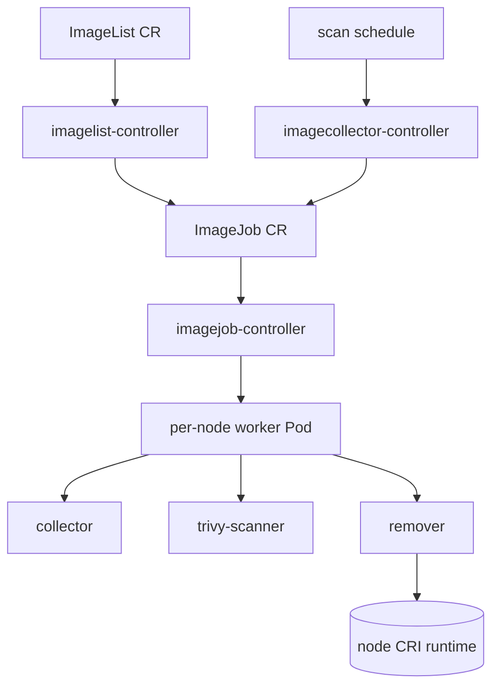

# Architecture

## Big picture

Eraser is one Go binary (`main.go`) that runs in different roles depending on how the container is started. A long-lived `eraser-manager` runs the controllers; short-lived worker Pods do the per-node work and then exit. The manager watches two cluster-scoped CRDs, `ImageList` and `ImageJob`, and translates a cleanup request into a Job that fans out one Pod per node. Each worker Pod talks to the node's container runtime over the CRI API to list images, list running containers, and delete the images that are both targeted and non-running.

## Components

### eraser-manager (controller-manager)

The resident process. It registers and runs three controllers off the same manager (`main.go`). The `imagelist-controller` watches the `ImageList` CRD (`controllers/imagelist/imagelist_controller.go`). The `imagejob-controller` watches `ImageJob` and creates the per-node worker Pods (`controllers/imagejob/imagejob_controller.go`). The `imagecollector-controller` builds the periodic scan Jobs (`controllers/imagecollector/imagecollector_controller.go`). Configuration is read from a ConfigMap-based `EraserConfig`, not a CRD; the only CRDs are `ImageList` and `ImageJob`.

### Worker Pod (per node)

For each cleanup, the manager schedules one Pod per node, pinned with `NodeName` and `RestartPolicy: Never`, so it runs once and exits. Inside the Pod are up to three containers: a collector that lists every image on the node from the CRI (`pkg/collector`), a Trivy scanner that flags vulnerable images (`pkg/scanners/trivy`), and a remover that deletes the non-running targeted images through the CRI (`pkg/remover`). In manual (`ImageList`) mode the remover runs on its own; in scan mode all three run and hand data between each other.

### CRI client

Every worker reaches the node's runtime through the CRI client in `pkg/cri`. It negotiates the runtime API version, trying CRI `v1` first and falling back to `v1alpha2`, so it works against older containerd and CRI-O (`pkg/cri/client.go:47`). The remover uses this client to list images, list running containers, and delete images.

### CRDs

Both CRDs are in the `eraser.sh` group and cluster-scoped. `ImageList` carries `spec.images []string`, the images to delete, with `*` meaning prune everything non-running, plus success/failed/skipped/timestamp status (`api/v1/imagelist_types.go:20-49`). `ImageJob` represents one cluster-wide sweep: `status.phase` is Running, Completed, or Failed, with desired/succeeded/failed/skipped counts and a `deleteAfter` timestamp for delayed cleanup of the finished Job (`api/v1/imagejob_types.go:41-72`).

## How a request flows

Tracing a manual cleanup, from applying an `ImageList` to a node deleting the image:

1. A user applies an `ImageList` named `imagelist`. The imagelist-controller's `Reconcile` fires but ignores any name other than the fixed `imagelist` (`controllers/imagelist/imagelist_controller.go:139-144`).
2. `Reconcile` filters existing child `ImageJob`s by owner reference. With none, it takes the new-event path `handleImageListEvent`; if a Job is already running, it requeues a minute later (`controllers/imagelist/imagelist_controller.go:158-173`).
3. `handleImageListEvent` marshals `spec.Images` to JSON and creates an immutable ConfigMap holding it (`controllers/imagelist/imagelist_controller.go:257-273`), then assembles the remover `PodTemplateSpec` with the image list mounted and the `--imagelist` argument set (`controllers/imagelist/imagelist_controller.go:276-278`).
4. It creates an `ImageJob` owned by the `ImageList`, plus a `PodTemplate` object, and re-parents the ConfigMap to the Job so cleanup is by owner reference.
5. The imagejob-controller's `Reconcile` sees the new Job with an empty phase and calls `handleNewJob` (`controllers/imagejob/imagejob_controller.go:294`).
6. `handleNewJob` lists all nodes, sets `status.desired` to the node count, applies the NodeFilter include/exclude selectors, and records the skipped count (`controllers/imagejob/imagejob_controller.go:294-300`).
7. For each selected node it calls `copyAndFillTemplateSpec` to clone the PodSpec and pin `NodeName`, then creates a `GenerateName: eraser-<node>-` Pod (`controllers/imagejob/imagejob_controller.go:533`, `controllers/imagejob/imagejob_controller.go:582`).
8. Each remover Pod starts, builds a CRI client with `cri.NewRemoverClient`, parses the mounted image list, and calls `removeImages` (`pkg/remover/remover.go:63`, `pkg/remover/remover.go:121`, `pkg/remover/remover.go:140`).
9. `removeImages` lists all images and all running containers from the CRI, builds the running and non-running image maps, and deletes each target that is non-running and not excluded; a target that is running is skipped with a log line (`pkg/remover/helpers.go:11`, `pkg/remover/helpers.go:66-96`).
10. As Pods finish, the imagejob-controller marks the Job Completed or Failed. The imagelist-controller aggregates the result into `ImageList.status`, sets `deleteAfter`, and later garbage-collects the Job, PodTemplate, and ConfigMap by owner reference.

## Key design decisions

Push-based fan-out instead of a DaemonSet. Rather than keeping an agent on every node, Eraser creates one single-shot Pod per node from a Job and lets it exit when done. Removal work is a burst, so this avoids a resident per-node cost, at the price of the controller having to manage Job lifetimes and delayed cleanup (`controllers/imagelist/imagelist_controller.go:179-255`).

Running-image protection from CRI data, not the kubelet. The remover decides what is safe to delete from the node's real running set, obtained by listing containers through the CRI, rather than trusting any higher-level record (`pkg/remover/helpers.go:45-52`). The [Internals](./internals) page traces how that map is built.

Scanning is optional and pluggable. Trivy is the default scanner, but the scan step is defined by an interface, so a different scanner can take its place, and disabling scanning turns Eraser into a plain scheduled image cleaner (`pkg/scanners/template/scanner_template.go:21`).

## Extension points

- **`ImageList` CRD**: the manual interface. List image names or digests to delete, or `*` to prune every non-running image (`api/v1/imagelist_types.go:20-49`).
- **Scanner interface**: implement `ImageProvider` (`ReceiveImages`, `SendImages`, `Finish`) to replace Trivy with a custom scanner (`pkg/scanners/template/scanner_template.go:21`).
- **NodeFilter**: include or exclude selectors decide which nodes a Job targets, recorded as skips in the Job status (`controllers/imagejob/imagejob_controller.go:294-300`).
- **Exclusion ConfigMaps**: images listed in an exclusion ConfigMap are never deleted even when targeted (`pkg/remover/helpers.go:72-76`).
