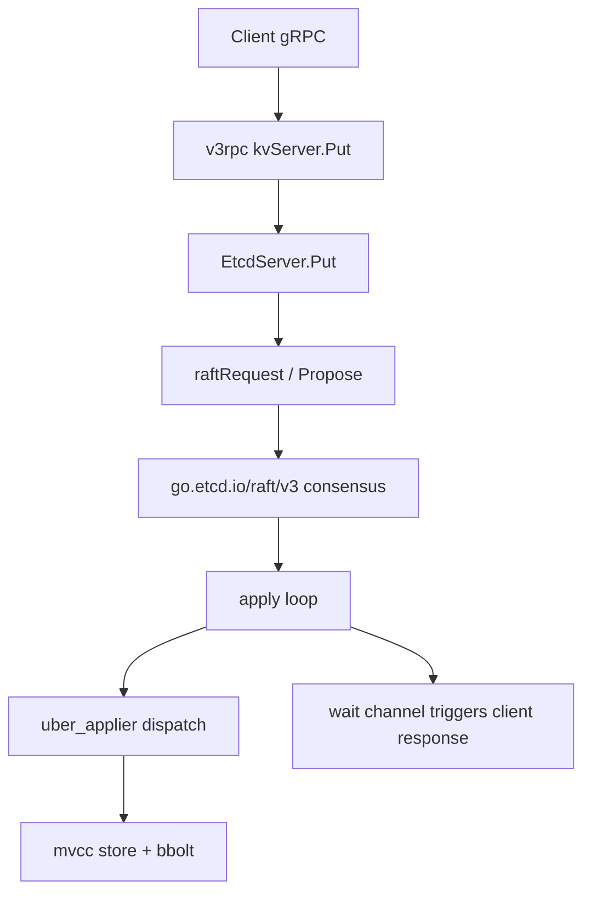

# Architecture

## Big picture

An etcd member is a state machine driven by a Raft log. Clients talk gRPC to the server; writes are turned into Raft proposals, replicated to a majority of members, and only then applied to the local store. The store keeps data under MVCC on a bbolt backend. Around that core sit leases, authentication, and the watch layer.

The diagram below shows the path a write takes through one member.

## Components

### server/etcdserver

The core state machine. It hosts the client-facing API handlers, the Raft loop, the apply loop, and membership management. `EtcdServer.Put` and the proposal machinery live in `server/etcdserver/v3_server.go`; the apply loop is in `server/etcdserver/server.go`. The Raft node wrapper that bundles the `raft.Node`, transport, and ticker is `raftNode` in `server/etcdserver/raft.go:81`.

### server/storage

The persistence layer: `mvcc` is the multi-version store, `backend` wraps bbolt, `wal` is the write-ahead log, plus `schema` and `datadir`. The store keys bbolt by revision, not by user key (`server/storage/mvcc/kvstore.go:53`).

### server/lease and server/auth

`server/lease` manages TTL-based key expiry through the `lessor` (`server/lease/lessor.go:145`). `server/auth` holds the RBAC store for users, roles, and permissions.

### api, client, and CLIs

`api` holds the protobuf and gRPC definitions (`go.etcd.io/etcd/api/v3`). `client` is the Go client (`clientv3`). `etcdctl` and `etcdutl` are the command-line tools. The Raft algorithm itself is a separate module, `go.etcd.io/raft/v3` (`go.mod:37`), so projects outside etcd can use it.

## How a request flows

A client `Put` travels end to end like this:

1. The gRPC handler `kvServer.Put` validates the request and calls the store (`server/etcdserver/api/v3rpc/key.go:90`).
2. `EtcdServer.Put` wraps it as an internal Raft request (`server/etcdserver/v3_server.go:295`) and calls `raftRequest` (`server/etcdserver/v3_server.go:303`).
3. `processInternalRaftRequestOnce` assigns a request ID, marshals it, registers a wait channel with `s.w.Register(id)` (`server/etcdserver/v3_server.go:1106`), and submits it with `s.r.Propose(cctx, data)` (`server/etcdserver/v3_server.go:1113`). It then blocks on the channel for the result (`server/etcdserver/v3_server.go:1123`).
4. Raft (the external `go.etcd.io/raft/v3` module) replicates the log entry. Once committed, the entry is handed back to the apply loop.
5. `applyEntryNormal` runs the committed entry through `apply.Apply` (`server/etcdserver/server.go:1959`) and, on success, calls `s.w.Trigger(id, ar)` (`server/etcdserver/server.go:1971`) to unblock step 3 and return the response.
6. `dispatch` unpacks the request and, for a put, calls `a.applyV3.Put(r.Put)` (`server/etcdserver/apply/uber_applier.go:134`).
7. The backend applier forwards to the MVCC transaction layer (`server/etcdserver/apply/backend.go:50`), which opens a write transaction and writes the key (`server/etcdserver/txn/put.go:30`).
8. `storeTxnWrite.put` marshals the value and writes it to bbolt with `tx.UnsafeSeqPut`, then updates the in-memory index with `kvindex.Put` (`server/storage/mvcc/kvstore_txn.go:259`).

## Key design decisions

Writes always go through Raft, which is what makes them linearizable. Reads can skip Raft: a serializable read is served straight from the local MVCC store via `doSerialize` (`server/etcdserver/v3_server.go:1034`), trading freshness for latency.

The store keys persistent data by revision rather than by user key (`server/storage/mvcc/kvstore_txn.go:259-260`). The user-key-to-revision mapping lives only in the in-memory index, which is what enables MVCC, history-aware watches, and compaction. See [Internals](./internals) for why this dual write matters.

To avoid applying the same entry twice after a restart, etcd persists a consistent index. `applyEntryNormal` moves it forward to the entry's index in a deferred block (`server/etcdserver/server.go:1939-1942`).

## Extension points

The clearest reuse point is the Raft module `go.etcd.io/raft/v3`, designed as a standalone consensus library used by projects beyond etcd. The gRPC API in `api` lets any language generate a client. The apply path is a decorator chain (corrupt, capped, quota, auth, backend) described in `server/etcdserver/apply/uber_applier.go:85-87`, which is where apply-time behaviour is layered.
