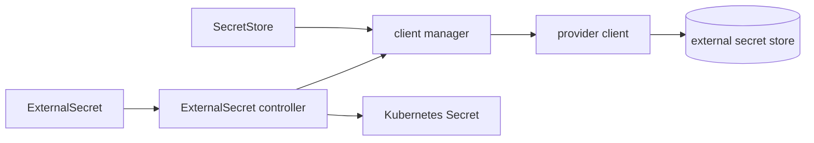

# Architecture

## Big picture

ESO ships as one binary that runs a set of controllers, each reconciling one custom resource. The central loop reads an `ExternalSecret`, resolves its `SecretStore` into a provider client, fetches the requested values, and writes a Kubernetes `Secret`. A `SecretStore` holds connection and auth to one backend; an `ExternalSecret` says what to sync. Providers implement a common interface, so the reconciler never depends on a specific backend. The root command is `external-secrets`, with `webhook` and `certcontroller` subcommands alongside the default controller manager (`cmd/controller/root.go:126`, `cmd/controller/webhook.go:60`, `cmd/controller/certcontroller.go:48`).

## Components

### ExternalSecret controller (`pkg/controllers/externalsecret/`)

The main loop. It reconciles an `ExternalSecret`, reads values from the provider, and writes them into a Kubernetes `Secret`, honoring the refresh interval and the target `deletionPolicy`. Its `Reconcile` is the entry point (`pkg/controllers/externalsecret/externalsecret_controller.go:173`).

### SecretStore / ClusterSecretStore controller (`pkg/controllers/secretstore/`)

Validates a store's configuration and tracks its status. `ClusterSecretStore` is cluster-scoped, so one store definition can be referenced across namespaces. The client manager that turns a store into a live provider client lives here too (`pkg/controllers/secretstore/client_manager.go`).

### PushSecret controller (`pkg/controllers/pushsecret/`)

The reverse direction. It takes a Kubernetes `Secret` and writes it out to a provider, for cases where the cluster is the origin of a value that a backend needs.

### Cluster-scoped fan-out (`pkg/controllers/clusterexternalsecret/`, `pkg/controllers/clusterpushsecret/`)

`ClusterExternalSecret` templates an `ExternalSecret` into many namespaces by selector, so one definition can populate a secret across a fleet. `ClusterPushSecret` does the same for `PushSecret`.

### Providers (`providers/v1/<name>/`)

41 provider implementations, each its own Go module, each satisfying the `esv1.Provider` and `esv1.SecretsClient` interfaces. Providers are registered via build-tagged files under `pkg/register/` (for example `//go:build aws || all_providers` in `pkg/register/aws.go:1`), so a build can include one backend or all of them.

### Generators (`generators/v1/<name>/`)

17 generators that produce values rather than fetch them (password, uuid, ecr, sts, and others). They are `v1alpha1` and compile unconditionally with no build tag.

## How a request flows

Tracing the reconcile of one `ExternalSecret` from provider to Kubernetes `Secret`:

1. `Reconcile` starts, records metrics, and defers a sync-duration measurement (`pkg/controllers/externalsecret/externalsecret_controller.go:173`, `:182`). It fetches the object and returns early on NotFound (`:188`).
2. Finalizer handling. On deletion it cleans up managed secrets and removes the finalizer; otherwise it adds `ExternalSecretFinalizer` with a Patch, not an Update, to avoid claiming ownership of spec fields like `refreshInterval` (`externalsecret_controller.go:231-234`, `:244`).
3. It resolves the target `Secret` name (defaulting to the ExternalSecret name) and reads the existing Secret from a partial-metadata cache (`externalsecret_controller.go:296`, `:309`).
4. Refresh decision. If `shouldRefresh` is false and `isSecretValid` is true, it skips work and requeues; the check uses the refresh interval, the generation, and a data-hash annotation (`externalsecret_controller.go:372`).
5. It fetches values from the provider: `dataMap, err := r.GetProviderSecretData(ctx, externalSecret)` (`externalsecret_controller.go:417`).
6. Inside `GetProviderSecretData`, a `secretstore.Manager` is created for the reconcile (`externalsecret_controller_secret.go:44`, `:49`). It walks `spec.dataFrom` and `spec.data`, resolving each to a provider client via `cmgr.Get` and calling `client.GetSecret` per remote reference (`externalsecret_controller_secret.go:80`, `:126`, `:132`), then decoding the result and storing it under the target key (`:138`, `:147`).
7. Back in `Reconcile`, if zero values came back, the target `deletionPolicy` (Delete, Retain, or Merge) decides whether the Secret is removed, kept, or partially updated. Otherwise it builds the Secret's data, labels, and template and writes it.

## Key design decisions

Store and secret are separate objects. A `SecretStore` owns the connection and credentials; an `ExternalSecret` owns what to sync. This is the change ESO made over KES, which mixed the two, and it lets one store serve many secrets while backend credentials live in one place (`apis/externalsecrets/v1/secretstore_types.go`, [Container Solutions](https://blog.container-solutions.com/the-birth-of-the-external-secrets-community)).

The backend is chosen by JSON structure, not a type tag. `SecretStoreProvider` is a union of provider configs; the code marshals it to JSON and requires exactly one key to be set, which is the selected backend (`apis/externalsecrets/v1/provider_schema.go:104-124`). More than one, or zero, is a validation error.

Provider clients live for the reconcile, not the call. The `secretstore.Manager` caches a provider client per store and closes them all when the reconcile ends, rather than opening and closing per `GetSecret`. The comment notes this exists because some providers (GCP) cannot cheaply recreate clients (`externalsecret_controller_secret.go:49-52`).

Pull with a refresh interval, not push. ESO polls the backend on `refreshInterval` and reconciles; it does not require the backend to notify the cluster of a change. The refresh check short-circuits when nothing changed (`externalsecret_controller.go:372`).

## Extension points

- **Providers**: implement `esv1.Provider` and `esv1.SecretsClient` and register with a build tag under `pkg/register/` (`apis/externalsecrets/v1/provider.go:53`, `pkg/register/aws.go:1`).
- **Generators**: implement a generator under `generators/v1/` to produce values in-cluster instead of fetching them.
- **CRDs**: `ExternalSecret`, `SecretStore` / `ClusterSecretStore`, `PushSecret`, `ClusterExternalSecret`, `ClusterPushSecret`, and generator resources are the third-party-facing API.
- **Webhook and cert controller**: the `webhook` and `certcontroller` subcommands run the admission webhook and manage its certificates (`cmd/controller/webhook.go:60`, `cmd/controller/certcontroller.go:48`).
