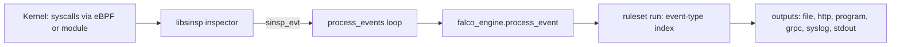

# Architecture

## Big picture

Falco is one binary, `falco`. On each node it reads kernel events, evaluates them against rules, and sends matches to its outputs. The work splits across a few layers: an application layer that owns the CLI, config, outputs, and the event loop (`userspace/falco/`); a rule engine that loads rules and evaluates filters (`userspace/engine/`); and an external dependency, `falcosecurity-libs` (`libsinsp`), that captures syscalls, abstracts events as `sinsp_evt`, and compiles and runs filter expressions. The libs version is pinned in `cmake/modules/falcosecurity-libs.cmake:45`.

## Components

### Application layer (`userspace/falco/`)

Owns startup, configuration, outputs, the webserver, metrics, and the event loop. The entry point is `userspace/falco/falco.cpp:59` (`main`). Startup is modeled as an ordered list of actions. `userspace/falco/app/app.cpp:56` declares `run_steps`, which runs `load_config`, `load_plugins`, `init_inspectors`, `init_falco_engine`, `load_rules_files`, `init_outputs`, `start_webserver`, and `process_events` in dependency order. Each action returns a `run_result` that is merged at `app.cpp:97`. A separate `teardown_steps` list at `app.cpp:87` always runs so cleanup is not skipped on failure.

### Rule engine (`userspace/engine/`)

Loads rule YAML, compiles conditions into filters, and evaluates events. The public surface is the `falco_engine` class. Event evaluation enters at `userspace/engine/falco_engine.cpp:364` (`process_event`).

### libsinsp (external dependency)

Captures syscalls, presents each as a `sinsp_evt`, and provides the filter AST and the `sinsp_filter` execution engine that Falco's compiled rule conditions run on. Falco drives it as a `sinsp` inspector.

### Rules (`rules/`)

Default rule YAML, pulled in through the `falcosecurity-rules` submodule.

## How a request flows

One event in, one alert out:

1. The event loop at `userspace/falco/app/actions/process_events.cpp:163` runs `while(1)` and calls `inspector->next(&ev)` at `:164` to pull one event. It branches on `SCAP_TIMEOUT` (`:198`) and `SCAP_EOF` (`:230`), and handles signals here.
2. The source index is resolved; in live capture it reads `ev->get_source_idx()` at `:244`. Drop accounting runs through `sdropmgr.process_event` at `:298`.
3. The event goes to the engine at `process_events.cpp:307`: `s.engine->process_event(source_engine_idx, ev, s.config->m_rule_matching)`. No filtering happens on the inspector side, so every event reaches the engine.
4. `falco_engine::process_event` (`falco_engine.cpp:364`) resolves the source with `find_source(source_idx)` at `:375` and returns early if `should_drop_evt()` is true at `:377`. It then branches on the matching strategy at `:381`: `ALL` collects every match into `source->m_rules` (`:386`), `FIRST` keeps a single match (`:394`).
5. The actual evaluation is `source->ruleset->run(...)`. The ruleset narrows work by event type before running any filter (see Internals).
6. For each matched rule the engine builds a `rule_result` at `falco_engine.cpp:402`, copying the event, rule name, source, output format, priority, tags, and extra fields, and returns the vector.
7. Back in the loop, `process_events.cpp:313` calls `s.outputs->handle_event(...)` for each result, fanning out to every configured output. Capture (PCAP-style dump) also runs here depending on `m_capture_mode` (`:310`, `:322`).

## Key design decisions

Detection over enforcement: Falco produces alerts and does not block. This keeps the hot path cheap and leaves response to downstream tools.

Event-type indexing in the ruleset (`userspace/engine/indexable_ruleset.h`) avoids scanning all rules per event. Syscalls arrive hundreds of thousands per second, so the engine pre-computes which event types each rule cares about and only evaluates the relevant bucket. This is detailed in Internals.

Hot restart without killing the process: `main` loops `falco_run` while a `restart` flag is set (`falco.cpp:67`). On SIGHUP the application layer is rebuilt so rules and config are reloaded without restarting the process.

## Extension points

The plugin framework adds event sources beyond syscalls (Kubernetes audit, CloudTrail, GitHub, Okta) as shared libraries (source 6, 7). Outputs are pluggable channels (file, http, program, stdout, syslog, grpc). Rules and lists are user-authored YAML loaded at startup and on reload.
