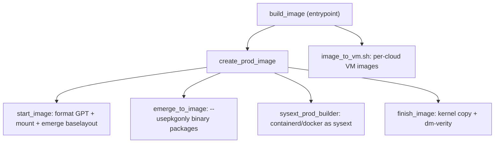

# Architecture

## Big picture

Flatcar is not a daemon or a service; it is an OS image, and its "architecture" is mostly the build pipeline that produces that image. The pipeline runs inside an SDK container, emerges pre-built Gentoo binary packages into a root filesystem, lays out a GPT disk with A/B `/usr` partitions, protects `/usr` with dm-verity, and converts the result into per-cloud VM images.

## Components

### `build_image` (entrypoint)

The top-level script. It asserts it is running inside the chroot (`src/build_image:22`), sources the `build_library/*.sh` helpers in a dependency-sensitive order (`src/build_image:108-116`), then dispatches on the image type argument. For `prod` it calls `create_prod_image` (`src/build_image:189`). The default container runtimes shipped as sysexts are declared here as a spec string for `containerd` and `docker` (`src/build_image:42`).

### `build_library/`

The real work. `prod_image_util.sh` holds `create_prod_image`; `build_image_util.sh` holds `start_image`, `emerge_to_image`, and `finish_image`; `disk_layout.json` defines the partition table; and `disk_util` (Python) handles GPT formatting, mounting, and verity. `vm_image_util.sh` converts the generic image into cloud-specific formats.

### `sdk_container/src/third_party/`

The ebuild overlays, which are the source of truth for what packages exist. `portage-stable` is kept aligned with upstream Gentoo and is not modified except in minor justified cases (`README.md:41`); `coreos-overlay` holds Flatcar's significantly modified or self-written ebuilds (`README.md:44`).

### SDK container wrappers

`run_sdk_container`, `build_sdk_container_image`, and `bootstrap_sdk_container` start, build, and bootstrap the containerised SDK. Building OS images needs privileged access to `/dev` because the tooling uses loop devices to partition images (`README.md:89`).

## How a request flows

Building a production image runs end to end as follows.

1. `build_image` dispatches to `create_prod_image` (`src/build_image:189`), implemented at `src/build_library/prod_image_util.sh:58`.
2. `create_prod_image` calls `start_image` (`src/build_library/prod_image_util.sh:92`), defined at `src/build_library/build_image_util.sh:494`. `start_image` formats the GPT (`disk_util format`, `src/build_library/build_image_util.sh:508-509`), mounts `/usr` writable for verity (`disk_util mount --writable_verity`, `src/build_library/build_image_util.sh:514-515`), then emerges only `sys-apps/baselayout` to seed the filesystem (`src/build_library/build_image_util.sh:519`).
3. Back in `create_prod_image`, `set_image_profile prod` switches the profile and `emerge_to_image` installs the base package `coreos-base/coreos` (`src/build_library/prod_image_util.sh:95-97`). `emerge_to_image` runs `emerge --usepkgonly` so only pre-built binary packages are used (`src/build_library/build_image_util.sh:132-141`).
4. `sysext_prod_builder` composes containerd and docker into systemd-sysext squashfs images rather than the base OS (`src/build_library/prod_image_util.sh:105-112`).
5. SBOM, license, and package lists are written (`src/build_library/prod_image_util.sh:116-123`).
6. `finish_image` (`src/build_library/prod_image_util.sh:183`, defined at `src/build_library/build_image_util.sh:532`) copies the kernel to `/boot` and applies dm-verity (covered in [Internals](./internals)).
7. `build_image` writes `version.txt` and `image_to_vm.sh` produces the target VM images (`src/build_image:211-221`).

## Key design decisions

- **Binary-only package installation.** The image is assembled from pre-built binary packages with `--usepkgonly` (`src/build_library/build_image_util.sh:132-141`); the build never compiles from source into the image, which keeps image assembly reproducible and fast.
- **A/B `/usr` with verity.** The base layout defines `USR-A` and `USR-B` partitions; `USR-A` is `btrfs` with `zstd` compression mounted at `/usr` with the `prioritize` and `verity` features (`src/build_library/disk_layout.json:25-37`). One partition is active while the other receives an update.
- **Runtimes as sysext, not base OS.** Declaring containerd and docker as a sysext spec string (`src/build_image:42`) keeps the container runtime separable from the immutable base image.

## Extension points

- **systemd-sysext**: features and runtimes are layered onto the read-only `/usr` as squashfs sysext images.
- **Ignition**: declarative first-boot configuration (provisioning, units, files), applied before the system is up.
- **Ebuild overlays**: `coreos-overlay` is where downstream package changes go; `portage-stable` mirrors upstream Gentoo (`README.md:41-44`).
