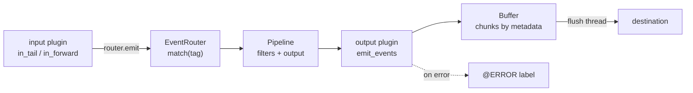

# Architecture

## Big picture

A running Fluentd is a supervisor process that manages one or more worker processes (`lib/fluent/supervisor.rb:570`). Each worker builds a tree of plugins from the configuration file and then runs it. At the root of that tree is the `RootAgent` (`lib/fluent/root_agent.rb:48`), which holds the `<source>`, `<filter>`, `<match>`, and `<label>` blocks. Events enter from input plugins, get a tag, flow through an `EventRouter` that matches the tag to a chain of filters and an output, and end up buffered for delivery.

## Components

### Supervisor and workers

`Fluent::Supervisor` (`lib/fluent/supervisor.rb:570`) owns process lifecycle, configuration reload, and socket inheritance. `run_supervisor` (`lib/fluent/supervisor.rb:689`) loads the configuration with `Fluent::Engine.run_configure` (`lib/fluent/supervisor.rb:721`), and each worker calls `run_worker` (`lib/fluent/supervisor.rb:758`), which configures and then calls `Fluent::Engine.run` (`lib/fluent/supervisor.rb:783`).

### RootAgent and labels

`RootAgent` (`lib/fluent/root_agent.rb:48`) is the root of the plugin tree. It binds inputs, filters, and matches, and groups them under `<label>` blocks. Each label has its own independent `EventRouter`. A built-in `@ERROR` label (`ERROR_LABEL`, `lib/fluent/root_agent.rb:49`) receives events that failed downstream. `SourceOnlyMode` (`lib/fluent/root_agent.rb:51`) is an input-only buffering mode used for zero-downtime restarts.

### EventRouter

`EventRouter` (`lib/fluent/event_router.rb:44`) is the routing core. It maps a tag to a collector, which can be an output, a filter pipeline, or another router. It keeps a `Rule` list (`lib/fluent/event_router.rb:57`), an LRU `MatchCache` (`lib/fluent/event_router.rb:140`), and builds a `Pipeline` (`lib/fluent/event_router.rb:165`) for each matched tag.

### Plugins and buffer

Built-in plugins live under `lib/fluent/plugin/` as `in_*.rb`, `out_*.rb`, `filter_*.rb`, `parser_*.rb`, `formatter_*.rb`, and `buf_*.rb`. Output buffering is handled by `Buffer` (`lib/fluent/plugin/buffer.rb:26`), which groups events into chunks keyed by `Metadata` (`lib/fluent/plugin/buffer.rb:72`).

## How a request flows

1. An input plugin emits. `in_tail` calls `router.emit(tag, time, record)` (`lib/fluent/plugin/in_tail.rb:705`); `in_forward` calls `router.emit_stream(tag, es)` (`lib/fluent/plugin/in_forward.rb:322`).
2. `EventRouter#emit` wraps a single record in a `OneEventStream` and delegates to `emit_stream` (`lib/fluent/event_router.rb:104`).
3. `emit_stream` calls `match(tag).emit_events(tag, es)` and routes `Pipeline::OutputError` to the `@ERROR` handler (`lib/fluent/event_router.rb:114`).
4. `match(tag)` checks the LRU `MatchCache` and on a miss runs `find(tag)` (`lib/fluent/event_router.rb:133`), which scans the rules and builds a `Pipeline` ending in an output (`lib/fluent/event_router.rb:287`).
5. `Pipeline#emit_events` runs the filter chain, then hands the result to the output's `emit_events` (`lib/fluent/event_router.rb:192`).
6. `Output#emit_events` (`lib/fluent/plugin/output.rb:876`) branches on `@buffering`: non-buffered goes through `emit_sync` (`lib/fluent/plugin/output.rb:885`), buffered through `emit_buffered` (`lib/fluent/plugin/output.rb:897`).
7. Buffered output computes chunk keys with `metadata(tag, time, record)` (`lib/fluent/plugin/output.rb:912`) and appends events to a chunk via `Buffer#write` (`lib/fluent/plugin/buffer.rb:330`). A full chunk is enqueued by `enqueue_chunk` (`lib/fluent/plugin/buffer.rb:482`), and a flush thread dequeues it (`lib/fluent/plugin/buffer.rb:559`) to call the plugin's `write` (`lib/fluent/plugin/output.rb:118`).

## Key design decisions

Tags drive everything. Routing, buffering chunk keys, and the error path all key off the event tag rather than message content, which keeps the hot path simple. Delivery is asynchronous by default: buffered outputs return as soon as the event is written to a chunk, and a separate flush thread handles delivery and retry with exponential backoff. Time is carried at nanosecond precision through a custom MessagePack extension type while staying backward compatible with integer-second timestamps (see [Internals](./internals)).

## Extension points

Every category of behavior is a plugin: inputs, outputs, filters, parsers, formatters, and buffer backends, all under `lib/fluent/plugin/`. Plugin authors reuse common mixins from `lib/fluent/plugin_helper/` (timer, server, socket, storage, thread, retry_state). Buffer backends ship as `buf_memory`, `buf_file`, and `buf_file_single`.
