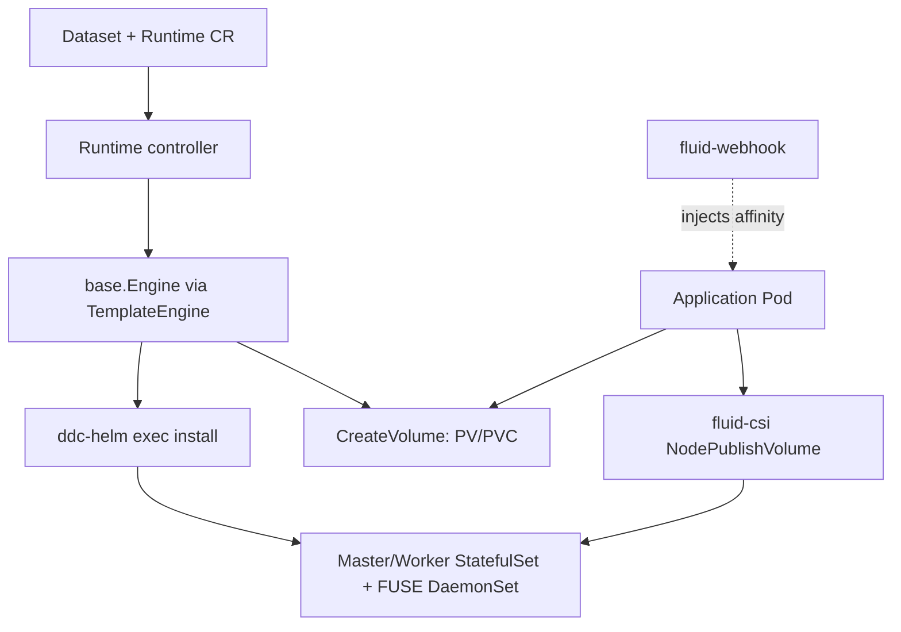

# Architecture

## Big picture

Fluid is a set of Kubernetes controllers, plus a CSI driver and an admission webhook, organised around two ideas: a `Dataset` describes data that lives somewhere remote, and a `Runtime` wraps the cache engine that brings that data close to compute. The repository builds several binaries from `cmd/`: a `dataset-controller`, one controller per cache engine (`cmd/alluxio`, `cmd/juicefs`, `cmd/jindo`, `cmd/thin`, `cmd/vineyard`, `cmd/efc`, `cmd/cache`), the CSI driver (`cmd/csi/main.go`), the webhook (`cmd/webhook/main.go`), and an application controller (`cmd/fluidapp/main.go`).

## Components

### Runtime controllers

Each cache engine has its own controller binary, but they share a common reconcile core. For example the Alluxio controller's `Reconcile` (`pkg/controllers/v1alpha1/alluxio/alluxio_runtime_controller.go:75`) loads the runtime, picks an engine implementation, then delegates to the shared `RuntimeReconciler.ReconcileInternal` (`pkg/controllers/runtime_controller.go:79`). Shared helpers in `pkg/ctrl/` (master, worker, fuse, affinity) manage StatefulSet and DaemonSet replicas and node affinity.

### The engine abstraction

The heart of Fluid is `pkg/ddc/`. The `base.Engine` interface (`pkg/ddc/base/engine.go:32`) defines the coarse operations every engine supports: `Setup`, `Sync`, `CreateVolume`, `DeleteVolume`, `Shutdown`, `Validate`. The finer-grained `base.Implement` interface (`pkg/ddc/base/engine.go:69`) lists the steps an engine must supply (`CheckMasterReady`, `SetupWorkers`, `BindToDataset`, UFS preparation, and so on). A `TemplateEngine` embeds an `Implement` and drives those steps in fixed order. Concrete engines live in `pkg/ddc/alluxio`, `pkg/ddc/juicefs`, `pkg/ddc/jindocache`, and others; `pkg/ddc/factory.go` selects one by runtime type.

### CSI driver and webhook

The `fluid-csi` driver mounts the cache into application Pods. Its `NodePublishVolume` (`pkg/csi/plugins/nodeserver.go:67`) bind-mounts the cache FUSE endpoint to the Pod's target path. The `fluid-webhook` is a mutating admission webhook that injects data affinity so Pods are scheduled onto nodes that already hold the cache.

## How a request flows

Creating a `Dataset` plus a matching `AlluxioRuntime` triggers this sequence:

1. The Alluxio runtime controller's `Reconcile` builds a `ReconcileRequestContext`, sets the engine implementation with `ddc.InferEngineImpl` (`pkg/controllers/v1alpha1/alluxio/alluxio_runtime_controller.go:102`), and calls `ReconcileInternal`.
2. `ReconcileInternal` (`pkg/controllers/runtime_controller.go:79`) gets or creates the engine (`:101`), fetches the same-named `Dataset` (`:114`), checks it is not already bound elsewhere via `CanbeBound` (`:150`), requeues after 5 seconds if the dataset is missing (`:177`), and hands off to `ReconcileRuntime` (`:181`).
3. `ReconcileRuntime` (`pkg/controllers/runtime_controller.go:254`) calls `Validate`, then `Setup`; if setup is not done it requeues after 20 seconds (`:283`), then `CreateVolume` and `Sync`.
4. `TemplateEngine.Setup` (`pkg/ddc/base/setup.go:25`) runs the template steps: set up the master, wait for it ready, prepare the UFS, set up workers, wait for them, update status, and finally `BindToDataset`, which flips the `Dataset` `status.phase` to `Bound`.

## Key design decisions

The decision that shapes everything is how Fluid deploys cache Pods. It does not apply StatefulSets and DaemonSets through the Go client directly. Instead each engine renders Helm values from the `Runtime` spec and shells out to an external `ddc-helm` binary to install a bundled chart (`pkg/ddc/alluxio/master_internal.go:32`, `pkg/utils/helm/utils.go:44`). The charts live in `charts/`. This keeps each engine's complex manifests inside a chart, so adding an engine is mostly "write a chart plus implement `base.Implement`". The cost is an external binary dependency and hand-written output parsing and rollback (`pkg/utils/helm/utils.go:82`).

## Extension points

- `ThinRuntime`: a generic runtime that lets third parties integrate any FUSE-based storage without a built-in engine; this is how 3FS and Curvine were added in `v1.0.8`.
- `base.Implement` (`pkg/ddc/base/engine.go:69`): implement this interface plus a Helm chart to add a new engine.
- Data operation CRDs (`DataLoad`, `DataBackup`, `DataMigrate`, `DataProcess`) in `api/v1alpha1/`.
- The mutating admission webhook for custom scheduling injection.
