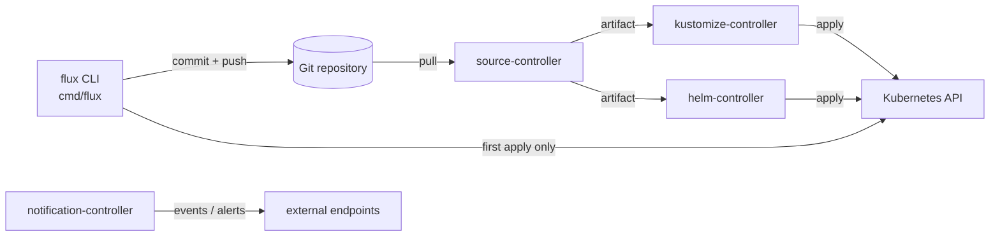

# Architecture

## Big picture

Flux has two layers. The `flux` CLI does day-0 work: it bootstraps a cluster and generates manifests. The in-cluster GitOps Toolkit controllers do the continuous reconciliation. Once the CLI bootstraps a cluster, all further operations collapse into commits to Git, and the CLI is no longer required for steady-state operation.

The CLI lives in `cmd/flux/`, with the bootstrap orchestration in `pkg/bootstrap/` and manifest generation in `pkg/manifestgen/`. The controllers ship from separate repositories and are referenced as API modules in `go.mod`. The default install deploys `source-controller`, `kustomize-controller`, `helm-controller`, and `notification-controller`, with `image-reflector-controller`, `image-automation-controller`, and `source-watcher` available as extras (`pkg/manifestgen/install/options.go:46`).

## Components

### flux CLI

A Cobra-based binary covering all subcommands (`bootstrap`, `create`, `get`, `reconcile`, `build`). The root command is defined at `cmd/flux/main.go:43`, `func main()` at `cmd/flux/main.go:191`, and execution at `cmd/flux/main.go:204`. The CLI embeds versioned manifests via `//go:embed manifests/*.yaml` so it can assemble the install base without network access (`cmd/flux/manifests.embed.go:27`).

### Bootstrap orchestration

`pkg/bootstrap/` drives the bootstrap sequence. It defines the `Reconciler` interface (`pkg/bootstrap/bootstrap.go:56`) implemented by `PlainGitBootstrapper` (plain Git remote) and `GitProviderBootstrapper` (GitHub, GitLab, Gitea, BitBucket via `pkg/bootstrap/provider/`).

### Manifest generation

`pkg/manifestgen/` builds the YAML Flux commits to Git: `install` produces `gotk-components.yaml` (`pkg/manifestgen/install/install.go:40`), `sync` produces `gotk-sync.yaml` (`pkg/manifestgen/sync/sync.go:36`), and `sourcesecret` produces the Git or OCI auth secret.

### GitOps Toolkit controllers

The in-cluster reconcilers. `source-controller` fetches Git, Helm, and OCI artifacts; `kustomize-controller` applies Kustomize overlays; `helm-controller` reconciles `HelmRelease` objects; `notification-controller` handles inbound webhooks and outbound alerts. These are external modules, depended on through `go.mod`, not source in this repository.

## How a request flows

Trace `flux bootstrap github` end to end.

1. `bootstrapGitHubCmdRun` (`cmd/flux/bootstrap_github.go:109`) reads `GITHUB_TOKEN` (`cmd/flux/bootstrap_github.go:115`), then assembles `install.Options` (`cmd/flux/bootstrap_github.go:193`), `sourcesecret.Options` (`cmd/flux/bootstrap_github.go:216`), and `sync.Options` (`cmd/flux/bootstrap_github.go:238`). It builds the provider client (`cmd/flux/bootstrap_github.go:170`) and a gogit client (`cmd/flux/bootstrap_github.go:182`), then constructs the bootstrapper with `bootstrap.NewGitProviderBootstrapper` (`cmd/flux/bootstrap_github.go:296`).
2. `bootstrap.Run` (`pkg/bootstrap/bootstrap.go:98`) calls, in order: `ReconcileRepository` (only when the reconciler is a `RepositoryReconciler`, to create the remote repo), `ReconcileComponents`, `ReconcileSourceSecret`, `ReconcileSyncConfig`, then the health reports.
3. `ReconcileComponents` (`pkg/bootstrap/bootstrap_plain_git.go:119`) clones the repo with one retry (`pkg/bootstrap/bootstrap_plain_git.go:127`), generates `gotk-components.yaml` via `install.Generate` (`pkg/bootstrap/bootstrap_plain_git.go:155`), commits it with message `Add Flux <version> component manifests` (`pkg/bootstrap/bootstrap_plain_git.go:168`), and pushes if there are staged changes; `git.ErrNoStagedFiles` is treated as up to date (`pkg/bootstrap/bootstrap_plain_git.go:193`).
4. Only on the first run does it apply imperatively. `mustInstallManifests` (`pkg/bootstrap/bootstrap.go:140`) returns true when the `flux-system` Kustomization has an empty `Status.LastAppliedRevision`, and then `utils.Apply` pushes the components straight to the cluster (`pkg/bootstrap/bootstrap_plain_git.go:198`).
5. `ReconcileSyncConfig` generates `gotk-sync.yaml` via `sync.Generate` (`pkg/manifestgen/sync/sync.go:36`): a `GitRepository` (`pkg/manifestgen/sync/sync.go:52`) and a `Kustomization` whose `spec.path` is the target path (`pkg/manifestgen/sync/sync.go:82`). Both objects are named `flux-system` (`pkg/manifestgen/sync/options.go:44`). This commit is what makes Flux manage itself.
6. After apply, `bootstrap.Run` polls for health. `hasRevision` (`pkg/bootstrap/bootstrap.go:268`) checks `status.artifact.revision` for source objects and `status.lastAttemptedRevision` for the Kustomization against the expected revision.

## Key design decisions

Flux is pull-based. The CLI commits desired state to Git, but the cluster's controllers fetch and apply it; the only imperative apply is the very first one, gated by `mustInstallManifests` (`pkg/bootstrap/bootstrap.go:140`). This keeps a clear trust boundary: credentials to mutate the cluster stay in the cluster, not in CI.

Flux manages itself. Bootstrap commits both its own component manifests and a `GitRepository` plus `Kustomization` (named `flux-system`) that point back at the same repo and path (`pkg/manifestgen/sync/sync.go:52`, `pkg/manifestgen/sync/sync.go:82`). After the first apply, the in-cluster `kustomize-controller` reconciles Flux's own components from Git, so upgrading is just committing a new `gotk-components.yaml`. The empty `LastAppliedRevision` check is the hinge that distinguishes the first run from every subsequent one.

The CLI is decoupled from the controllers. The controllers are separate modules referenced through `go.mod`, so the CLI carries only their APIs, and the controllers can release independently.

## Extension points

- Custom resources are the primary surface: `GitRepository`, `Kustomization`, `HelmRelease`, `OCIRepository`, and the notification and image-automation kinds.
- The `Reconciler` interface (`pkg/bootstrap/bootstrap.go:56`) plus the provider abstraction in `pkg/bootstrap/provider/` let Flux target GitHub, GitLab, Gitea, and BitBucket.
- `notification-controller` exposes inbound webhook receivers and outbound alert providers for integration with external systems.
