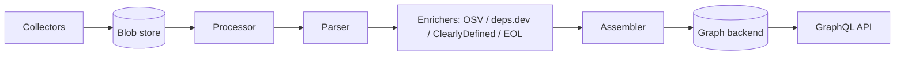

# Architecture

## Big picture

GUAC is an asynchronous ingestion pipeline that ends in a graph database queried over GraphQL. Documents are collected from sources, parked in a blob store, pulled by a processor over a pub/sub queue, parsed into typed evidence, and assembled into the graph via GraphQL mutations. The same four stages also exist as a synchronous, in-process pipeline used by the all-in-one CLI: `Ingest()` wires `processorFunc` then `ingestorFunc` (the parser) then `collectSubEmitFunc` then `assemblerFunc` and runs them in order (`pkg/ingestor/ingestor.go:52`, `pkg/ingestor/ingestor.go:59`).

## Components

### Collectors

A `Collector` retrieves documents from a source and emits each one onto a channel for the processor (`pkg/handler/collector/collector.go:36`, the `RetrieveArtifacts(ctx, docChannel chan<- *processor.Document)` method). Implementations under `pkg/handler/collector/` cover file, GCS, S3, OCI, git, GitHub, deps.dev, Kubescape, and blob sources. Collectors self-register into a global map through `RegisterDocumentCollector` (`pkg/handler/collector/collector.go:64`).

### Processor

The processor turns raw bytes into a typed, validated document tree. In the async deployment it runs as a subscriber: `Subscribe` decodes a pub/sub event to a blob key, reads the bytes from the blob store, unmarshals them into a `processor.Document`, and only acknowledges the message after ingestion succeeds (`pkg/handler/processor/process/process.go:85`, `pkg/handler/processor/process/process.go:138`). The core logic is `Process` then `processDocument` (`pkg/handler/processor/process/process.go:168`, `pkg/handler/processor/process/process.go:197`).

### Parser and enrichers

The parser walks the document tree and converts each node into `assembler.IngestPredicates` (`pkg/ingestor/parser/parser.go:84`). When the corresponding scan flags are set, it concurrently fans out to OSV, ClearlyDefined, endoflife.date, and deps.dev to add evidence (`pkg/ingestor/parser/parser.go:109`).

### Assembler and backends

The assembler bulk-loads predicates into the graph through a genqlient GraphQL client (`pkg/ingestor/ingestor.go:177`). The graph itself sits behind the `Backend` interface (`pkg/assembler/backends/backends.go:27`), which every storage backend must satisfy: read queries, paged `*List` variants, `Ingest*` mutations, and topology operations like `Neighbors` and `Path` (`pkg/assembler/backends/backends.go:135`, `pkg/assembler/backends/backends.go:139`).

## How a request flows

Tracing one document end to end through the synchronous `Ingest` path (`pkg/ingestor/ingestor.go:39`):

1. `processorFunc(d)` runs `Process`, which guesses the document type, validates its format, validates against the type schema, and unpacks nested envelopes into a `DocumentTree` (`pkg/ingestor/ingestor.go:59`, `pkg/handler/processor/process/process.go:197`).
2. `ingestorFunc(docTree)` parses the tree into predicates and identifier strings, fanning out to enrichers if requested (`pkg/ingestor/ingestor.go:64`, `pkg/ingestor/parser/parser.go:84`).
3. `collectSubEmitFunc(idstrings)` reports discovered identifiers back to the collectsub server; failure here is logged and ignored, it does not abort ingestion (`pkg/ingestor/ingestor.go:69`).
4. `assemblerFunc(predicates)` writes the evidence into the graph backend over GraphQL (`pkg/ingestor/ingestor.go:73`).

## Key design decisions

The pipeline is asynchronous and pull-based. Collectors only push documents into a blob store and signal a pub/sub event; the processor pulls work from the queue and acknowledges a message only after ingestion succeeds (`pkg/handler/processor/process/process.go:138`), giving at-least-once delivery so a crashed processor does not silently drop a document.

Signature verification and ingestion are deliberately separate. The DSSE processor only base64-decodes the envelope payload into child documents, it does not check the signature (`pkg/handler/processor/dsse/dsse.go:55`). Verification is a separate path, `VerifyIdentity` (`pkg/ingestor/verifier/verifier.go:71`), and even a verified identity is documented as "not trusted": the `Identity` comment states that `Verified` only means the signature matched a key, not that the identity should be trusted (`pkg/ingestor/verifier/verifier.go:46`). Trust decisions are left to the query and policy layer.

Storage is pluggable behind one interface. `keyvalue` (in-memory) and `ent` (PostgreSQL) are the supported backends, with arangodb, neo4j, and neptune also present; forcing every backend to implement the same `Backend` interface keeps the GraphQL contract identical regardless of store (`pkg/assembler/backends/backends.go:27`).

## Extension points

GUAC uses an `init()`-based plugin pattern: processors, parsers, collectors, and verifiers all self-register into global maps at package load (`pkg/handler/processor/process/process.go:57`, `pkg/ingestor/parser/parser.go:42`, `pkg/handler/collector/collector.go:64`, `pkg/ingestor/verifier/verifier.go:61`). Adding support for a new document format is essentially one registration call. The trade-off is that a duplicate registration overwrites the existing entry while also returning an error (`pkg/handler/processor/process/process.go:74`).
