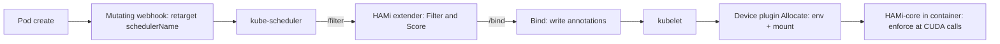

# Architecture

## Big picture

HAMi splits one job (sharing a GPU with real limits) across three layers that never fully trust each other. A control-plane scheduler decides which physical GPU a pod gets and writes the decision into pod annotations. A per-node device plugin reads the annotation, resolves it to a real device, and injects environment variables and a library mount. An in-container library, HAMi-core, is preloaded into every process and enforces the memory and compute limits at CUDA call time. The scheduler never touches a device, the device plugin never enforces a limit, and HAMi-core never makes a placement decision. The README states this chain directly (`README.md:57-66`).

## Components

### Mutating webhook

`pkg/scheduler/webhook.go` is a Kubernetes admission webhook. When a pod is created it inspects each container, and if the pod requests a GPU resource it rewrites the pod's `schedulerName` to point at the HAMi scheduler (`pkg/scheduler/webhook.go:53`). It skips privileged containers and rejects a pod with no containers, then checks the request against a namespace resource quota before returning a JSON patch. This is how HAMi captures GPU pods without replacing the default scheduler for everything else.

### Scheduler extender

`cmd/scheduler` and `pkg/scheduler` run an HTTP server that kube-scheduler calls as an extender. It registers `/filter`, `/bind`, and `/webhook` routes on startup (`cmd/scheduler/main.go:145-147`). The extender filters candidate nodes, scores them by fit, chooses the best node, and writes the chosen devices into pod annotations. It owns the "which GPU on which node" decision.

### Device plugins

`cmd/device-plugin/nvidia` and `pkg/device-plugin/nvidiadevice/nvinternal` implement the kubelet device-plugin API. On `Allocate()` the plugin reads the scheduler's annotation, resolves it to real devices, injects the CUDA limit environment variables, and mounts `libvgpu.so` plus an `ld.so.preload` entry into the container (`pkg/device-plugin/nvidiadevice/nvinternal/plugin/server.go:593`). Each vendor has its own plugin path; the NVIDIA one is the reference.

### HAMi-core (libvgpu.so)

HAMi-core is a C/CUDA library in the separate Project-HAMi/HAMi-core repository, referenced here as the `libvgpu` submodule (`.gitmodules`). Preloaded through `LD_PRELOAD`, it intercepts CUDA and NVML calls, reads the injected `CUDA_DEVICE_MEMORY_LIMIT_*` and `CUDA_DEVICE_SM_LIMIT` values, and rejects allocations past the memory ceiling while throttling kernel launches to the core limit. This is where runtime isolation actually happens. The submodule is fetched as a shallow clone in this checkout, so its internals are not read here.

### Monitor and metrics

`cmd/vGPUmonitor`, `pkg/monitor`, and `pkg/metrics` aggregate per-pod GPU usage and expose it to Prometheus. The default monitor port is `31993` (`README.md:158`).

## How a request flows

Trace a pod that asks for one GPU with a 3000 MB memory ceiling (`README.md:71-79`):

1. **Admission.** The pod create hits `/webhook`, and `webhook.Handle` decodes it (`pkg/scheduler/webhook.go:53`). A pod with zero containers is rejected; privileged containers are skipped (`pkg/scheduler/webhook.go:74`). For each container it calls the vendor `MutateAdmission` (`pkg/scheduler/webhook.go:80-81`); the NVIDIA implementation is `pkg/device/nvidia/device.go:345`. If the pod has a GPU request, the webhook sets its `schedulerName` to the HAMi scheduler (`pkg/scheduler/webhook.go:93-94`), checks the namespace quota with `fitResourceQuota` (`pkg/scheduler/webhook.go:100`), and returns a patch.

2. **Filter.** kube-scheduler posts the candidate nodes to `/filter`, which decodes the body under a 1 MB limit and calls `Scheduler.Filter` (`pkg/scheduler/routes/route.go:50`; `pkg/scheduler/scheduler.go:741`). Filter aggregates the request with `device.Resourcereqs`, pulls each node's current GPU usage, and runs `calcScore`, whose per-vendor `Fit` decides which physical GPUs on the node can hold the request. It sorts nodes by score, writes the chosen devices into annotations, and returns the single best node.

3. **Fit.** `NvidiaGPUDevices.Fit` walks the node's devices from the end of the slice (`for i := len(devices) - 1; i >= 0; i--`) and checks each one in order: health, type match, NUMA, UUID constraint, time-slicing count, a `Coresreq > 100` correction, memory (absolute or percentage), quota, free memory, free cores, and exclusive-vs-shared conflicts (`pkg/device/nvidia/device.go:749`). A GPU that clears every check is selected; failures are tallied by reason.

4. **Bind.** kube-scheduler posts to `/bind`, and `Scheduler.Bind` marks the allocation as `allocating`, stamps a bind-time annotation, and calls the Kubernetes bind API (`pkg/scheduler/scheduler.go:670`).

5. **Allocate.** On the node, kubelet calls the plugin's `Allocate()` (`pkg/device-plugin/nvidiadevice/nvinternal/plugin/server.go:593`). It finds the pending pod, reads the assigned devices from the annotation, and for the non-MIG path injects `CUDA_DEVICE_MEMORY_LIMIT_<i>` as `<usedmem>m`, sets `CUDA_DEVICE_SM_LIMIT` to the core percentage, points `CUDA_DEVICE_MEMORY_SHARED_CACHE` at a cache file, and mounts `libvgpu.so` plus `/etc/ld.so.preload` into the container (`server.go:661-711`).

6. **Runtime isolation.** The preloaded HAMi-core reads those variables and enforces them at CUDA call time. Placement was the scheduler's job, physical resolution and mounting were the device plugin's, and enforcement is HAMi-core's (`README.md:57-66`).

## Key design decisions

HAMi extends kube-scheduler rather than replacing it. The webhook retargets only GPU pods, so the default scheduler keeps handling everything else, and HAMi's extender adds device-aware placement on top (`pkg/scheduler/webhook.go:93-94`). This keeps existing scheduler configuration intact.

Node and GPU placement policies are independent. A cluster can binpack across nodes while spreading across GPUs, or any other combination, plus a topology-aware GPU policy (`pkg/util/types.go:64-73`). The defaults are node binpack and GPU spread (`cmd/scheduler/main.go:70-71`).

Runtime enforcement lives outside the control plane. The device plugin only injects environment variables and a mount; the actual memory ceiling and core throttle are enforced by the preloaded C library inside the container (`server.go:661-711`). This is what lets HAMi present a "virtual GPU" with no driver or kernel changes, at the cost of relying on a library the workload could, in principle, work around.

## Extension points

- **Vendor devices**: adding a new accelerator means implementing the `Devices` interface (`pkg/device/devices.go:36`) under `pkg/device/<vendor>`. The scheduler and webhook call the interface, not any specific vendor.
- **Scheduling policies**: node and GPU policies are selectable (`binpack`, `spread`, and `topology-aware` for GPU) through flags and per-pod annotations (`pkg/util/types.go:64-73`).
- **Admission webhook**: the mutating webhook is the entry point for GPU pods and is where request rewriting and quota checks are applied (`pkg/scheduler/webhook.go:53`).
- **Batch scheduler integration**: HAMi works alongside Volcano and Koordinator, which drive HAMi-based sharing under a batch scheduling model (HAMi documentation; Koordinator docs).
