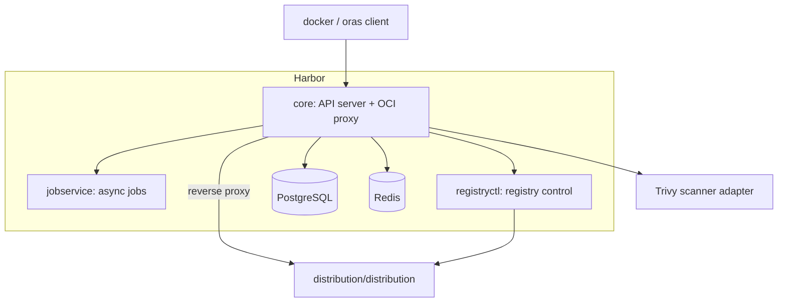

# Architecture

## Big picture

Harbor is three independent Go binaries plus an Angular UI, all sitting in front of a Docker Distribution backend that does the actual blob and manifest storage. The core binary terminates the OCI registry API and the REST API, the jobservice runs async work, and registryctl controls the backend registry. Each layer is split as `server/` (HTTP routing and middleware), then `controller/` (business logic), then `pkg/` (domain managers with `dao/` database access).

## Components

### core

The API server. Its entry point is `package main` at `src/core/main.go:15`, built on the Beego v2 web framework (`github.com/beego/beego/v2/server/web`, `src/core/main.go:30`). It hosts the OCI registry routes, the REST API, the token service, and the auth backends. The backends register themselves through blank imports: authproxy, db, ldap, oidc, and uaa (`src/core/main.go:42-46`). `main()` initializes cache, config, the database and migrations, scanners, and notifications before serving (`src/core/main.go:138-327`).

### jobservice

The async worker for replication, garbage collection, scanning, and retention. It runs as `src/jobservice/main.go` and pulls jobs from a Redis-backed queue. The core schedules jobs by handing them to jobservice rather than running them inline.

### registryctl

A sidecar-style controller for the backend Distribution registry, used for operations like triggering garbage collection. It runs as `src/registryctl/main.go`.

### Supporting binaries

`src/cmd/exporter/main.go` is a Prometheus exporter, and `src/cmd/standalone-db-migrator/main.go` is a standalone database migrator. The `portal/` directory holds the Angular web UI.

## How a request flows

Harbor's defining decision is that it does not store blobs or manifests. It reverse-proxies them to the backend Distribution registry and inserts gates in front. There is a single proxy instance built from `httputil.NewSingleHostReverseProxy` (`src/server/registry/proxy.go:29-42`), and its Director adds basic auth credentials for the backend on every forwarded request (`src/server/registry/proxy.go:44-52`).

The OCI v2 routes are registered in `RegisterRoutes` (`src/server/registry/route.go:34-129`). Every route under `/v2` runs `v2auth.Middleware()` first (`src/server/registry/route.go:37`), then each operation stacks its own middleware. A manifest pull (GET `/v2/<repo>/manifests/<ref>`) runs metric injection, then `repoproxy.ManifestMiddleware` (for proxy-cache projects), then `contenttrust.ContentTrust` (signature policy), then `vulnerable.Middleware` (vulnerability gate), then the `getManifest` handler (`src/server/registry/route.go:52-59`). A manifest push (PUT) chains immutability, quota, Cosign signature, subject, and blob middleware in series (`src/server/registry/route.go:74-84`). The full pull path is traced in [Internals](./internals).

## Key design decisions

Harbor does not store tags in the backend registry. On a manifest push where the reference is a tag, it reads the body, computes `digest.FromBytes(data)`, and rewrites the proxy URL from the tag to the digest before forwarding (`src/server/registry/manifest.go:192-206`). The tag-to-digest mapping lives only in Harbor's database (`src/server/registry/manifest.go:189-191`). This lets Harbor implement immutable tags, retention, and tag-level RBAC independently of the backend registry's constraints.

Existence is checked in the database before proxying. The pull handler resolves the artifact via `artifact.Ctl.GetByReference` first, then proxies (`src/server/registry/manifest.go:55`). Async work is offloaded to jobservice rather than blocking the API, so replication, GC, scanning, and retention run as queued jobs.

## Extension points

- **Auth backends**: db, LDAP/AD, OIDC, UAA, and auth proxy, pluggable and registered at startup (`src/core/main.go:42-46`).
- **Scanner adapters**: Trivy ships as the default (`src/core/main.go:331-346`); other scanners plug in through the scanner adapter API.
- **Replication adapters**: policy-driven replication to and from other registry types.
- **Webhooks**: events such as `PullArtifactEventMetadata` fire notifications (`src/server/registry/manifest.go:131-139`).
- **REST API**: the OpenAPI/Swagger-described v2.0 API for external integration.
