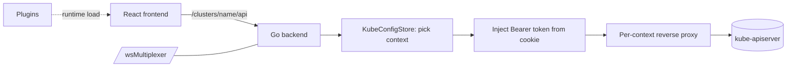

# Architecture

## Big picture

Headlamp has two halves that ship as one product. A Go backend serves the single-page frontend, holds the kubeconfig contexts, and reverse-proxies every Kubernetes API call from the browser to the right cluster with a bearer token attached. A React frontend renders the UI and never contacts a cluster directly; it always goes through the backend. The same backend and frontend also run inside an Electron shell as a desktop app. A plugin system loads extra JavaScript into the frontend at runtime so third parties can add pages without forking.

## Components

### Go backend server

`backend/cmd/` is the HTTP server, built on `gorilla/mux`. Its entry point is `main` (`backend/cmd/server.go:47`), which calls `StartHeadlampServer` (`backend/cmd/headlamp.go:1374`). It owns six jobs: serving the frontend as a static single-page app, reverse-proxying to each cluster's Kubernetes API, authentication (OIDC and token cookies), plugin delivery, helper APIs (Helm, port-forward, drain), and a WebSocket multiplexer. The router registration lives in `headlamp.go`, a large file that wires every route.

### React frontend

`frontend/src/` is the TypeScript and React app (MUI for components, react-router v5 for routing). It lists, inspects, and edits Kubernetes resources. API access lives in `frontend/src/lib/k8s/`, split into a v1 layer (`api/v1/clusterRequests.ts`) and a newer v2 layer (`api/v2/fetch.ts` with React Query hooks). Both send their requests to the backend rather than to a cluster.

### Plugin system

`frontend/src/plugin/` in the frontend and `plugins/headlamp-plugin` for the SDK make the UI extensible at runtime. The backend lists installed plugins over an HTTP endpoint and serves each plugin's files statically; the frontend fetches each plugin's `main.js`, executes it, and lets it register into the UI through a `Registry` object.

### Desktop app

`app/` wraps the same backend and frontend in Electron to ship a Linux, macOS, and Windows desktop application from the same code.

## How a request flows

Trace a resource fetch from a click in the browser to the kube-apiserver and back.

1. The frontend calls `request(path)` (`frontend/src/lib/k8s/api/v1/clusterRequests.ts:95`), which calls `clusterRequest` (`clusterRequests.ts:123`). It builds `fullPath = /clusters/{cluster}/{path}` with the current cluster name (`clusterRequests.ts:155`, using `CLUSTERS_PREFIX`) and sends `fetch(url, { credentials: 'include' })` (`clusterRequests.ts:165`). The `credentials: 'include'` option carries the token cookie along with the request.
2. The backend router matches `PathPrefix("/clusters/{clusterName}/{api:.*}")` (`backend/cmd/headlamp.go:1884`, registered by `handleClusterAPI`). If caching is enabled, `CacheMiddleWare` wraps the handler.
3. `clusterRequestHandler` (`headlamp.go:1772`) resolves the kubeconfig context key with `getContextKeyForRequest(r)` and looks it up with `c.KubeConfigStore.GetContext(contextKey)` to get a `*kubeconfig.Context` (`headlamp.go:1788`, `headlamp.go:1794`).
4. It builds the destination URL: `url.Parse(kContext.Cluster.Server)` (`headlamp.go:1805`), then rewrites the incoming request to the cluster by setting `r.URL.Host`, `r.URL.Scheme`, and `r.URL.Path = mux.Vars(r)["api"]`, which strips the `/clusters/{name}/` prefix back off (`headlamp.go:1828-1830`).
5. It injects auth: `auth.GetTokenFromCookie(r, clusterName)` reads the token and sets `Authorization: Bearer <token>` (`headlamp.go:1845`, `headlamp.go:1849`).
6. It hands off with `kContext.ProxyRequest(w, r)` (`headlamp.go:1857`), which lives in `backend/pkg/kubeconfig/kubeconfig.go:387`. On first use `SetupProxy` (`kubeconfig.go:431`) builds an `httputil.NewSingleHostReverseProxy(URL)` (`kubeconfig.go:437`) and wraps its transport in a `userAgentRoundTripper` that stamps a Headlamp User-Agent (`kubeconfig.go:34-51`). After that `c.proxy.ServeHTTP` forwards to the kube-apiserver (`kubeconfig.go:395`).
7. The response returns through the proxy to the frontend. When caching is on, `k8cache` stores GET responses and invalidates on non-GET requests (`server.go:285`).

## Key design decisions

Everything goes through the backend. The frontend cannot reach a kube-apiserver on its own: the token lives in a server-side cookie, and the proxy moves it into the `Authorization` header. This is what removes CORS from the picture, keeps the token out of browser-visible JavaScript, and lets a single instance front many clusters at once.

The reverse proxy is cached per context. Each `kubeconfig.Context` holds a lazily created `proxy *httputil.ReverseProxy` field (`kubeconfig.go:71`), so a cluster's proxy is built once and reused across requests rather than rebuilt each call.

Authorization stays with the cluster. Headlamp is a pass-through proxy; the kube-apiserver makes the allow-or-deny decision. The frontend uses access-review checks to hide UI it knows the user cannot use, but the real enforcement happens at the API server, so a hidden button is a courtesy and not the security boundary.

## Extension points

- **Frontend plugins**: a plugin is JavaScript the frontend fetches and executes at runtime. It registers into the UI through a `Registry` object, adding sidebar entries (`registerSidebarEntry`, `frontend/src/plugin/registry.tsx:301`), routes (`registerRoute`, `registry.tsx:445`), detail-view sections (`registerDetailsViewSection`, `registry.tsx:606`), app-bar actions, and object-glance cards. The backend delivers the plugin files; the frontend runs them.
- **Stateless mode**: `backend/cmd/stateless.go` accepts a kubeconfig in a request header instead of storing it server-side. The frontend sets `opts.headers['KUBECONFIG']` when it has one (`clusterRequests.ts:151`), which suits multi-tenant hosting where the server holds no cluster credentials.
- **Cluster inventory**: `backend/pkg/clusterinventory` discovers clusters dynamically from `ClusterProfile` resources rather than a static kubeconfig.
- **Helm, port-forward, and telemetry**: `backend/pkg/helm`, `backend/pkg/portforward`, and `backend/pkg/telemetry` (OpenTelemetry) add helper APIs beyond the raw proxy.
