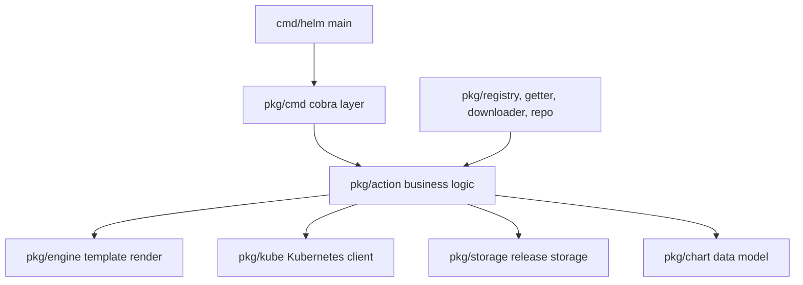

# Architecture

## Big picture

Helm is a layered CLI. A thin `main` sets up the root command, a cobra command layer parses flags, an action layer holds the business logic for each subcommand, and a set of supporting packages handle templating, the chart data model, the Kubernetes client, release storage, and chart distribution. The shared `action.Configuration` carries the cluster client, the release storage, and the discovered cluster capabilities so every action works from the same state.

## Components

### Entry point: `cmd/helm`

A thin `main`. It sets `kube.ManagedFieldsManager = "helm"` so the field manager name stays stable even if the binary is renamed, then builds and executes the root cobra command (`cmd/helm/helm.go:36`, `cmd/helm/helm.go:38`).

### Command layer: `pkg/cmd`

The cobra commands users invoke (`root.go`, `install.go`, `uninstall.go`, and so on). They parse flags, resolve charts and values, and hand off to an action. `newInstallCmd` builds the install command and its `RunE` calls `runInstall` (`pkg/cmd/install.go:132`, `pkg/cmd/install.go:159`). The root command also reads `HELM_DRIVER` to choose the storage backend (`pkg/cmd/root.go:65`).

### Action layer: `pkg/action`

The business logic for each subcommand: Install, Upgrade, Rollback, Uninstall, List, Pull, Push, Lint, and more. `Configuration` is the shared context holding `KubeClient`, `Releases` storage, `Capabilities`, and the `RESTClientGetter` (`pkg/action/action.go`).

### Template engine: `pkg/engine`

Renders chart templates using Go `text/template` (`pkg/engine/engine.go:82`).

### Chart model: `pkg/chart`

The chart data model. The v2 type lives in `pkg/chart/v2/chart.go:38`, with a newer v3 model under `internal/chart/v3`.

### Storage: `pkg/storage` and `pkg/storage/driver`

The release persistence layer. The driver abstracts where release state lives: secret, configmap, memory, or sql (`pkg/storage/driver/driver.go:99`).

### Kubernetes client: `pkg/kube`

A wrapper around the Kubernetes client that builds objects from rendered manifests, then creates, updates, and waits on them.

### Distribution: `pkg/registry`, `pkg/getter`, `pkg/downloader`, `pkg/repo`, `pkg/pusher`, `pkg/provenance`

Fetching and publishing charts, including OCI registries, plus OpenPGP provenance signing and verification in `pkg/provenance`.

## How a request flows

Tracing `helm install` end to end:

1. The cobra command parses args, and its `RunE` calls `runInstall`, which resolves the chart and merges values, then calls `client.RunWithContext(ctx, chartRequested, vals)` (`pkg/cmd/install.go:159`, `pkg/cmd/install.go:347`).
2. The action checks cluster reachability when not a dry run (`pkg/action/install.go:296`), validates the release name (`pkg/action/install.go:308`), and resolves subchart dependencies (`pkg/action/install.go:313`).
3. It gathers cluster capabilities (`pkg/action/install.go:352`), then composes and schema-validates the final values (`pkg/action/install.go:366`).
4. It creates a `Release` with revision 1 (`pkg/action/install.go:375`) and renders templates into hooks, a manifest, and NOTES (`pkg/action/install.go:378`).
5. The manifest string is built into Kubernetes objects (`pkg/action/install.go:394`), and install rejects resources that already exist unless ownership is taken (`pkg/action/install.go:415`). A dry run returns here (`pkg/action/install.go:423`).
6. The release is saved to storage (`pkg/action/install.go:465`), then `performInstallCtx` applies it to the cluster (`pkg/action/install.go:472`).

## Key design decisions

Since Helm 3, release state lives in the cluster as a Kubernetes Secret in the target namespace by default. The storage selector treats an empty driver and `"secret"`/`"secrets"` the same way and builds the secret driver (`pkg/action/action.go:675`). The stored payload is a JSON-encoded release, gzipped at best compression and base64-wrapped (`pkg/storage/driver/util.go:38`), held in a Secret of type `helm.sh/release.v1` (`pkg/storage/driver/secrets.go:284`). This is the post-Tiller design: rather than a dedicated server holding state, Helm puts state next to the workloads it manages. The driver is swappable through `HELM_DRIVER` to secret, configmap, memory, or sql (`pkg/cmd/root.go:65`).

## Extension points

- Storage drivers behind the `Driver` interface (`pkg/storage/driver/driver.go:99`).
- Chart distribution through OCI registries and HTTP repositories (`pkg/registry`, `pkg/repo`).
- Provenance signing and verification (`pkg/provenance`).
- Custom template functions on the engine, supplied through `Configuration.CustomTemplateFuncs` (`pkg/action/action.go:307`).
