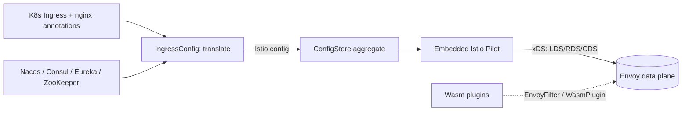

# Architecture

## Big picture

Higress is a forked Istio Pilot plus an Envoy data plane plus a Wasm plugin layer. The control plane does not program Envoy from Kubernetes Ingress directly. Instead it translates Ingress (and nginx-compatible annotations, and Gateway API) into Istio configuration, and an embedded Istio Pilot compiles that into Envoy's xDS. The key structural fact is that Higress's Ingress store is registered into Pilot as just another `ConfigStoreController`, so from Pilot's point of view the translated Istio config is indistinguishable from config a user applied directly.

## Components

### Entrypoint and server assembly

`cmd/higress/main.go` is the binary. `main` runs the cobra root command (`cmd/higress/main.go:26`, `cmd/higress/main.go:28`). Server assembly lives in `pkg/bootstrap/server.go`: `NewServer` (`pkg/bootstrap/server.go:152`) wires the startup tasks, including `initConfigController` (`pkg/bootstrap/server.go:220`). The server embeds Istio's xDS `DiscoveryServer` via `xds.NewDiscoveryServer` (`pkg/bootstrap/server.go:344`) and registers a custom generator per GVK (`pkg/bootstrap/server.go:346` onward), each defined in `pkg/ingress/mcp/generator.go`.

### Ingress translation layer

`pkg/ingress/` is the core, the layer that turns Kubernetes objects into Istio config. `translation/translation.go` holds `IngressTranslation`, a thin wrapper that merges Ingress v1 and Knative ingress. `config/ingress_config.go` holds `IngressConfig`, the roughly 2,300-line body of the translation. `kube/annotations/` holds the nginx-compatibility parsers, one file per annotation family (cors, canary, rewrite, retry, timeout, auth, ip_access_control, and more, about 25 files). `kube/gateway/` handles Gateway API.

### Service discovery

`registry/` watches external service registries and generates Istio `ServiceEntry` objects, which is how Higress serves as a microservice gateway. It has providers for `nacos`, `consul`, `eureka`, `zookeeper`, and `direct`, reconciled under `registry/reconcile`.

### Wasm plugins

`plugins/wasm-go/` and `plugins/wasm-rust/` hold the Wasm extensions that run inside Envoy's HTTP filter chain. At the documented commit `plugins/wasm-go/extensions/` contains 59 extensions (`ai-proxy`, `ai-cache`, `jwt-auth`, `ext-auth`, `waf`, `oidc`, `mcp-server`, `mcp-router`, and others). The `ai-proxy` extension registers 37 LLM provider initializers in one map (`plugins/wasm-go/extensions/ai-proxy/provider/provider.go:224`).

### The Istio fork

`istio/` holds the forked Istio (`api`, `client-go`, `istio`, `pkg`, `proxy`). Higress does not vendor upstream Istio unchanged; it carries a modified copy in-tree so it can plug its Ingress store into Pilot's config machinery.

## How a request flows

Trace a Kubernetes Ingress becoming an Envoy route, end to end:

1. `main` runs the cobra root command (`cmd/higress/main.go:26`), which reaches `NewServer` (`pkg/bootstrap/server.go:152`) and its `initConfigController` (`pkg/bootstrap/server.go:220`).
2. `initConfigController` builds the Ingress store: `translation.NewIngressTranslation(...)` creates the `IngressConfig`-backed store (`pkg/bootstrap/server.go:239`), appends it to `s.configStores` (`pkg/bootstrap/server.go:242`), wraps the set with `configaggregate.MakeCache` (`pkg/bootstrap/server.go:245`), and sets it as `s.environment.ConfigStore` (`pkg/bootstrap/server.go:252`). From here Pilot treats the Ingress store as a plain config source.
3. When xDS needs config of a given GVK, it calls `ConfigStore.List`, which reaches `IngressTranslation.List` (`pkg/ingress/translation/translation.go:163`) and then `IngressConfig.List` (`pkg/ingress/config/ingress_config.go:288`).
4. `IngressConfig.List` short-circuits unless the requested type is Gateway, VirtualService, DestinationRule, EnvoyFilter, ServiceEntry, or WasmPlugin (`pkg/ingress/config/ingress_config.go:289`), then calls `listFromIngressControllers` (`pkg/ingress/config/ingress_config.go:324`).
5. `listFromIngressControllers` lists raw Ingress from each cluster's controller (`pkg/ingress/config/ingress_config.go:352`), sorts by creation time with `SortIngressByCreationTime` (`pkg/ingress/config/ingress_config.go:357`), builds wrapper configs with `createWrapperConfigs` (`pkg/ingress/config/ingress_config.go:358`), then branches by GVK (`pkg/ingress/config/ingress_config.go:361`).
6. For VirtualService the branch calls `convertVirtualService` (`pkg/ingress/config/ingress_config.go:486`). For each Ingress it builds HTTP routes with `ingressController.ConvertHTTPRoute` (`pkg/ingress/config/ingress_config.go:522`), applies nginx-compatible annotations with `annotationHandler.ApplyRoute` (`pkg/ingress/config/ingress_config.go:530`), merges canary Ingress with `applyCanaryIngresses` (`pkg/ingress/config/ingress_config.go:536`), and normalizes weighted clusters so the weights sum to 100 (`pkg/ingress/config/ingress_config.go:542`).
7. The returned `[]config.Config` is Istio's VirtualService, Gateway, DestinationRule, EnvoyFilter, ServiceEntry, or WasmPlugin. Pilot's per-GVK generators (`pkg/bootstrap/server.go:346` onward) compile these to Envoy xDS (LDS/RDS/CDS) and push to the Envoy data plane.

## Key design decisions

The central decision is to reuse Istio's control plane rather than write an Ingress-to-Envoy compiler. By implementing `istiomodel.ConfigStoreController` on `IngressConfig` (`pkg/ingress/config/ingress_config.go:79`) and registering it as a config source, Higress gets Pilot's xDS generation, incremental push, and Envoy management for free, while hiding Istio's CRDs behind Ingress and annotations. The trade-off is weight: Higress ships a forked Istio Pilot plus Envoy, a larger footprint than a standalone gateway.

The second decision is nginx-annotation compatibility as a first-class concern. `kube/annotations/` reimplements about 25 nginx-Ingress annotation families as individual parsers, so an existing nginx-Ingress deployment can move to Higress without rewriting routing objects. This is migration support expressed in code, not marketing.

The third is that route changes propagate through xDS rather than a proxy reload, so the Envoy data plane keeps serving while routes change. That is the mechanism behind the "no reload" claim and the Sealos migration writeup's reported speedup (README; Sealos blog).

## Extension points

- **Wasm plugins**: extensions compiled to WebAssembly run in Envoy's HTTP filter chain. `convertWasmPlugin` (`pkg/ingress/config/ingress_config.go:838`) and `convertIstioWasmPlugin` (`pkg/ingress/config/ingress_config.go:1123`) turn Higress's `WasmPlugin` CRD into Istio's `extensions.WasmPlugin`, injected via EnvoyFilter. Plugins are written with the higress-group Go SDK (`github.com/higress-group/wasm-go`).
- **nginx-compatible annotations**: adding an annotation family means adding a parser under `kube/annotations/`.
- **Service registries**: `registry/` supports Nacos, Consul, Eureka, ZooKeeper, and direct discovery, each generating ServiceEntry.
- **Gateway API**: `kube/gateway/` handles Gateway API resources alongside Ingress.
