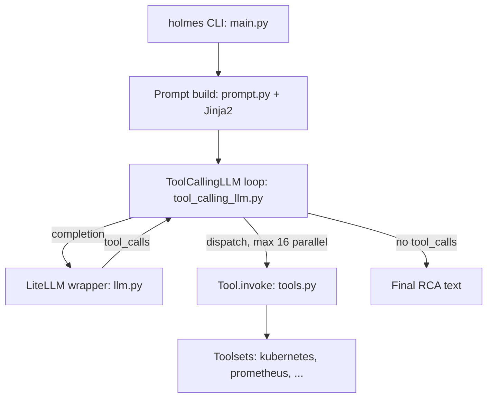

# Architecture

## Big picture

HolmesGPT is a Python program wrapped around one loop. A CLI entrypoint loads config and builds a system prompt plus a user prompt from the alert or question. The engine (`ToolCallingLLM`) then calls the model, and if the model asks for tools, runs them and feeds the results back, iterating until the model stops or a step limit is hit. The model reaches data sources through toolsets, and it reaches the model provider through a LiteLLM wrapper that hides whether the backend is OpenAI, Anthropic, Azure, Bedrock, or Gemini. Everything the model does is orchestration by Python; everything Python does is safety and plumbing around the model's choices.

## Components

### CLI and config

`holmes/main.py` is the Typer CLI with `ask`, `investigate`, and `toolset` subcommands. It loads configuration and routes commands. `holmes/config.py` reads `~/.holmes/config.yaml` for the model, API key, and enabled toolsets, and is the factory for alert sources (AlertManager, Jira, PagerDuty, OpsGenie). This layer decides what the engine will run with; it does not run the loop itself.

### Prompt building

`holmes/core/prompt.py` assembles the system and user prompts from Jinja2 templates in `holmes/plugins/prompts/`. `generic_ask.jinja2` is the system prompt, built from components (`intro`, `cluster_name`, `todowrite`, `toolset_instructions`, `style_guide`) that can be turned on or off (`prompt.py:12` `PromptComponent`, `prompt.py:97` `is_component_enabled`, controlled by the `ENABLED_PROMPTS` environment variable). Runbooks and any guidance enter the model here, as prompt text.

### Engine

`holmes/core/tool_calling_llm.py` holds `ToolCallingLLM` (`tool_calling_llm.py:196`), the loop. It owns `tool_executor`, `max_steps`, and the LLM handle. `call` (`tool_calling_llm.py:575`) is the synchronous entry that drains `call_stream` (`tool_calling_llm.py:1031`), the loop body. Despite the name, `call_stream` does not stream LLM tokens; it yields one Holmes iteration at a time, and each model call runs with `stream=False` (a comment states this at `tool_calling_llm.py:1044`).

### LLM abstraction

`holmes/core/llm.py` holds `DefaultLLM`, which calls providers through LiteLLM, so one code path serves OpenAI, Anthropic, Azure, Bedrock, and Gemini. Token counting and context-window sizing live here too, which is what the compaction step later depends on.

### Tools and toolsets

`holmes/core/tools.py` defines `Tool.invoke` (`tools.py:353`) and the unified output type `StructuredToolResult` (`tools.py:96`), whose `status` enum distinguishes `success`, `error`, `no_data`, `approval_required`, and `frontend_pause` (`tools.py:64`). `holmes/plugins/toolsets/` holds 46 data-source integrations (Kubernetes, Prometheus, Grafana, Datadog, AWS, Docker, Elasticsearch, MCP, and more), mixing YAML definitions with Python implementations. `holmes/plugins/sources/` ingests alerts (GitHub, Jira, OpsGenie, PagerDuty, and Prometheus AlertManager), and `holmes/plugins/destinations/` writes findings back out.

## How a request flows

Trace `holmes investigate`, which analyzes one alert end to end:

1. `_investigate_issue` (`main.py:163`) builds the system prompt with `build_system_prompt` (`main.py:173` into `prompt.py:177`) and the user prompt with `generate_user_prompt` (`main.py:181` into `prompt.py:161`). The investigation-specific instruction is added at `main.py:172` ("Provide a terse analysis of the following ... alert/issue and why it is firing."). It assembles `messages = system + user` and calls `ai.call(messages, ...)` (`main.py:189`).
2. `ToolCallingLLM.call` (`tool_calling_llm.py:575`) drains `call_stream`, whose loop is `while i < max_steps` (`tool_calling_llm.py:1101`).
3. Each iteration calls the model once: `self.llm.completion(messages=..., tools=tools, tool_choice="auto", temperature=TEMPERATURE, stream=False, drop_params=True)` (`tool_calling_llm.py:1163`), through LiteLLM (`llm.py`).
4. If the response has no `tool_calls`, the loop emits `ANSWER_END` (`tool_calling_llm.py:1262`) and returns; the message content is the final root cause analysis the model wrote.
5. If it has `tool_calls`, they run in a `ThreadPoolExecutor(max_workers=16)` (`tool_calling_llm.py:1295`), each call reaching `Tool.invoke` (`tools.py:353`) to hit the real data source. Results are appended to `messages` and the loop iterates. When `i` reaches `max_steps`, the tools are removed so the model must conclude (`tool_calling_llm.py:1101`).

## Key design decisions

The decisive choice is where judgment lives. Deterministic Python owns loop control and `max_steps`, tool dispatch, the duplicate-call safeguard (`safeguards.py:24`), the approval gate (`tools.py:363`), context compaction and oversized-output spilling, and token accounting and tracing. The model owns which tool to call, with which arguments, when to stop, and the wording of the analysis. There is no hardcoded diagnostic decision tree; runbooks are prompt-injected text, so the execution decision still belongs to the model (recon; source at `84cb39c`). The result is an agent whose reasoning is entirely the model's, with Python confined to running tools safely and returning their output in a form the context can hold.

A second choice is per-iteration parallelism. A single step can issue several tool calls at once, run up to 16 in parallel, and return them together, which cuts the wall-clock cost of an investigation that needs many independent lookups (`tool_calling_llm.py:1295`).

A third is that all built-in tools are read-only by design. That is what makes the duplicate-call safeguard sound: refusing an identical repeated call is only safe because tools do not mutate state, and a source comment notes the safeguard would need to change if that ever stopped being true (`safeguards.py:24`).

## Extension points

- **Toolsets**: a new data source is a new toolset under `holmes/plugins/toolsets/`, defined in YAML or Python, exposing read-only commands the model can call.
- **MCP**: toolsets can reach external tools through the Model Context Protocol, which is how integrations such as GitHub, GitLab, and cloud providers are wired in (README).
- **Alert sources**: `holmes/plugins/sources/` adds ingestion from systems such as AlertManager, PagerDuty, OpsGenie, and Jira, some of which can also receive findings back.
- **Prompt components**: the system prompt is assembled from toggleable components (`prompt.py:12`, `prompt.py:97`), controlled by `ENABLED_PROMPTS`, so guidance and runbooks can be swapped without touching the engine.
