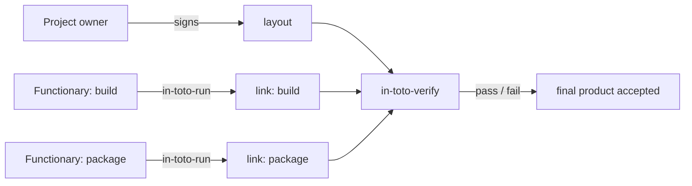

# Architecture

## Big picture

The whole system has two actors. A **layout** is the policy: the ordered steps of a supply chain, the keys allowed to sign each step, and rules about which files (artifacts) each step may consume and produce. A **link** is the evidence: a record of one step actually being run, listing the materials that went in, the products that came out, and the command. The generation side (`in_toto/runlib.py`) produces links; the verification side (`in_toto/verifylib.py`) collects links and checks them against the layout.

## Components

### CLI layer

Six thin entry points are registered in pyproject.toml:50. `in-toto-run` and `in-toto-record` generate evidence, `in-toto-verify` verifies it, `in-toto-sign` manages signatures, `in-toto-mock` does a key-less trial run, and `in-toto-match-products` compares products. Each one parses arguments and calls into a library; for example in_toto/in_toto_verify.py:222 loads the layout and hands off to `verifylib`.

### Generation engine: `runlib.py`

`runlib.py` builds links. `record_artifacts_as_dict` (in_toto/runlib.py:69) hashes materials and products, `execute_link` (in_toto/runlib.py:293) runs the step command in a subprocess and captures its byproducts, and `in_toto_run` (in_toto/runlib.py:406) assembles and signs the link. For multi-part steps, `in_toto_record_start` (in_toto/runlib.py:622) and `in_toto_record_stop` (in_toto/runlib.py:791) split material and product recording.

### Verification engine: `verifylib.py`

`verifylib.py` is the verifier. `in_toto_verify` (in_toto/verifylib.py:1484) orchestrates an 11-step procedure listed in its docstring (in_toto/verifylib.py:1495-1511). Individual rule checks such as `verify_match_rule` (in_toto/verifylib.py:645) live alongside it.

### Models and rules

`in_toto/models/` holds the data types: `layout.py` (Layout, Step, Inspection), `link.py` (Link), and `metadata.py` (the signed-container abstraction). `in_toto/rulelib.py` parses artifact-rule strings into dicts via `unpack_rule` (in_toto/rulelib.py:43), supporting MATCH, CREATE, DELETE, MODIFY, ALLOW, DISALLOW, and REQUIRE (in_toto/rulelib.py:51-58).

### Artifact resolvers

`in_toto/resolver/_resolver.py` hashes artifacts behind URI schemes. `Resolver.for_uri` (in_toto/resolver/_resolver.py:28) dispatches on the scheme and falls back to the file resolver for unknown schemes (in_toto/resolver/_resolver.py:32-35). The registered resolvers are `FileResolver` (scheme `file`, in_toto/resolver/_resolver.py:51), `OSTreeResolver` (`ostree`, in_toto/resolver/_resolver.py:210), and `DirectoryResolver` (`dir`, in_toto/resolver/_resolver.py:280).

## How a request flows

Tracing `in-toto-verify` end to end:

1. The CLI loads the layout with `Metadata.load(args.layout)` (in_toto/in_toto_verify.py:222), loads each verification key (in_toto/in_toto_verify.py:227-234), then calls `verifylib.in_toto_verify(...)` (in_toto/in_toto_verify.py:236).
2. `in_toto_verify` (in_toto/verifylib.py:1484) runs the procedure in order:
   - `verify_metadata_signatures` checks the layout signatures against the supplied keys (in_toto/verifylib.py:1584).
   - `metadata.get_payload()` extracts the Layout from its signed container (in_toto/verifylib.py:1590).
   - `verify_layout_expiration` checks the expiry (in_toto/verifylib.py:1593).
   - `load_links_for_layout` reads `STEP-NAME.KEYID-PREFIX.link` files from disk (in_toto/verifylib.py:1601).
   - `verify_link_signature_thresholds` requires a threshold of valid functionary signatures per step (in_toto/verifylib.py:1604).
   - `verify_sublayouts` recurses into any nested layouts (in_toto/verifylib.py:1607).
   - `verify_all_steps_command_alignment` compares reported and expected commands (in_toto/verifylib.py:1612).
   - `verify_threshold_constraints` then `reduce_chain_links` collapse agreeing links (in_toto/verifylib.py:1615-1616).
   - `verify_all_item_rules(layout.steps, ...)` applies step artifact rules (in_toto/verifylib.py:1622).
   - `run_all_inspections` runs inspection commands and generates their links (in_toto/verifylib.py:1625).
   - `verify_all_item_rules(layout.inspect, ...)` applies inspection rules (in_toto/verifylib.py:1634).
   - `get_summary_link` returns a materials/products summary of the whole chain (in_toto/verifylib.py:1642).

## Key design decisions

- **Verification runs in isolation.** in-toto deliberately ignores external key attributes such as creation time, revocation status, and usage flags. The docstring states this explicitly (in_toto/verifylib.py:1513-1521), as does the CLI help (in_toto/in_toto_verify.py:85-88). To revoke a key, the owner signs a new layout.
- **Step rules are checked before inspections run.** A comment explains the reason: it stops inspection commands from executing on already-compromised files. The trade-off, also noted, is that step match rules cannot reference inspection artifacts (in_toto/verifylib.py:1618-1620).
- **Command mismatch is a soft failure.** Following the specification, a difference between the reported and expected command logs a warning rather than failing verification (in_toto/verifylib.py:1504-1507).

## Extension points

The artifact resolver registry is the main third-party seam: a resolver registers itself under a URI scheme in `RESOLVER_FOR_URI_SCHEME` (in_toto/resolver/_resolver.py:21) and implements the `Resolver` abstract base class (in_toto/resolver/_resolver.py:24). The metadata layer is also pluggable across envelope formats: both the DSSE `Envelope` and the legacy `Metablock` subclass the `Metadata` abstraction (in_toto/models/metadata.py:144, in_toto/models/metadata.py:220).
