# Architecture

## Big picture

Istio is two layers. The control plane is `istiod`, the `pilot-discovery` binary built from `pilot/cmd/pilot-discovery` (`Makefile.core.mk:213`). It watches the Kubernetes API and Istio config CRDs, builds Envoy configuration, and pushes it to the data plane over xDS, a gRPC discovery protocol. The data plane is Envoy: a sidecar per pod in the classic model, or in ambient mode a per-node ztunnel for L4 plus an optional waypoint Envoy for L7. The single control loop is "config changes, recompute, push to every connected proxy".

```mermaid
flowchart LR
  cfg[K8s API and Istio CRDs] -->|watch| cu["ConfigUpdate()"]
  cu --> pc[pushChannel]
  pc --> db["debounce()"]
  db --> push["Push(): build PushContext"]
  push --> all["AdsPushAll -> pushQueue"]
  all --> pcn["pushConnection per proxy"]
  pcn --> gen["pushXds: generator -> Envoy resources"]
  gen -->|xDS gRPC| envoy[Envoy sidecar / ztunnel / waypoint]
```

## Components

### istiod (pilot)

The control plane core lives in `pilot/`. Its entry point is `pilot/cmd/pilot-discovery/main.go:27`, which calls `app.NewRootCommand()` (`pilot/cmd/pilot-discovery/app/cmd.go:41`). Inside, the xDS server is `DiscoveryServer` (`pilot/pkg/xds/discovery.go:65`). It owns the config model, the service registry, and xDS generation and delivery.

### istioctl

The CLI is `istioctl/`, built from `istioctl/cmd/istioctl` (`Makefile.core.mk:212`). It covers install, `analyze`, and `proxy-config` inspection.

### security (CA)

`security/` is the certificate authority. It issues SPIFFE-based workload certificates, the identity backing mutual TLS in the mesh.

### istio-cni

`cni/` is the CNI plugin, built from `cni/cmd/istio-cni` (`Makefile.core.mk:218`). It sets up the traffic redirection that steers a pod's traffic through the sidecar or, in ambient mode, the node ztunnel.

### Shared libraries

`pkg/` holds shared code, including the generic xDS server scaffolding in `pkg/xds/server.go`. `operator/` and `manifests/` hold the Helm charts and install profiles.

## How a request flows

The representative operation is a config change propagating to every Envoy. Trace it through `pilot/pkg/xds`.

1. A config change (for example a `VirtualService`) reaches `DiscoveryServer.ConfigUpdate(req)`. It clears the xDS cache for Address kinds, then drops the request onto `pushChannel` and returns (`pilot/pkg/xds/discovery.go:326-343`).
2. `handleUpdates` delegates to `debounce()` (`pilot/pkg/xds/discovery.go:351-352`). Debounce collapses a burst of events into one, merging the `PushRequest` values, bounded by a minimum quiet time and a maximum delay (`pilot/pkg/xds/discovery.go:355`). This is the defense against a thundering herd of pushes.
3. After debounce, `Push(req)` runs (`pilot/pkg/xds/discovery.go:288-307`). It saves the old `PushContext`, stamps a new version with `NextVersion()`, builds a fresh immutable `PushContext` snapshot via `initPushContext`, attaches it to `req.Push`, and calls `AdsPushAll(req)`.
4. `AdsPushAll` calls `StartPush`, which walks every connected client and enqueues the request (`pilot/pkg/xds/ads.go:566-592`).
5. A separate goroutine drains the queue, gated by a `concurrentPushLimit` semaphore so only so many proxies are pushed at once.
6. Each connection runs `pushConnection(con, ev)` (`pilot/pkg/xds/ads.go:478-503`). It refreshes proxy state, then asks `ProxyNeedsPush`. If the proxy's scope does not depend on the change, it is skipped. Otherwise each watched resource is pushed in `PushOrder`: clusters, endpoints, listeners, routes, secrets, then the ambient address and workload types (`pilot/pkg/xds/ads.go:505-516`).
7. `pushXds(con, w, req)` (`pilot/pkg/xds/xdsgen.go:112`) looks up the generator for the resource's TypeUrl with `findGenerator`, calls `gen.Generate(...)`, assembles a `DiscoveryResponse`, and writes it to the gRPC stream.

ACK and NACK flow the other way. Envoy returns a request carrying a nonce, handled by `processRequest` (`pilot/pkg/xds/ads.go:139`) and `Stream` (`pilot/pkg/xds/ads.go:187`). The `WatchedResource.NonceSent` and `NonceAcked` fields track whether the last response was accepted.

## Key design decisions

Istio rebuilds the entire `PushContext` on every config change rather than mutating shared state. `Push()` retires the old context and constructs a new immutable snapshot (`pilot/pkg/xds/discovery.go:288-306`); all per-proxy computation then reads that single snapshot. This prevents proxies from seeing inconsistent config while a push is in flight and lets a single version (PushVersion) propagate to Envoy. The cost is rebuilding indexes each time, which is why debounce sits in front of it to bound the frequency. On top of that, `ProxyNeedsPush` and `PushRequest.ConfigsUpdated` skip proxies whose scope does not depend on the change. This combination is the answer to convergence-time and CPU/memory pressure at very large proxy counts ([eBay case study](https://istio.io/latest/about/case-studies/ebay/)).

Ambient is a separate data-plane path. L4 is handled by the per-node ztunnel (Rust, in `istio/ztunnel`), which shares mTLS and routing across pods on the node. A waypoint Envoy is added per namespace or service only when L7 features are required. The same `istiod` drives both over xDS, with extra TypeUrls for the workload and address types (`pilot/pkg/xds/ads.go:511-516`).

## Extension points

- Configuration CRDs: `VirtualService`, `DestinationRule`, `Gateway`, `Sidecar`, authentication and authorization policies, and `Telemetry`, all indexed in the push context.
- `EnvoyFilter` for patching generated Envoy config directly.
- The injection webhook and the `istio-cni` plugin for wiring workloads into the mesh.
- The xDS generator registry on `DiscoveryServer.Generators`, keyed by TypeUrl, for custom resource generation.
